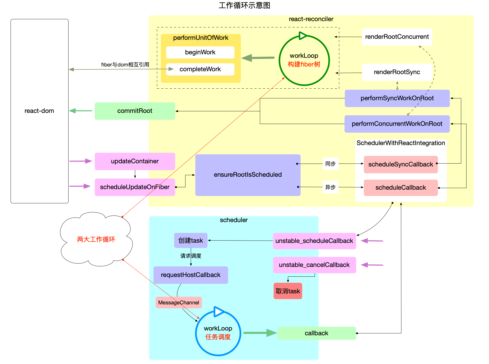

# React工作循环

主要是两个循环：

1. **任务调度循环**：源码位于 `Scheduler.js`，它是 `react` 运行核心，它需要循环调用，控制所有任务的调度。
2. **fiber构造循环**：源码位于`ReactFiberWorkLoop.js`, 控制 `fiber` 树的构造, 整个过程是一个深度优先遍历。

这两个循环对应的js源码不同于其他闭包（运行时就是闭包），其中定义的全局变量，不仅是该作用域的私有变量，更用于**控制react应用的执行过程**。

### 区别与联系

1. **区别**
    * **任务调度循环**是以 **二叉堆** 为数据结构，循环执行**堆**的顶点，直到**堆**被清空。
    * **任务调度循环**的逻辑偏向宏观，它调度的是每一个任务(task), 而不关心这个任务具体是干什么的(甚至可以将 `Scheduler` 包脱离 `react` 使用)，具体任务其实就是执行回调函数 `performSyncWorkOnRoot` 或 `performConcurrentWorkOnRoot`。
    * **fiber构造循环** 是以**树**为数据结构，**从上至下**执行深度优先遍历。
    * **fiber构造循环**的逻辑偏向具体实现，它只是任务(`task`)的一部分(如 `performSyncWorkOnRoot` 包括: `fiber` 树的构造, DOM渲染, 调度检测), 只负责 `fiber` 树的构造.

2. **联系**
    * **fiber构造循环**是**任务调度循环**中任务的一部分，是**从属关系**，每个任务都会重新构建一个 `fiber` 树。

### 主要逻辑

两大循环的分工可以总结为：大循环(**任务调用循环**)负责调度 `task`，小循环(**fiber构造循环)**负责实现 `task`。

react 运行的主干逻辑，即**输入到输出**的核心逻辑，react运行的主要逻辑进行概括：

1. **输出**：将每一次更新(如：新增、删除、修改节点之后)视为一次**更新需求**（目的是更新DOM节点）。
2. **注册调度任务**：`react-reconciler` 收到**更新需求**后，并不会立即构造 `fiber` 树，而是去调度中心 `scheduler` 注册一个新任务 `task`，将**更新需求**转换为一个 `task`。
3. **执行调度任务(输出)**：调度中心 `scheduler` 通过**任务调度循环**来执行 `task`(`task` 的执行又回到了 `react-reconciler` 包中)。
    * **fiber构造循环**是 `task` 的实现环节之一， 循环完成之后会构造出最新的 `fiber` 树。
    * `commitRoot`是 `task` 的实现环节之二，把最新的 `fiber` 树最终渲染到页面上, `task` 完成。