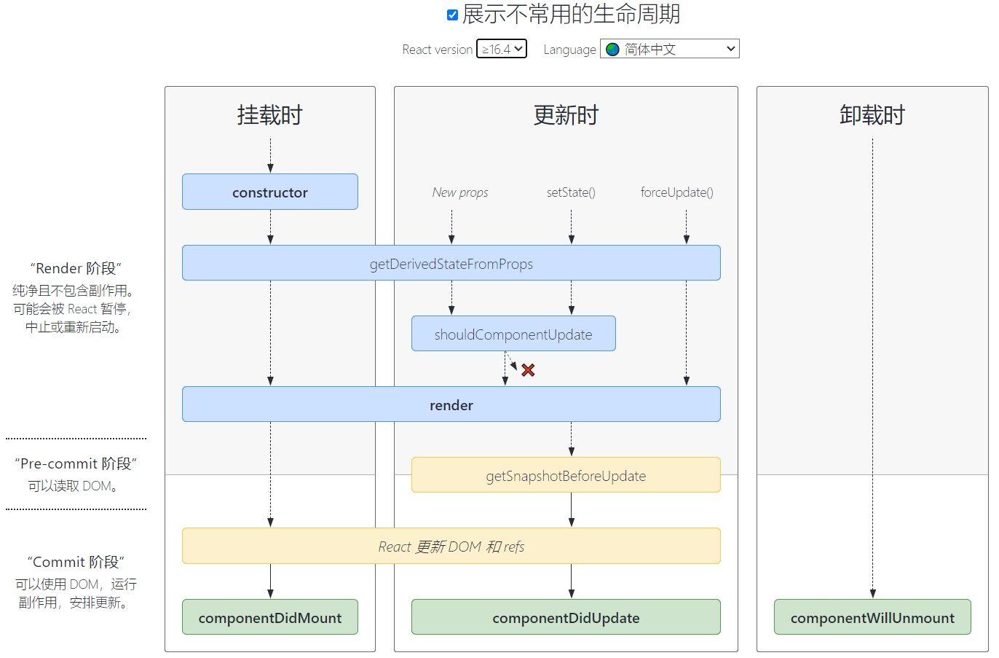

# React类组件生命周期及使用场景



### 生命周期方法

#### constructor(props) [:link:](https://zh-hans.react.dev/reference/react/Component#constructor)
1. 用于初始化内部状态，很少使用。
2. 唯一可以直接修改 `state` 的地方。

#### getDerivedStateFromProps(不推荐使用) [:link:](https://zh-hans.react.dev/reference/react/Component#static-getderivedstatefromprops)
1. 当 `state` 需要从 `props` 初始化时使用。
2. 尽量不要使用：维护两者状态一致性会增加复杂度。
3. 每次render都会调用。
4. 典型场景: **表单控件**获取默认值。

#### componentDidMount [:link:](https://zh-hans.react.dev/reference/react/Component#componentdidmount)
1. UI渲染完成后调用。
2. 只执行一次。
3. 典型场景: 获取外部资源(AJAX请求)。

#### componentWillUnmount [:link:](https://zh-hans.react.dev/reference/react/Component#componentwillunmount)
1. 组件移除时被调用。
2. 典型场景：**资源释放**。

#### shouldComponentUpdate(nextProps, nextState, nextContext) [:link:](https://zh-hans.react.dev/reference/react/Component#shouldcomponentupdate)
1. 决定Virtual DOM是否要重绘。
2. 一般可以由 [PureComponent](https://zh-hans.react.dev/reference/react/PureComponent) (类似`Component`, 但当 `props` 和 `state` 与之前一致时会跳过重新渲染)自动实现。
3. 典型场景：**性能优化**。

#### getSnapshotBeforeUpdate(prevProps, prevState)  [:link:](https://zh-hans.react.dev/reference/react/Component#getsnapshotbeforeupdate)
1. 在页面 `render` 之前调用，`state` 已更新。
2. 典型场景：获取 `render` 之前的DOM状态。

#### componentDidUpdate(prevProps, prevState, snapshot?) [:link:](https://zh-hans.react.dev/reference/react/Component#componentdidupdate)
1. 每次UI更新时被调用。
2. 典型场景：页面需要根据 `props` 变化重新获取数据(例如文章详情页切换文章，内容根据ID来变化)

#### componentDidCatch(error, info) [:link:](https://zh-hans.react.dev/reference/react/Component#componentdidcatch)

1. 捕获渲染过程中发生的错误。
2. 典型场景：**错误边界**。

#### getDerivedStateFromError(error) [:link:](https://zh-hans.react.dev/reference/react/Component#getderivedstatefromerror)

1. 捕获子组件抛出的错误，更新 `state` 以显示降级 UI。
2. 是一个纯函数，若想执行副作用你想执行副作用（例如调用分析服务），你还需要实现 `componentDidCatch`。

3. 典型场景：**错误边界**

### 生命周期方法执行顺序

#### 一、挂载阶段（Mounting）

组件被创建并插入DOM的阶段，执行顺序如下：

1. `constructor`: 初始化 `state` 或绑定事件。避免在构造函数中执行副操作（如请求数据）。
2. `getDerivedStateFromProps`: 根据 `props` 更新 `state`。
3. `render`: 必须实现的方法，返回 JSX 或 `null`，需保持纯函数特性。
4. `componentDidMount`: 组件挂载到 DOM 后调用，适合执行副作用操作（如 API 请求、DOM 操作、订阅事件）

#### 二、更新阶段（Updating）

组件因 `props` 或 `state` 变化而重新渲染的阶段，执行顺序如下：

1. `getDerivedStateFromProps`: 同挂载阶段，在每次更新前调用，根据 `props` 更新 `state`。
2. `shouldComponentUpdate`: 判断是否需要重新渲染。
3. `render`: 重新渲染组件。
4. `getSnapshotBeforeUpdate`: 在 DOM 更新前捕获信息（如滚动位置），返回值需要传给 `componentDidUpdate`的第三个参数，必须和 `componentDidUpdate` 配合使用。
5. `componentDidUpdate`: 组件更新后调用。

#### 三、卸载阶段（Unmounting）

组件从 DOM 中移除的阶段：

1. `componentWillUnmount`: 组件从 DOM 中移除前调用，适合执行清理操作（如取消订阅、清除定时器）。

#### 四、错误处理（Error Handling）

组件渲染过程中发生错误时触发：

1. `getDerivedStateFromError`: 捕获子组件抛出的错误，更新 `state` 以显示降级 UI。
2. `componentDidCatch`: 捕获渲染过程中发生的错误。

### 两个例子

::: code-group

```jsx [时钟]
import React from 'react'
export default class Clock extends React.Component{
    constructor(props) {
        super(props);
        console.log("Clock constructed")
        this.state = { date: new Date()}
    }

    componentDidMount() {
        console.log('Clock did umount')
        this.timeID = setInterval(()=>this.tick(),1000)
    }

    componentWillUnmount() {
        console.log("Clock will unmount")
        clearInterval(this.timeID)
    }

    componentDidUpdate() {
        console.log('Clock did Update')
    }

    tick(){
        this.setState({
            date:new Date()
        })
    }

    render() {
        return (
            <>
                <h2>
                    It is {this.state.date.toLocaleTimeString()}
                </h2>
            </>
        )
    }
}

```

:::

::: code-group

```jsx [消息框信息顶部添加]
import React, { PureComponent } from "react";

export default class SnapshotSample extends PureComponent {
    state = {
        messages: [],
    };

    handleNewMessage() {
        this.setState(prev => ({
            messages: [`msg ${prev.messages.length}`, ...prev.messages],
        }));
    }

    componentDidMount() {
        for (let i = 0; i < 20; i++) this.handleNewMessage();
        this.interval = window.setInterval(() => {
            if (this.state.messages.length > 200) {
                window.clearInterval(this.interval);
                return;
            }
            this.handleNewMessage();
        }, 1000);
    }
    componentWillUnmount() {
        window.clearInterval(this.interval);
    }

    getSnapshotBeforeUpdate() {
        return this.rootNode.scrollHeight;
    }

    componentDidUpdate(prevProps, prevState, prevScrollHeight) {
      const scrollTop = this.rootNode.scrollTop;
      if (scrollTop < 5) return;
      this.rootNode.scrollTop =
        scrollTop + (this.rootNode.scrollHeight - prevScrollHeight);
    }

    render() {
        return (
            <div className="snapshot-sample" ref={n => (this.rootNode = n)}>
                {this.state.messages.map(msg => (
                    <div>{msg}</div>
                ))}
            </div>
        );
    }
}

```
:::

### 总结

总得来说：
1. 挂载时调用 `constructor`，更新时不调用。
2. 更新时调用 `shouldComponentUpdate` 和 `getSnapshotBeforeUpdate`，挂载时不调用。
3. `shouldComponentUpdate` 在 `render` 前调用，`getSnapshotBeforeUpdate` 在 `render` 后调用。
4. 请求放在 `componentDidMount` 里。

原因是 `constructor` 无法放AJAX请求，是因为它会在SSR的时候会被调用，是会在服务端进行调用，服务端是拿不到数据的，更新时的钩子放请求会不断调用，可能会造成死循环，卸载时的钩子只会在生命周期结束的时候进行调用。

### 参考链接

> [React Lifecycle Methods diagram](https://projects.wojtekmaj.pl/react-lifecycle-methods-diagram/)
> 
> [React.Component](https://reactjs.org/docs/react-component.html#the-component-lifecycle)