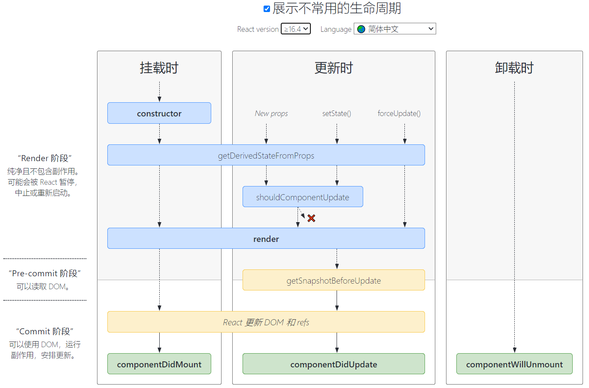

# React组件的生命周期及使用场景


#### constructor
1. 用于初始化内部状态，很少使用
2. 唯一可以直接修改state的地方

#### getDerivedStateFromProps(不推荐使用)
1. 当state需要从props初始化时使用
2. 尽量不要使用：维护两者状态一致性会增加复杂度
3. 每次render都会调用
4. 典型场景:表单控件获取默认值

#### componentDidMount
1. UI渲染完成后调用
2. 只执行一次
3. 典型场景:获取外部资源(AJAX请求)

#### componentWillUnmount
1. 组件移除时被调用
2. 典型场景：资源释放

#### getSnapshotBeforeUpdate
1. 在页面render之前调用，state已更新
2. 典型场景：获取render之前的DOM状态

#### componentDidUpdate
1. 每次UI更新时被调用
2. 典型场景：页面需要根据props变化重新获取数据(例如文章详情页切换文章，内容根据ID来变化)

#### shouldComponentUpdate
1. 决定Virtual DOM是否要重绘
2. 一般可以由PureComponent自动实现
3. 典型场景：性能优化

#### 两个例子

::: code-group

```javascript [时钟]
import React from 'react'
export default class Clock extends React.Component{
    constructor(props) {
        super(props);
        console.log("Clock constructed")
        this.state = { date: new Date()}
    }

    componentDidMount() {
        console.log('Clock did umount')
        this.timeID = setInterval(()=>this.tick(),1000)
    }

    componentWillUnmount() {
        console.log("Clock will unmount")
        clearInterval(this.timeID)
    }

    componentDidUpdate() {
        console.log('Clock did Update')
    }

    tick(){
        this.setState({
            date:new Date()
        })
    }

    render() {
        return (
            <>
                <h2>
                    It is {this.state.date.toLocaleTimeString()}
                </h2>
            </>
        )
    }
}

```

:::

::: code-group

```javascript [消息框信息顶部添加]
import React, { PureComponent } from "react";
import './SnapshotSmaple.css';

export default class SnapshotSample extends PureComponent {
    state = {
        messages: [],
    };

    handleNewMessage() {
        this.setState(prev => ({
            messages: [`msg ${prev.messages.length}`, ...prev.messages],
        }));
    }

    componentDidMount() {
        for (let i = 0; i < 20; i++) this.handleNewMessage();
        this.interval = window.setInterval(() => {
            if (this.state.messages.length > 200) {
                window.clearInterval(this.interval);
                return;
            }
            this.handleNewMessage();
        }, 1000);
    }
    componentWillUnmount() {
        window.clearInterval(this.interval);
    }

    getSnapshotBeforeUpdate() {
        return this.rootNode.scrollHeight;
    }

    componentDidUpdate(prevProps, prevState, prevScrollHeight) {
      const scrollTop = this.rootNode.scrollTop;
      if (scrollTop < 5) return;
      this.rootNode.scrollTop =
        scrollTop + (this.rootNode.scrollHeight - prevScrollHeight);
    }

    render() {
        return (
            <div className="snapshot-sample" ref={n => (this.rootNode = n)}>
                {this.state.messages.map(msg => (
                    <div>{msg}</div>
                ))}
            </div>
        );
    }
}

```
:::
