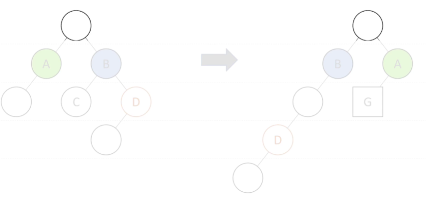
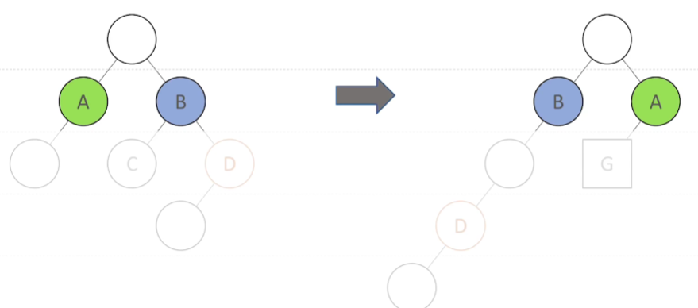
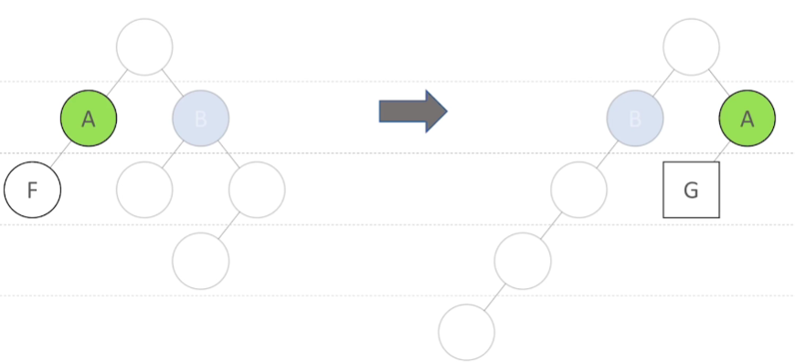
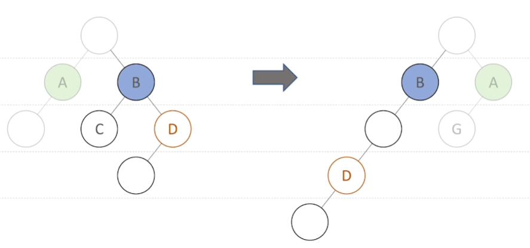

# Virtual DOM及key属性的作用

关于React虚拟DOM diff算法在页面更新时候的工作原理

#### 广度优先分层比较
1. 先从根节点开始比较

2. 属性变化及顺序(A和B调整顺序，交换节点位置)

3. 节点类型发生变化(直接将F节点删除，创建一个新的节点append到A节点下)

4. 节点跨层移动(直接将B节点下的子节点全部删除，创建一个新的D节点)

#### diff算法基于虚拟DOM的两个假设
1. 组件的DOM结构式相对稳定的
2. 类型相同的兄弟节点可以被唯一标识(相同节点用key来进行标识，提升性能)

#### 小结
1. 算法复杂度为 `O(n)`
2. 虚拟DOM通过广度优先分层比较计算diff
3. key属性的作用作为唯一标识

