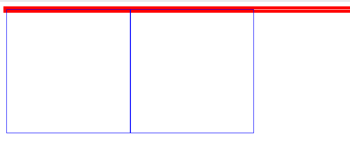
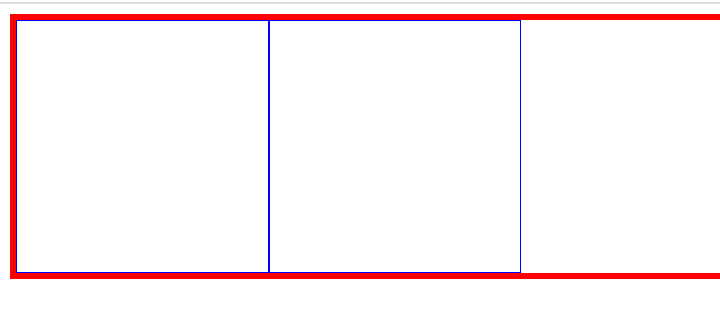

在写HTML和CSS时，如果一个父级元素内部的子元素是浮动的（float），那么常会发生父元素不能被子元素正常撑开的情况，代码如下所示：

HTML布局：

```
 <div class="father ">
 <div class="son"></div>
 <div class="son"></div>
 </div>
```
CSS布局：

```
.father{
 border:5px solid red;
}
.son{
 width: 200px;
 height: 200px;
 float:left;
 border:1px solid #00F;
}
```
如图所示：



为了解决这个问题在class类名,有以下几种解决方法。

* 添加以clear命名的class
* 在父容器里添加overflow:hidden样式
* 在父容器里添加overflow:auto样式
* 添加class以clearfix命名的after伪元素

拿最后一种举例：

```
.clearfix::after{
 content: "";
 display: block;
 clear: both;
}
.clearfix{
 zoom: 1; /\* IE 兼容\*/
 }
```

```
 <div class="father clearfix ">
 <div class="son"></div>
 <div class="son"></div>
 </div>
```
效果如图：



