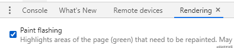

# 浏览器渲染原理

### 浏览器的渲染过程

* 根据HTML构建HTML树(DOM)
* 根据CSS构建CSS树(CSSOM)
* 将两棵树合成一个棵渲染树(render tree)
* Layout布局，包括文档流、盒模型、计算大小、位置等
* Paint绘制，包括边框颜色、文字颜色、阴影等
* Composite合成，根据层叠关系展示画面

### 三种跟新方式


第一种，全部执行 `div.remove()`触发当前小时，其他元素relayout(回流)

第二种，跳过layout 改变背景颜色，直接repaint(重绘)+composite

第三种，跳过layout和paint 改变transform，只需composite

在跟新样式的过程时，浏览器不一定按照上面的六个步骤执行。在更新样式的时候，会省略Layout或Paint这些步骤，可以通过Chrome中的开发者工具里的Rendering一栏中添加Paint flashing。通过高亮显示来突显重绘区域。



但由于每个属性所触发的流程并不知道，可以在[csstriggers.com](https://link.juejin.cn/?target=https%3A%2F%2Fcsstriggers.com) 这个网站中查找每个属性在相关浏览器下的触发流程。

# transform

### 四个常用功能

* 位移 `translate`
* 缩放 `scale` 
* 旋转 `rotate` 
* 倾斜 `skew`

一般都需要配合transition过渡，inline元素不支持transform，需要先变为block。四个功能可以组合使用

### translate

translateX(`<length-percentage>`) 水平方向移动元素(x轴)

translateY(`<length-percentage>`) 垂直方向移动元素(y轴)

translate(`<length-percentage>`,`<length-percentage>`) 垂直和水平方向移动(x和y轴)

translateZ(`<length-percentage>`) z轴重新定位元素，即靠近或远离观察者

父容器要设置perspective，设置观察者和z轴平面的距离，使得具有三维位置变化的元素产生透视效果

`translate3d(x,y,z)` x,y,z轴移动

### scale

`scale(x,y)` 2d缩放转换

`scale(x,y,z)` 3d 缩放转换

`scaleX(n)` 通过设置X轴的值来定义缩放转换

`scaleY(n)` 通过设置Y轴的值来定义缩放转换

`scaleZ(n)` 通过设置Z轴的值来定义缩放转换

### rotate

`rotate(deg)` 定义2D旋转 //单位为deg

`rotate3d(x,y,z,angle)` 定义3D旋转.x,y,z取值范围 0~1,是一个矢量值

`rotateX(deg)` 定义沿着X轴的3D旋转

`rotateY(deg)` 定义沿着Y轴的3D旋转

`rotateZ(deg)` 定义沿着Z轴的3D旋转

### skew

`skewX(angle)` 沿着X轴倾斜转换

`skewY(angle)` 沿着X轴倾斜转换

`skew(x,y`) 沿着X,Y轴2d倾斜转换

# transition

`transition`(过渡)的作用是补充中间帧的,属性是 `transition-property`，`transition-duration`，`transition-timing-function` 和 `transition-delay` 的一个简写属性。

* transition-property：指定应用过渡属性的名称。可以用all来代表所有属性。
* transition-duration：以秒或毫秒为单位指定过渡动画所需的时间。默认值为 0s,表示不出现过渡动画。
* transition-timing-function： 动画速度的曲线，可以取的值有ease(默认)、linear、ease-in、ease-out、ease-in-out、以及贝塞尔曲线等。
* transition-delay：动画的延迟时间，即就是多长时间后开始动画。注意：并不是所有的属性都能过渡。

**注意**

并不是所有的属性都能过渡

display:none=>block没法过渡,一般改为visibility:hidden=>visible

# animation

animation(动画)属性是 animation-name，animation-duration, animation-timing-function， animation-delay，animation-iteration-count，animation-direction，animation-fill-mode 和 animation-play-state 属性的一个简写属性形式

animation-name：动画的名称。

animation-duration：动画周期时长，同transition类似。

animation-timing-function：动画速度曲线，同transition类似。

animation-delay：延迟动画开始。

animation-iteration-count： 动画的运行次数，无限次(infinite)

animation-direction: 动画运动方向，常用的是alternate(交替)、reverse(反向)

animation-fill-mode：动画结束时的位置，forwards停到动画结束的位置。

animation-play-state： 定义一个动画运行(running)或者暂停(paused)

### @keyframes

使用@keyframes设置的动画名,在animation中作为动画名进行调用,包含每个阶段的动画样式.

* from to 写法

```css
@keyframes name {
from{
    动画开始的样式
  }
  to{
    动画结束的样式
  }
}
```
* 百分数写法

```css
@keyframes name {
  0%{
      动画开始的样式
    }
  50%{
      动画中间的样式
    }
  100%{
      动画结束的样式
  }
 }

```
# CSS动画优化

[**使用transform和opacity属性**](https://developers.google.com/web/fundamentals/performance/rendering/stick-to-compositor-only-properties-and-manage-layer-count#%E6%8F%90%E5%8D%87%E6%82%A8%E6%89%93%E7%AE%97%E8%AE%BE%E7%BD%AE%E5%8A%A8%E7%94%BB%E7%9A%84%E5%85%83%E7%B4%A0)来更改实现动画，上述方法不会在合成层引发重绘和回流

**利用GPU加速**，以下属性会获得GPU加速

`opacity/translate/rotate/scale`

**JS优化**使用`requestAnimationFrame`代替`setTimeout`或`setInterval`，`requestAnimationFrame`会把所有动画放到浏览器重绘周期内，避免单线程的JS环境的影响

**CSS优化**使用`will-change`或`translate`创建合成层，将动画放在一个独立图层，避免动画效果影响其他渲染层的元素

