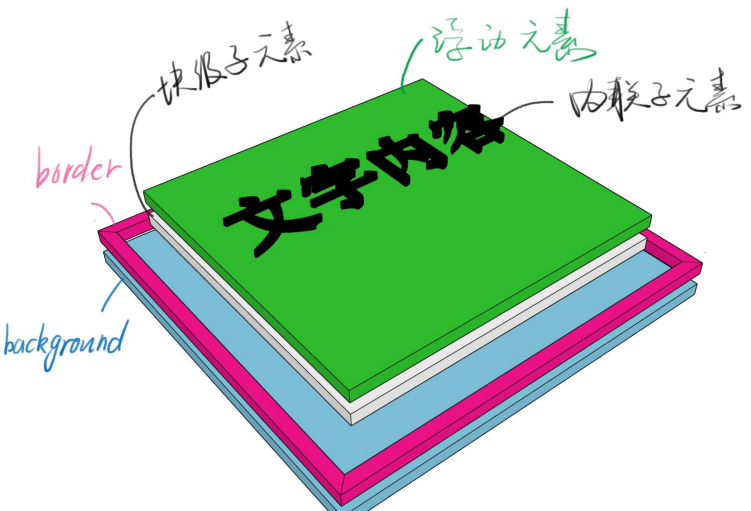

关于一个div的分层,背景的范围是border外边沿围成的区域,浮动元素是脱离文档流的,稍微浮起来点.



### postion

* static 默认值,待在文档流里
* relative 相对定位,升起来,但不脱离文档流,还处于文档流里,还是有位置的.
* 使用场景:用于位移,用于给absolute元素当爸爸
* 配合z-index

z-index:auto默认值，不创建新层叠上下文——计算出来值为0,0和auto不一样，
z-index：-2/-1/0/1/2
使用场景需要看情况
负z-index逃不出小世界

* absolute 绝对定位,定位的基准是祖先里的非static
* 使用场景

脱离原来的位置，另起一层,或鼠标提示

* 配合z-index
* 经验

absolute是相对祖先元素中第一个定位元素定位的,需要写top/left，不然会位置错乱

善用left:100%

善用left:50%;加负margin用于居中

* fixed 固定定位,定位基准是viewport
* 使用场景

烦人广告

回到顶部按钮

* 配合z-index
* 经验

手机上尽量不要使用这个属性

* sticky 粘滞定位 根据文档流进行定位,然后相对它的最近滚动组件/块级祖先,基于top,left,bottom,right进行偏移

white-space:nowrap; 用于处理元素中空白

### 层叠上下文

每个层叠上下文就是一个新的小世界(作用域)

这个小世界里面的z-index跟外界无关

处于同一个小世界的z-index才能比较

**可以通过不正交的属性创建它**

z-index/flex/opacity(控制的是整个内容)/transform

负z-index也逃不出小世界,如下面例子,此时container的z-index为默认值auto,demo在container的背景下面,这个时候还不是层叠上下文,给添加不正交的属性来使得demo显示在container的背景上.

```
<!doctype html>
<html lang="en">
<head></head>
<body>
<div class="container">
  <div class="demo">
  </div>
</div>
</body>
</html>
<style>
    .container {
        border: 1px black solid;
        width: 200px;
        height: 200px;
        position: relative;
        background: rgba(255,255,0,0.5);
    		//z-index:0;
    }
    .demo{
        position: absolute;
        width: 100px;
        height: 100px;
        background: royalblue;
        z-index:-1;
    }
</style>
```
