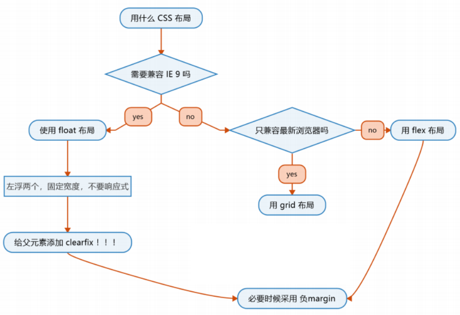

将页面划分，按左中右、上中下等排列

### 布局分类

* 固定宽度布局

一般宽度为960/1000/1024px

* 不固定宽度布局

主要靠文档流的原理来布局

* 响应式布局

PC上固定宽度，手机上不固定宽度，算混合布局

### 布局思路

* 从大到小 先顶下大局，然后完善每个部分的小布局
* 从小到大 先完成小布局，然后组合完成大布局

### 一图流

前端戒律根据一图流，必须先给设计稿即pc和手机端，如何快速切换用@media媒体查询



### Float布局

**步骤**

子元素上添加float:left和width

父元素上必须要加clearfix来清除浮动

**经验**

一般用于IE，需要计算宽度，不灵活，可以留点空间自动扩展(max-width)或最后一个不设width

由于IE6/7存在双倍marigin bug，解决办法将margin减半在添加display:inline-block

`margin:0 auto`居中使用这种方法更为好`margin-left:auto;margin-right:auto`

### Flex布局

flex布局(一维布局)，将元素变成flex容器

`display:flex` 弹性盒

`display:inline-flex` 行内弹性盒

flex container的样式

多行内容

**align-content**

* flex-start
* flex-end
* center
* stretch 均匀分布
* space-between
* space-around

次轴对齐(默认纵轴)

**align-items**

* stretch
* flex-start
* flex-end
* center
* baseline

主轴对齐方式(默认横轴)

**justify-content**

* flex-start
* flex-end
* center
* space-between
* space-around
* space-evenly

改变折行

**flex-wrap**

* nowrap
* wrap
* wrap-reverse

改变items流动方向(主轴)

**flex-direction**

* row
* row-reverse
* column
* column-reverse

flex item的属性

item上面可以加**order**，元素按照order属性顺序来布局，默认为0。

item:first-child 第一个元素

item:nth-child() 第n个元素

item:last-child 最后一个元素

[**flex**](https://developer.mozilla.org/zh-CN/docs/Web/CSS/flex)**为flex-grow、flex-shrink、flex-basis的缩写**

**flex-grow**

指定了flex容器中剩余空间的多少应该分配给项目，控制自己如何长胖
**设定项目应该为多大**，**默认值0负值无效**

**flex-shrink**

空间不够时使用，**控制如何变瘦**
flex 元素的收缩规则：一般写**flex-shrink:0防止变瘦，默认是1**

**flex-basis**

**控制基准宽度相当于width**
指定了 flex 元素在主轴方向上的初始大小，**默认值为auto****align-self**

用于定制align-items，如果某个item特立独行
align-self属性不适用于块类型的盒模型和表格单元。如果任何 flexbox 元素的侧轴方向 margin 值设置为 auto，则会忽略 align-self。

### [Flex 小游戏](https://flexboxfroggy.com/)

### Grid布局

Grid布局(二维布局),适合不规则布局

Grid布局 变为container

`display:grid | inline-grid`

**grid-template-colums** 定义每列的列宽

**grid-template-rows** 定义每行的行高

**grid-template-areas** 网格布局允许指定区域

```
grid-template-areas: 'a a a'
                     'b b b'
                     'c c c';
//有些区域用不到用 . 代替
grid-template-areas: 'a . c'
                     'd . f'
                     'g . i';
```
**grid-column-gap** 列与列之间的间隔

**grid-row-gap** 行与行之间的间隔

**grid-gap** 是**grid-row-gap grid-column-gap**的合并

```
grid-gap: <grid-row-gap> <grid-column-gap>;
```
**repeat(length,percentage)**

解决重复写值,下面例子容器为3\*3的布局。length重复次数，percentage重复的值

```
.container {
  display: grid;
  grid-template-columns: repeat(3, 33.33%);
  grid-template-rows: repeat(3, 33.33%);
}
```
**auto-fill** 关键字，由于容器大小不确定，但单元格大小固定，为了容纳更多的单元格，可使用auto-fill

```
.container {
  display: grid;
  grid-template-columns: repeat(auto-fill, 100px);
}
```
**fr** 关键字 fraction片段，划分几分

**auto** 由浏览器自己决定长度

```
.container {
  display: grid;
  grid-template-columns: 1fr auto 2fr;
}
```
**span** 关键字，表示跨越，即左右边框（上下边框）之间跨越多少个网格。

**order** 关键字，默认情况下所有网格项order都是0顺序可以被设置为正数或负数和z-index一样

还可以给每条线取名字

```
.container{
	grid-template-rows:[row1-start] 25% [row1-end] 100px [third-lin] auto [last-line]
  grid-template-columns: [first] 40px [line2] 50px [line3] auot [col4-start] 50px [five] 40px [end]
}
```
**grid-area** 指定目标放在那个区域，还可以作为grid-row-start、grid-column-start、grid-row-end、grid-column-end的合并简写形式，直接指定项目的位置。

* grid-column-start属性：左边框所在的垂直网格线
* grid-column-end属性：右边框所在的垂直网格线
* grid-row-start属性：上边框所在的水平网格线
* grid-row-end属性：下边框所在的水平网格线

```
.item-1 {
  grid-column-start: 2;
  grid-column-end: 4;
}
//该项目左边框从第二根垂直网格线开始，右边框是第四根垂直网格线
```
**grid-template** 为grid-template-columns、grid-template-rows和grid-template-areas这三个属性的合并简写形式。

```
/* 为 grid-template-areas grid-template-rows / grid-template-column */
grid-template:
            "a a a" 40px
            "b c c" 40px
            "b c c" 40px / 1fr 1fr 1fr;
```
[Grid Garden小游戏](https://cssgridgarden.com/#zh-cn)

