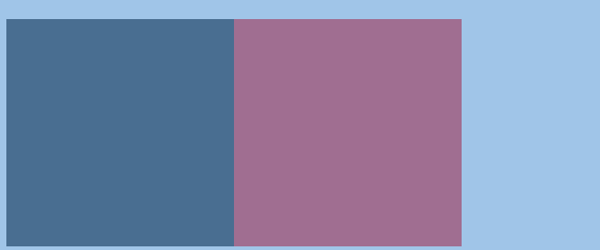
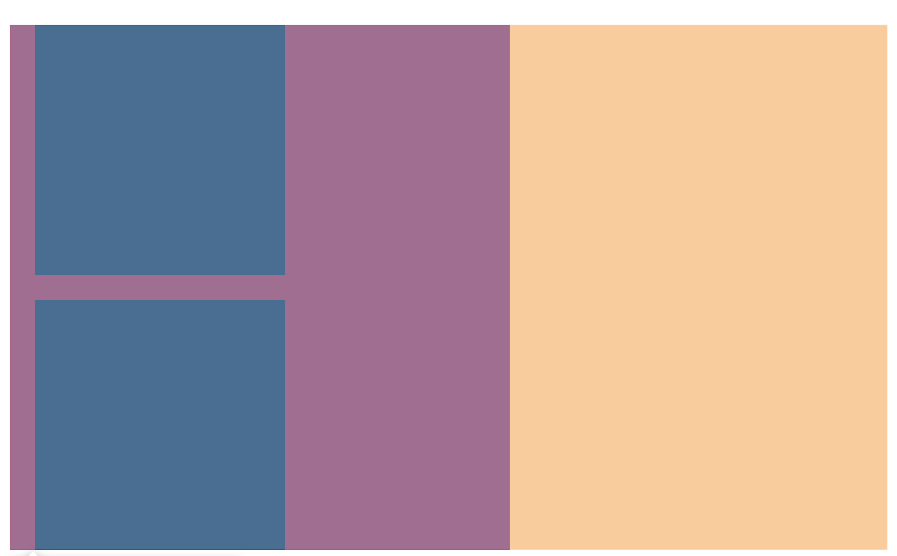

盒模型(box model)是CSS中的一个重要概念。

#

# content-box（默认）

叫**标准模式盒模型**

内容就是盒子边界

即`width`指定的是`content`区域宽度，而不是实际宽度，公式为

实际宽度 = **witdh + padding + border**

[content-box案例](http://js.jirengu.com/buvoguxusi/2/)

border-box

叫**怪异模式盒模型**

边框就是盒子边界，布局所占宽度Width：

即`width`指定的是左右边框外侧的距离

 实际宽度 = **witdh**

[border-box案例](http://js.jirengu.com/buvoguxusi/2)

# Margin合并

### 合并的情况

#### 父子 margin 合并

HTML代码：

```
<div class="father ">
   <div class="son"></div>
</div>
```
CSS代码：

```
.father {
    background: red;
    width: 400px;
    margin-top: 20px
}
.son {
    width: 200px;
    height: 200px;
    margin-top: 20px;
    background: black;
}
```
效果如图所示：



#### 兄弟 margin 合并

HTML代码：

```
  <div class="father ">
        <div class="son"></div>
        <div class="son"></div>
    </div>
```
CSS代码：

```
.father {
    background: red;
    width: 600px;
}

.son {
    width: 200px;
    height: 200px;
    margin: 20px;
    background: black;
}
```
效果如图所示：



#### 阻止合并：

* 父子合并用 padding / border 挡住
* 父子合并用 overflow: hidden 挡住
* 父子合并用  display: flex
* 兄弟合并可以用 添加inline-block 消除
* enable-margin-callaspe:false/ture 单独控制合并
