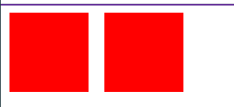

### 为什么会有BFC？

如父元素内有个子元素设置浮动后，父元素的高度没有了。示例如下:



### 解决办法BFC：

BFC=Blok Formatting context(格式化上下文)，块盒子的布局过程发生的区域，也是浮动元素与其他元素交互的区域。即浮动,绝对定位元素,非块盒的块容器(inline-block,table-cells,table-captions)和'overflow'不为'visible'的块盒会为它们的内容建立一个新的格式化上下文.

格式化上下文中,盒在在竖直方向一个个放置,兄弟盒之间的竖直距离由'marigin'属性决定,但是**同一个格式化上下文中的相邻块级盒子键值的竖直margin会合并**,示例如下:

```
 <body>
 <div class="father">
  <div class="son"></div>
  <div class="son"></div>
</div>
</body>
<style>
.father{
    border:1px solid rebeccapurple;
    display: flow-root;
    width: 200px;
}
.son{
    margin:10px;
    width: 100px;
    height: 100px;
    background: red;
}
</style>
```
###

### 创建格式化上下文

* 根元素（`<html>）`
* 浮动元素（元素的 `float` 不是 `none`）
* 绝对定位元素（元素的 `position` 为 `absolute` 或 `fixed`
* 行内块元素（元素的 `display` 为 `inline-block)`
* 表格单元格（元素的 `[display](https://developer.mozilla.org/zh-CN/docs/Web/CSS/display)` 为 `table-cell`，HTML表格单元格默认为该值）
* 表格标题（元素的 `[display](https://developer.mozilla.org/zh-CN/docs/Web/CSS/display)` 为 `table-caption`，HTML表格标题默认为该值）
* 匿名表格单元格元素（元素的 `[display](https://developer.mozilla.org/zh-CN/docs/Web/CSS/display)` 为 `table、``table-row`、 `table-row-group、``table-header-group、``table-footer-group`（分别是HTML table、row、tbody、thead、tfoot 的默认属性）或 `inline-table`）
* `overflow` 计算值(Computed)不为 `visible` 的块元素
* `[display](https://developer.mozilla.org/zh-CN/docs/Web/CSS/display)` 值为 `[flow-root](https://drafts.csswg.org/css-display/#valdef-display-flow-root)` 的元素

由于css样式不正交,会带来很多负面的效果,`display:flow-root`的作用就单单创建格式化上下文,新属性浏览

器不一定支持

* `[contain](https://developer.mozilla.org/zh-CN/docs/Web/CSS/contain)` 值为 `layout`、`content`或 paint 的元素
* 弹性元素（`display` 为 `flex` 或 `inline-flex`元素的直接子元素）
* 网格元素（`[display](https://developer.mozilla.org/zh-CN/docs/Web/CSS/display)` 为 `grid` 或 `inline-grid` 元素的直接子元素）
* 多列容器（元素的 `[column-count](https://developer.mozilla.org/zh-CN/docs/Web/CSS/column-count)` 或 `[column-width](https://developer.mozilla.org/en-US/docs/Web/CSS/column-width)`[(en-US)](https://developer.mozilla.org/en-US/docs/Web/CSS/column-width) 不为 `auto，包括``column-count` 为 `1`）
* `column-span` 为 `all` 的元素始终会创建一个新的BFC，即使该元素没有包裹在一个多列容器中（[标准变更](https://github.com/w3c/csswg-drafts/commit/a8634b96900279916bd6c505fda88dda71d8ec51)，[Chrome bug](https://bugs.chromium.org/p/chromium/issues/detail?id=709362)）。

### float+div左右自适应布局

```
<body>
  <div class="left">left</div>
  <div class="right">right</div>
</body>
<style>
.left{
    width: 100px;
    border:1px solid red;
    height: 200px;
    float: left;
}
.right{
    height: 200px;
    border: 3px solid green;
    overflow: auto;
}
</style>
```


