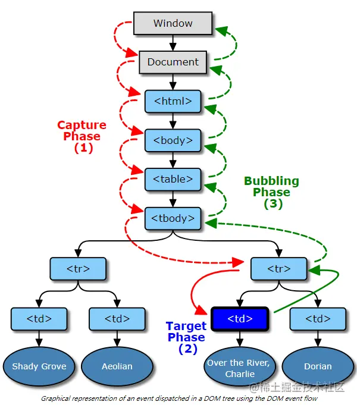

DOM文档对象模型，是以根元素开头展开成一颗树，描述了处理网页内容的方法和接口。
当用户或浏览器自己执行的某种动作即为事件。

例如点击(click)按钮，通过点击按钮触发这个事件，但到底页面上会有那些元素会触发这个事件呢？是这个按钮，还是按钮的父元素也会触发这个点击事件呢？还是都触发？

这就与事件流有关联了，上述示例的描述即事件的触发顺序，这得看是那种类型的事件流。

# 事件流

* 事件捕获(从外向内找监听函数)
事件冒泡是IE的事件流，事件是由最具体的元素接收，然后逐级向上传播，在每一级的节点上都会发生，直到传播到document对象。(Chrome浏览器会冒泡到window对象)
* 事件冒泡(从内向外找监听函数)
事件捕获是Netscape浏览器开发团队提出的，他们思想和IE的截然相反。也就是说，从不具体的节点到最具体的节点，一般是从document对象开始传播。

# DOM事件流模型

2020年，W3C发布标准，文档名为DOM Level 2 Events Specification,规定浏览器同时支持两种调用顺序，首先事件捕获，然后事件冒泡，有监听函数就调用。

* 捕获阶段——事件从Document节点自上而下向目标节点传播的阶段
* 目标阶段——真正的目标节点正在处理事件的阶段
* 冒泡阶段——事件从目标节点自下而上向Document节点传播的阶段

特例：只有一个div被监听(不用考虑父子同时被监听)，fn分别在捕获阶段和冒泡阶段监听click事件，如下所示。

```
//f1函数打印出f1，f2函数打印出f2
div.addEventLisenter('click',f1)
div.addEventLisenter('click',f2,true)
```

结果是f1先执行，f2后执行，若两行调换位置，则f2先执行，f1后执行，但这样理解是错的，是**由谁先监听谁先来执行的**。

## **完整DOM事件模型示意图:**



# DOM事件级别

DOM级别一共可以分为四个级别：DOM0级、DOM1级、DOM2级和DOM3级。而DOM事件分为3个级别：DOM 0级事件处理，DOM 2级事件处理和DOM 3级事件处理。由于DOM 1级中没有事件的相关内容，所以没有DOM 1级事件。

## 1. DOM 0级事件

DOM0级事件就是将一个函数赋值给一个事件处理属性，如下所示。缺点是在于一个处理程序无法同时绑定多个处理函数。

```
<button id="btn" type="button"></button>

<script>
  var btn = document.getElementById('btn');

  btn.onclick = function() {
    alert('Hello World');
  }

  // btn.onclick = null; 解绑事件
</script>
```
## 2. DOM 2级事件

DOM2级事件在DOM0级事件的基础上弥补了一个处理程序无法同时绑定多个处理函数的缺点，允许给一个处理程序添加多个处理函数，如下所示。

```
<button id="btn" type="button"></button>

<script>
  var btn = document.getElementById('btn');

  function showFn() {
    alert('Hello World');
  }

  btn.addEventListener('click', showFn, false);

  // btn.removeEventListener('click', showFn, false); 解绑事件
</script>
```

DOM2级事件定义了`addEventListener`和`removeEventListener`两个方法，分别用来绑定和解绑事件。

```
addEventListener(event-name, callback, useCapture)
//event-name: 事件名称
//callback:回调函数
//useCapture:默认值为flase，事件在冒泡阶段执行；true，事件在捕获阶段执行
```

IE浏览器不支持`addEventListener()`和`removeEventListener()`，使用`attachEvent()`与`detachEvent()` 代替，它是不支持事件捕获，所以没有第三个参数。

```
btn.attachEvent('onclick', showFn); // 绑定事件
btn.detachEvent('onclick', showFn); // 解绑事件
```
## 3. DOM 3级事件

DOM 3级事件在DOM 2级事件的基础上添加了更多的事件类型。

* UI事件，当用户与页面上的元素交互时触发，如：`load`、`scroll`
* 焦点事件，当元素获得或失去焦点时触发，如：`blur`、`focus`
* 鼠标事件，当用户通过鼠标在页面执行操作时触发如：`dblclick`、`mouseup`
* 滚轮事件，当使用鼠标滚轮或类似设备时触发，如：`mousewheel`
* 文本事件，当在文档中输入文本时触发，如：`textInput`
* 键盘事件，当用户通过键盘在页面上执行操作时触发，如：`keydown`、`keypress`
* 合成事件，当为IME（输入法编辑器）输入字符时触发，如：`compositionstart`
* 变动事件，当底层DOM结构发生变化时触发，如：`DOMsubtreeModified`
* 同时DOM3级事件也允许使用者自定义一些事件。

# 其他内容

## 取消冒泡

捕获不可以取消，但冒泡可以。

* `e.stopPropagation()`可以中断冒泡
* `e.preventDefault()`可以阻止默认事件

什么是默认事件呢？例如表单一点击提交按钮(submit)跳转页面、a标签默认页面跳转或是瞄点定位等。但有些事件不能阻止默认动作。

事件的特性有Bubbles表示冒泡，Cancelable表示是否支持开发者取消默认事件。可以通过查找知道每个事件的特性。

例子：阻止滚动。scroll事件是不可阻止默认事件，阻止scoll默认动作没有用，因为先有滚动才有滚动事件，可以阻止wheel和touchstart的默认动作，但滚动条还是可以用鼠标操作，可以使CSS让滚动条width:0;或者使用overflow:hidden直接取消滚动条。

