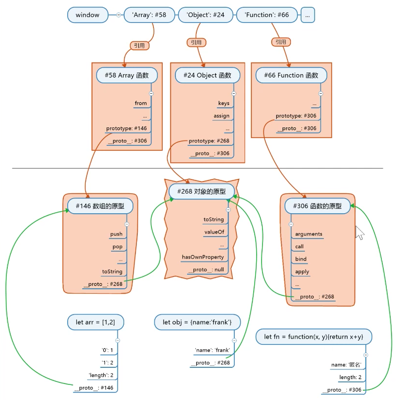

JavaScript 常被描述为一种基于原型的语言 (prototype-based language)——每个对象拥有一个**原型对象**，对象以**其原型为模板、从原型继承方法和属性**。原型对象也可能**拥有原型**，并从中**继承方法和属性**，一层一层、以此类推。这种关系常被称为**原型链** (prototype chain)，它解释了为何一个对象会拥有定义在其他对象中的属性和方法。

### 基本知识

* 所有对象都有原型，原型也是一个对象，原型对象里存着以它为原型的对象的共有属性，即**原型是这些对象的共有属性组成的对象**，是**对象的根**。
* 所有对象都有一个**隐藏属性(proto)**，这个隐藏属性都存着**一个地址**，指向这个**对象的原型(prototype)**。

### 构造函数

* 可以**构造出对象**的**函数**叫**构造函数**。
* 每个函数**都有prototype属性**,每个prototype**都有constructor属性**。
* 如果一个对象不是函数，那么这个对象一般来说没有prototype 属性。
* 所有函数对象的构造函数都是Function。
* 构造函数new X()总共做了**四件事**：
+ 自动创建空对象。
+ 自动为空对象关联原型，原型地址指定为X.prototype。
+ 自动将空对象作为**this关键字**运行构造函数。
+ 自动return this。

### JS世界

**JS世界的构造顺序：**

1. 创建根对象#268(toString)，根对象没有名字，原型\_\_proto\_\_为null
2. 创建函数的原型#306(call/apply)，原型\_\_proto\_\_为#268
3. 创建数组的原型#146(push/prop)，原型\_\_proto\_\_为#268
4. 创建Function#66，原型为\_\_proto\_\_#306
5. 让Function.prototype等于#306(有名字了)
6. 此时发现Function的\_\_proto\_\_和prototype都是#208，此时可以得出`Function.\_\_proto\_\_ === Function.prototype`
7. 用Function创建Object(实际没有名字)
8. 让Object.prototype等于#268(有名字了)
9. 用Function创建Array(实际没有名字)
10. 让Array.prototype等于#146(有名字了)
11. 创建window对象(不属于JS世界)
12. 用window的"Object"、"Array"属性将步骤7和9中的函数命名
13. 记住一点，JS创建一个对象时，不会给这个对象名字的(11步之前都没有名字)

**如下图所示：**

如果用`new Object()`创建obj，new会将obj的原型\_\_proto\_\_设置为`Object.prototype`，也就是#268。

如果用`new Array()`创建arr，new会将arr的原型\_\_proto\_\_设置为`Array.prototype`，也就是#146。

如果用`new Function()`创建fn，new会将fn的原型\_\_proto\_\_设置为`Function.prototype`，也就是#306。

若是要自己定义构造函数Person，函数里给this加属性，然后Person自动创建prototype属性和对应的对象#xxx，

在Person.prototype #xxx上面加属性，用new Person()创建对象p，new会将p的原型\_\_p设为#xxx。

### prototype和\_\_proto\_\_([[Prototype]])区别是什么

都存着原型的地址，只不过prototype挂在函数的上，\_\_proto\_\_([[Prototype]])挂在每个新生成的对象上。

### 总结

* JS公式：`对象.__proto__ === 其构造函数.prototype`
* 根公理：`Object.prototype`是所有对象的(直接或间接)原型

即 `Object.prototype.__proto__ === null`

* 函数公理： 所有函数都是由Function构造的

`任何函数. \_\_proto\_\_ === Function.prototype` 任何函数有Object/Array/Function。

