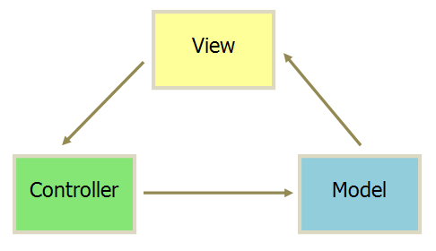
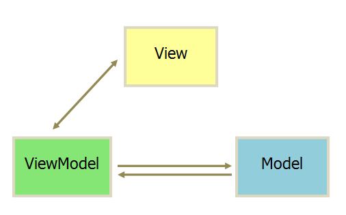

### MVC

* 视图(View):用户界面
* 控制器(Controller):业务逻辑
* 模型(Model):数据保存

各部分通信方式：

1. View传送指令到Controller
2. Controller完成业务逻辑后，要求Model改变状态
3. Model将新的数据发送到View，用户得到反馈

### MVVM

* 视图(View):用户界面
* 视图模型(ViewModel):暴露公共属性和命令的视图抽象，通过绑定器在视图和数据绑定器之间进行通信
* 模型(Model):数据保存

采用**双向绑定**:View的变动，自动反映在ViewModel，反之亦然。

