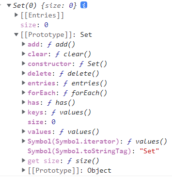

## Set

Set本身是一个构造函数，用于生成Set数据结构（类似于数组，但每个个元素都是唯一，无重复值）。

Set的原型上继承了很多方法和属性，如下图所示。



向Set加入值的时候，不会发生类型转换（字符串和数值）。Set内部判断两个值是否不同，是采用类似于"==="相等运算符的算法。只有一个特例，Set加入值时候认为NaN等于自身，但精确相等运算符NaN不等于自身。

```js
NaN === NaN //fasle
let set = new Set();
let a = NaN;
let b = NaN;
set.add(a);
set.add(b);
set // Set {NaN}
```
`Array.from`可以将Set结构转变为数组。

```js
const items = new Set([1, 2, 3, 4, 5]);
const array = Array.from(items);
// Array.from 数组去重方法
function dedupe(array) {
	return Array.from(new Set(array));
}
// 扩展操作符
function dedupe(array){
	return [...new Set(array)]
}
```
#### 属性

* `Set.prototype.constructor`：构造函数，默认就是Set函数。
* `Set.prototype.size`：返回Set实例的成员总数。

#### 方法

* 操作方法
+ `Set.prototype.add(value)`：添加某个值，返回 Set 结构本身。
+ `Set.prototype.delete(value)`：删除某个值，返回一个布尔值，表示删除是否成功。
+ `Set.prototype.has(value)`：返回一个布尔值，表示该值是否为Set的成员。
+ `Set.prototype.clear()`：清除所有成员，没有返回值。
* 遍历方法
+ `Set.prototype.keys()`：返回键名的遍历器
+ `Set.prototype.values()`：返回键值的遍历器
+ `Set.prototype.entries()`：返回键值对的遍历器
+ `Set.prototype.forEach()`：使用回调函数遍历每个成员

#### Set实现并集(Union)、交集(Intersect)、差集(Difference)

```js
let a = new Set([1,2,3])
let b = new Set([4,3,2])
//并集
let union = new Set([...a,...b])
// Set {1,2,3,4}
//交集
let intersect = new Set([...a].filter(x=>b.has(x)))
// Set {2,3}
//差集
let diff = new Set([...a].filter(x=>!b.has(x)))
// Set {1}
```
## Map

Map数据结构类似于对象，也是键值对的集合(Hash结构)，"键"的范围不限于字符串，各种类型的值(包括对象)。

Map可以接受一个数组作为参数。该数组的成员是一个个表示键值对的数组。

```js
const map = new Map([
  ['name','张三'],
  ['title','Author']
])
//实际执行如下
const items = [
  ['name','张三'],
  ['title','Author']
];
const map = new Map();
items.forEach(([key,value])=> map.set(key,value));
```
Map的键实际上跟内存地址绑定的，只要内存地址不一样就视为两个键。简单类型的值（数字、字符串、布尔值）,只要两个值严格相等，Map就视为一个键。（NaN不严格等于自身，但Map将其视为同一个键）

```js
let map = new Map();

map.set(-0, 123);
map.get(+0) // 123

map.set(true, 1);
map.set('true', 2);
map.get(true) // 1

map.set(undefined, 3);
map.set(null, 4);
map.get(undefined) // 3

map.set(NaN, 123);
map.get(NaN) // 123
```
#### 属性

* `Map.prototype.constructor`：构造函数，默认就是Map函数。
* `Map.prototype.size`：返回Map实例的成员总数。

#### 方法

* 操作方法
+ `Map.prototype.set(key, value)` ：set方法设置键名key对应的键值为value，然后返回整个 Map 结构。如果key已经有值，则键值会被更新，否则就新生成该键。可以采用链式写法。
+ `Map.prototype.get(key)`：get方法读取key对应的键值，如果找不到key，返回undefined。
+ `Map.prototype.has(key)`:has方法返回一个布尔值，表示某个键是否在当前 Map 对象之中。
+ `Map.prototype.delete(key)`:delete方法删除某个键，返回true。如果删除失败，返回false。
+ `Map.prototype.clear()`:clear方法清除所有成员，没有返回值。
* 遍历方法
+ `Map.prototype.keys()`：返回键名的遍历器。
+ `Map.prototype.values()`：返回键值的遍历器。
+ `Map.prototype.entries()`：返回所有成员的遍历器。
+ `Map.prototype.forEach()`：遍历 Map 的所有成员。

#### 其他数据结构的互相转换

1. Map 转为 数组

```js
let x = new Map()
.set(1,'1')
.set({obj:'name'},true)
[...x]
//[	[1,'1'],[{obj:'name'},true]]
```
2. 数组 转为 Map

```js
new Map([
	[1,'1'],
  [{obj:'name'},true]
])
```
3. Map 转为对象

如果Map的键都是字符串，它可以无损转为对象，如果有非字符串的键名就转为字符串。

```js
function strMapToObj(strMap){
	let obj = Object.create(null)
  for(let [k,v] of strMap){
  	obj[k] = v
  }
  return obj
}
let x = new Map()
.set(1,'1')
.set({obj:'name'},true)
strMapToObj(x)
```
4. 对象 转为 Map

```js
let obj = {"a":1,"b":2}
let map = new Map(Object.entries(obj))
function objToStrMap(obj){
	let strMap = new Map();
  for (let k of Object.keys(obj)) {
    strMap.set(k, obj[k]);
  }
  return strMap;
}
objToStrMap({yes: true, no: false})
// Map {"yes" => true, "no" => false}
```
5. Map 转为 JSON

```js
//Map键名为字符串
function strMapToJson(strMap) {
  return JSON.stringify(strMapToObj(strMap));
}

let myMap = new Map().set('yes', true).set('no', false);
strMapToJson(myMap)
// '{"yes":true,"no":false}'
//Map键名为非字符串
function mapToArrayJson(map) {
  return JSON.stringify([...map]);
}

let myMap = new Map().set(true, 7).set({foo: 3}, ['abc']);
mapToArrayJson(myMap)
// '[[true,7],[{"foo":3},["abc"]]]'
```
6. JSON 转为 Map

```js
function jsonToStrMap(jsonStr) {
  return objToStrMap(JSON.parse(jsonStr));
}

jsonToStrMap('{"yes": true, "no": false}')
// Map {'yes' => true, 'no' => false}
```
