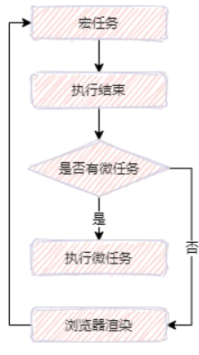
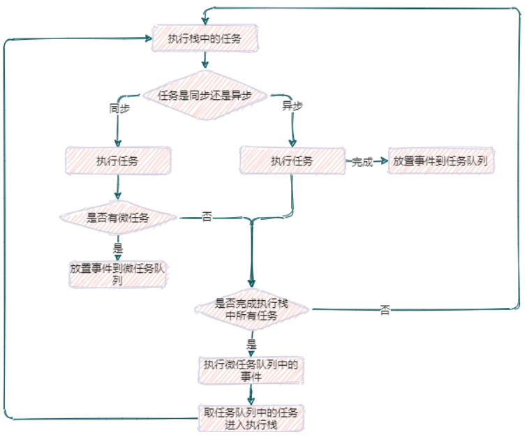

## 事件循环机制

1. JS是单线程的，为了防止阻塞，把代码（任务）分成了同步任务和异步任务
2. 同步代码首先由推入执行栈执行，宏任务代码交给宿主环境（浏览器或者Node）等待时机成熟送入宏任务队列，微任务由JS引擎发起送入微任务队列
3. 当第一次执行栈执行完毕，JS引擎（主线程）回去微任务队列看是否有任务，有就推入执行栈执行，微任务队列执行完毕后就再去宏任务队列查找，反复循环执行，这个过程是事件循环。
1. **同步任务**

指主线程上的排队执行的任务，只有前一个任务执行完毕后，才能执行后一个任务。

2. **异步任务**

指不进入主线程，等到某个异步任务可以执行了，该任务进入主线程执行

总结：JavaScript是单线程的，主线程上同步任务顺序执行，触发异步任务，将其加入到主线程来执行。

**异步执行运行机制**

1. 执行同步任务，创建执行上下文，按顺序进入执行栈（execution context stack）
2. 对于异步任务，由于主线程外存在一个"任务队列"，当异步任务完成后，在任务队列中添加一个任务事件。其他线程执行具体的异步操作（因为浏览器内核是多线程的）
3. 等待执行栈为空后，执行任务队列中的任务
4. 重复以上步骤

任务队列中分别为宏任务和微任务。

## 宏任务macrotask

宏任务指每次执行栈执行的代码。而宏任务包括：`script(整体代码)`、`setTimeout`、`setInterval`、`setImmediate`、`I/O` 、`UI rendering`、UI交互事件等

## 微任务microtask

微任务指当前执行栈中的任务执行结束后立即执行的任务。微任务包括：`MutationObserver`、`Promise.then()`或`reject()`、`Promise`为基础开发的其它技术，比如`fetch API`、`V8`的垃圾回收过程、Node独有的`process.nextTick`

运行机制如下图所示：



## Event Loop

Event Loop是实现异步的一种机制，类似于一个while(true)的循环，每执行一次循环体的过程就是查看是否有事件待处理。



注意⚠️：在**所有任务开始的时候**，由于宏任务中包括了`script`，所以浏览器会**先执行一个宏任务**，在这个过程中你看到的延迟任务(例如`setTimeout`)将被**放到下一轮宏任务**中来执行。

## 例题

### 题目一

```
const promise1 = new Promise((resolve, reject) => {
  console.log('promise1')
})
promise1.then(() => {
  console.log(3);
});
console.log('1', promise1);

const fn = () => (new Promise((resolve, reject) => {
  console.log(2);
  resolve('success')
}))
fn().then(res => {
  console.log(res)
})
console.log('start')
// promise1
// 1 Promise{<pending>}
// 2
// start
// success
```
* 从上至下，先遇到`new Promise`，执行该构造函数中的代码`promise1`
* 然后执行同步代码1，此时`promise1`没有被`resolve`或者`reject`，因此状态还是`pending`；
* 然后执行到`fn()`函数，进入`fn`中，打印2；
* 碰到`resolve`函数, 将`promise`的状态改变为`resolved`, 并将结果保存下来；
* 碰到`fn().then`这个微任务，将它放入微任务队列;
* 继续顺序执行，打印`start`；
* 当前宏任务执行完毕，检查微任务队列，发现有`promise.then`,则打印`success`。

### 题目二

```
Promise.resolve().then(() => {
  console.log('promise1');
  const timer2 = setTimeout(() => {
    console.log('timer2')
  }, 0)
});
const timer1 = setTimeout(() => {
  console.log('timer1')
  Promise.resolve().then(() => {
    console.log('promise2')
  })
}, 0)
console.log('start');
// start
// promise1
// timer1
// promise2
// timer2
```
### 题目三

```
const promise1 = new Promise((resolve, reject) => {
  setTimeout(() => {
    resolve("success");
    console.log("timer1");
  }, 1000);
  console.log("promise1里的内容");
});
const promise2 = promise1.then(() => {
  throw new Error("error!!!");
});
console.log("promise1", promise1);
console.log("promise2", promise2);
setTimeout(() => {
  console.log("timer2");
  console.log("promise1", promise1);
  console.log("promise2", promise2);
}, 2000);
// promise1里的内容
// promise1 Promise {<pending>}
// promise2 Promise {<pending>}
// timer1
// timer2
// promise1 Promise {<fulfilled>: 'success'}
// promise2 Promise {<rejected>: Error: error!!!
    at <anonymous>:9:9}
```
### 题目四

```
async function async1() {
  console.log("1");
  await async2();
  console.log("4");
  setTimeout(() => {
    console.log('7')
  }, 0)
}
async function async2() {
  setTimeout(() => {
    console.log('5')
  }, 0)
  console.log("2");
}
async1();
setTimeout(() => {
  console.log('6')
}, 0)
console.log("3")
// 将async await 转换为Promise 代码如下所示
function async1() {
    console.log("1");
    new Promise(resolve =>{
        setTimeout(() =>{
            console.log('6')
        },
        0) console.log("2");
        resolve()
    }).then(res =>{
        console.log("4");
        setTimeout(() =>{
            console.log('7')
        },
        0)
    })
}

async1();
setTimeout(() =>{
    console.log('5')
},
0) console.log("3")
```
### 题目五

```
async function async1() {
    console.log('async1 start', 2);
    await new Promise(resolve = >{
        console.log('promise1', 3) resolve('promise1 resolve')
    }).then(res = >console.log(res, 5)) console.log('async1 success', 6);
    return 'async1 end'
}
console.log('srcipt start', 1)
async1().then(res = >console.log(res, 7))
console.log('srcipt end', 4)
```
### 总结

1. `Promise`的状态一经改变就不能再改变。
2. `.then`和`.catch`都会返回一个**新**的`Promise`。
3. `.catch`不管被连接到哪里，都能捕获上层的错误。
4. 在`Promise`中，返回任意一个非`promise`的值都会被包裹成`promise`对象，例如`return 2`会被包装为`return Promise.resolve(2)`。
5. `Promise`的`.then`或者`.catch`可以被调用多次, 当如果`Promise`内部的状态**一经改变**，并且有了一个值，那么后续每次调用`.then`或者`.catch`的时候都会直接拿到该值。
6. `.then`或者`.catch`中`return`一个`error`对象并不会抛出错误，所以不会被后续的`.catch`捕获。
7. `.then`或`.catch`返回的值不能是`promise`本身，否则会造成死循环。
8. `.then`或者`.catch`的参数期望是**函数**，传入非函数则会发生值透传。
9. `.then`方法是能接收两个参数的，第一个是处理**成功的**函数，第二个是处理**失败的**函数，再某些时候你可以认为`catch`是`.then`第二个参数的简便写法。
10. `.finally`方法也是返回一个`Promise`，在`Promise`结束的时候，无论结果为`resolved`还是`rejected`，都会执行里面的回调函数。

<https://github.com/LinDaiDai/niubility-coding-js/blob/master/JavaScript/%E5%BC%82%E6%AD%A5/%E8%A6%81%E5%B0%B1%E6%9D%A545%E9%81%93Promise%E9%9D%A2%E8%AF%95%E9%A2%98%E4%B8%80%E6%AC%A1%E7%88%BD%E5%88%B0%E5%BA%95.md><https://juejin.cn/post/7198809411161473079#heading-9>
