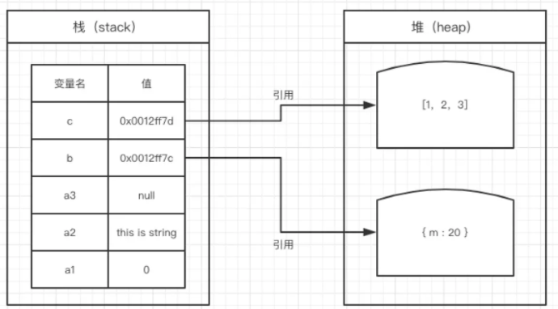

### 1、栈和堆

**栈(stack)**：是栈内存的简称，栈是**自动分配**相对**固定大小**的内存空间，并由系统**自动释放**，栈数据结构遵循**FLIO**(first in last out)**先进后出**的原则。比如乒乓球盒的结构与其类似，先放进去的乒乓球只能最后取出。

**堆(heap)**：是堆内存的简称。堆是**动态分配**内存，**内存大小不固定**，也**不会自动释放**，堆数据结构是一种**无序的树状**结构，同时它还满足**key-value键值**对的存储方式。

### 2、基本类型和引用类型

**基本数据类型：**`undefined`、`null`、`string`、`Boolean`、`Number`、`Symbol`(ES6 新增)，这些都是直接按值存放在**栈内存**中，占用内存空间的**大小是确定**的，并由系统**自动分配**和**自动释放**。

**引用数据类型：**`Object`、`Array`、`Function`，由于它们的值大小不固定，引用数据的值是保存在**堆内存中的对象**，如下图所示。当我们访问**堆内存**中的**引用数据类型**时，实际上则是**从栈中获取了该对象的引用地址(或者地址指针)**。

堆内存和栈内存是有**区别**的：**栈内存效率比堆内存高，空间相对于堆内存来说小，反之则相反**。

