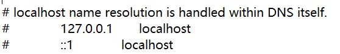
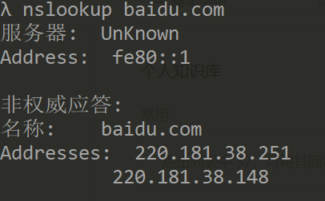
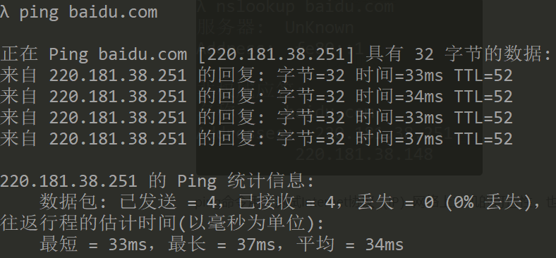

# URL

URL(Uniform Resourse Locator)代表着是统一资源定位符，包含的部分分别是协议+域名或IP+端口号+路径+查询参数+锚点。

以https://www.baidu.com/s?wd=hello&rsv\_spt=1#5 为例，协议是"https://", 域名是"www.baidu.com" ,无端口号，路径是"/s?"，查询字符串是"wd=hello&rsv\_spt=1"，锚点是"#5"。这里没有端口号的原因是https有默认的端口号。

## 协议

HTTP协议 HTTPS协议 FTP协议

## IP

全称为Internet Protocol,意思是互联网协议，只要使用互联网就要遵守这个协议。主要约定了两项事情：

1. 如何定位一台设备，就是常说的IP地址。
2. 如何封装数据报文，以跟其他设备交流。

### 特殊的IP

* 127.0.0.1表示自己。
* loacalhost可以通过hosts指定为自己。
若要修改在C:\Windows\System32\drivers\etc\hosts文件中修改，默认值如下所示。

* 0.0.0.0 不表示任何设备。

## 域名

域名：对IP的别称，如baidu.com，一个域名可以对应不同的IP，这样叫负载均衡，防止一台服务器访问过多，服务器承受不住。一个IP也可以对应多个域名，这叫做共享主机。域名和IP之间是通过DNS对应起来的。

域名还分顶级域名、二级域名(俗称一级域名)、三级域名(俗称二级域名)。

比如拿www.baidu.com 和xidemala.com 来举例子，他们不是同一个域名，其中com是顶级域名，xidemala.com 是二级域名，www.xiedaimala.com 是三级域名，他们是父子关系。

## 端口号

端口号：一台机器可以提供不同的服务，每个服务都需要一个号码，这个号码就是端口号。端口号和IP是缺一不可的。总共有65535个端口号，0-1023是系统用的，其他的是用户可以用的。若拥有管理员权限后就可以使用0-1023里的端口。

* HTTP默认端口号是80
* HTTPS默认是443
* FTP默认是21

## 路径

路径：通过不同的路径请求一个服务器上不同的页面

## 查询参数

查询参数：通过查询参数可以在同一个页面显示不同的内容

## 锚点

锚点：通过锚点可以显示同一页面的不同位置(注意：锚点不支持中文，并且不会传给服务器，只跟本地浏览器有关)

## DNS

DNS全称是Domain Name System，域名系统，通过它可以把IP和域名对应起来。

nslookup命令行用于查询工具域名系统，以获得域名或IP地址的映射，或其它的DNS记录，示例如下。

ping命令用于测试Internet协议（IP）网络上主机的可达性，也可以查到域名的IP，示例如下。

