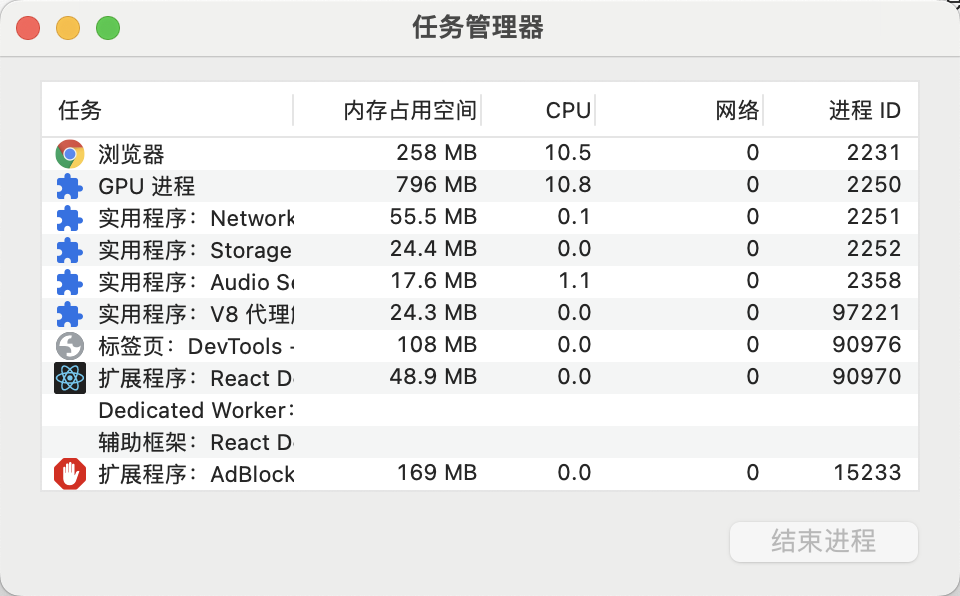
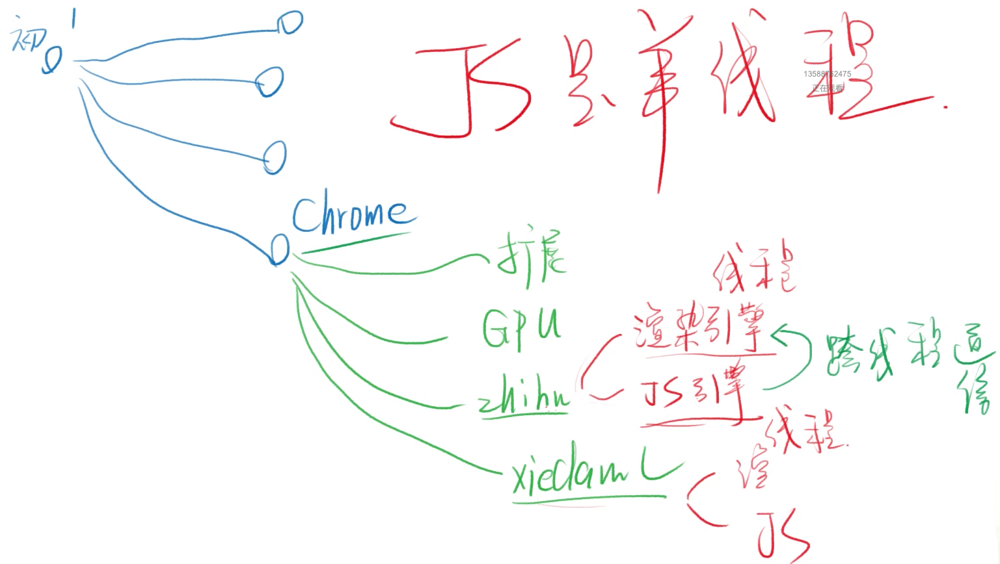
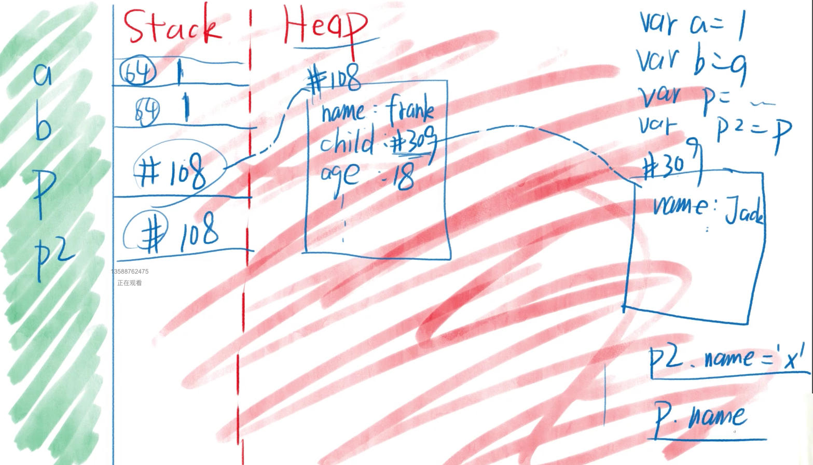

### 打开浏览器

* chrome.exe
+ 点击chrome图标，运行chrome.exe文件。
+ 会开启Chrome进程，作为主进程。
+ 主进程会开启一些辅助进程，如网络服务、GPU加速(可以通过浏览器的任务管理器查看)。



+ 每新建一个网页，就有可能会开启一个子进程(同域名下的可能不会)。
* 浏览器的功能
+ 发起请求，**下载**HTML，**解析**HTML，**下载**CSS，**解析**CSS，**渲染**界面，**下载**JS，**解析**JS，**执行**JS等。
+ 功能模块：用户界面、**渲染引擎**、**JS引擎**、存储等。
+ 上面功能模块一般各处于不同的线程(比进程更小)。
+ 如果进程是车间，那么线程就是车间里的流水线。



众所周知J**S是单线程**的，开启一个页面若某个情况JS引擎需要去修改HTML或者CSS需要用到渲染引擎，它不能直接修改，需要跨线程通信，这个浏览器会进行处理。这样就会得出另外一句话，**DOM操作慢**。

### JS引擎

**JS引擎举例：**

* Chrome用的是V8引擎，C++编写。
* 网景用的是SpiderMonkey(网景已经挂了)，后背Firefox使用，C++编写。
* Safari用的是Java ScriptCore。
* IE用的是Chakra(JScript9)——山寨JavaScript。
* Edge用的是Chakra(JavaScript)。
* Node.js用的是V8引擎。
**主要功能：**

* 编译：把JS代码翻译为机器能执行的字节码或机器码。
* 优化：改写代码，使其更高效。
* 执行：执行上面的字节码或者机器码。
* 垃圾回收：
* 把JS用完的内存回收，方便之后再次使用。
### 执行JS代码

浏览器提供API：window/document/setTimeout，这些都不是JS自身具备的功能，这些功能成为运行环境`runtime env`，一旦把JS放进页面，就开始执行JS。JS代码是在内存里运行的

### 瓜分内存

内存是被瓜分的，操作系统、Chrome、Chrome辅助进程瓜分一点，然后每个tab页面也瓜分一点，tab页面的内存还要瓜分给渲染线程、用户界面、JS引擎。JS引擎中存储代码区、环境和变量区域、还有数据区(Stack、Heap)。


#### 红色区域

**作用：**

* 红色专门用来存放数据。
* 红色区域并不存变量名，变量名在「不知区」。
* 每种浏览器的分配规则并不一样。
* 上图的区域并不完整，还有「调用栈」、「任务队列」、「垃圾回收」等。
**Stack和Heap：**

* 红色区域分为**Stack栈**和**Heap堆**。
* Stack区特点：每个数据**顺序存放**。
* Heap区特点：每个数据**随机存放**。

具体内容可以查看下面卡片。

此处为语雀内容卡片，点击链接查看：<https://www.yuque.com/baizhe-kpbhu/gayz3l/vmmt9g>#### Stack和Heap举例

```
var a = 1
var b = a
var person = {
  name: 'frank',
  child:{ name: 'jack' }
}
var person2 = person
```
**规律：**

* 数据分两种：非对象和对象
* 非对象都存在Stack
* 对象都存在Heap
* =号总是会把右边的东西复制到左边(不存在什么传值和传址)
画图来表示，如下所示。Stack中存储的是64位的，这边假设为值。



假设修改了p2的name的值，则p的name的值也会被修改，因为p和p2指向同一个引用地址。

