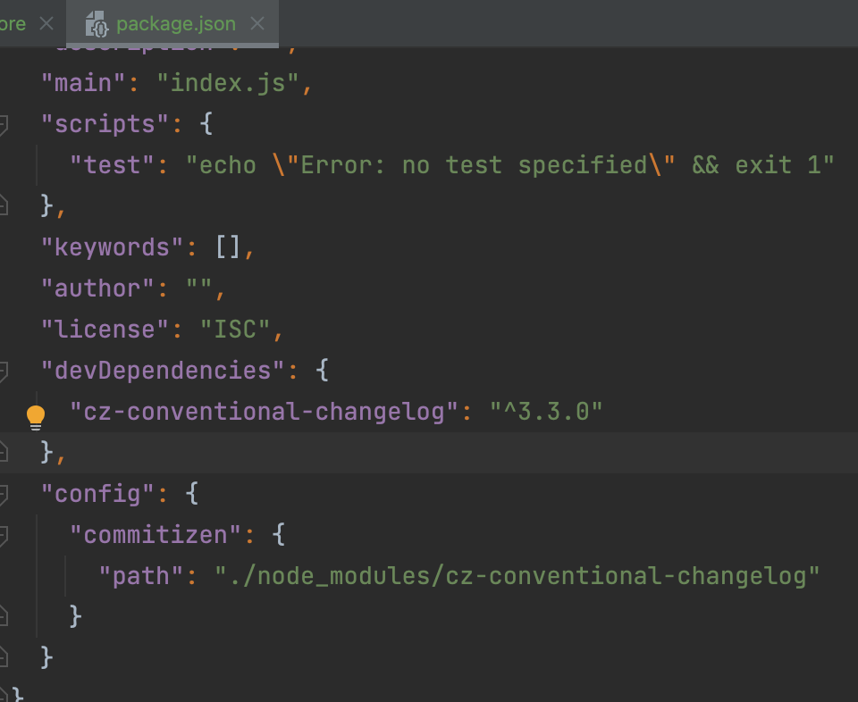
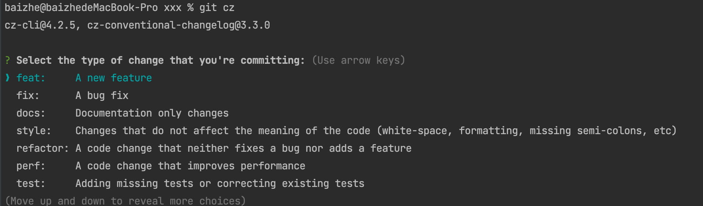

# Commit规范

### Commit message格式规范

每次提交，`Commit messae`都包括三个部分：`Header`，`Body`和`Footer`

```git-commit
<type>(<scope>):<subject>
<BLANK LINE>
<body>
<BLANK LINE>
<footer>
```
其中`Header`是必须的，`Body`和`Footer`可以省略。

#### Header

Header部分只有一行，包括三个字短：`type`(必需)、`scope`(可选)、`subject`(必需)。

* type

type为**commit记录的类型**。

```git-commit
feat：新功能（feature）
fix：修补bug
docs：文档（documentation）
style：修改代码格式（不影响代码运行的变动）
refactor：重构（即不是新增功能，也不是修改bug的代码变动）
test：增加修改测试用例
chore：构建过程或辅助工具的变动（包括但不限于文档、代码生成等）
ci：持续集成相关
perf：提升性能
build：影响生成系统或外部依赖项的更改
revert：还原先前的提交
deps：升级依赖
```
* scope

`scope`用于说明**commit影响的范围**，比如数据层、控制层、视图层等等，视项目不同而不同。

* subject

`subject`是**commit目的的简短描述**，不超过50个字符。

+ 以动词开头，使用第一人称现在时，比如change，而不是changed或changes
+ 第一个字母小写
+ 结尾不加句号（.）

#### Body

Body部分是对本次commit的**详细描述**，可以分成多行。

注意点：

1. 使用第一人称现在时，比如`change`而是不是`changed`或`changes`
2. 应该说明代码变动的动机，以及以前行为的对比。

#### Footer

Footer部分只用于两种情况。

1. 不兼容变动

如果当前代码与上一个代码不兼容，则Footer部分`BEAKING CHANGE`开头，后面是对变动的描述，以及变动理由和迁移方法。

```txt
BREAKING CHANGE: isolate scope bindings definition has changed.

    To migrate the code follow the example below:

    Before:

    scope: {
      myAttr: 'attribute',
    }

    After:

    scope: {
      myAttr: '@',
    }

    The removed `inject` wasn't generaly useful for directives so there should be no code using it.
```
2. 关闭Issue

如果当前commit针对某个issue，那么在Footer部分关闭i这个issue，也可以关闭多个issue。

```git-commit
Close #234
Close #234,#235,#236
```
#### Revert

还有一种特殊情况，如果当前commit用于撤销以前的commit，则必须`revert:` 开头，后面跟着被撤销的Commit的Header。

```git-commit
revert: feat(pencil): add 'graphiteWidth' option

This reverts commit 667ecc1654a317a13331b17617d973392f415f02.
```
**补充说明：**

`git revert` 撤销某次操作，此次操作之前和之后的commit和history都会保留，并且把这次撤销，作为一次新的提交。

```shell
git revert HEAD     // 撤销前一次 commit
git revert HEAD^   // 撤销前前一次 commit
git revert commit （比如：fa042ce57ebbe5bb9c8db709f719cec2c58ee7ff）
# 撤销指定的版本，撤销也会作为一次提交进行保存
```
#### 范例

```git-commit
feat($browser): onUrlChange event (popstate/hashchange/polling)

Added new event to $browser:

forward popstate event if available

forward hashchange event if popstate not available

do polling when neither popstate nor hashchange available

Closes #1213242

fix($compile): couple of unit tests for IE9

Older IEs serialize html uppercased, but IE9 does not...

Would be better to expect case insensitive, unfortunately jasmine does

not allow to user regexps for throw expectations.

Closes #17116
```
### Commitizen

[Commitizen](https://github.com/commitizen/cz-cli)是一个撰写合格 Commit message 的工具。

安装命令如下：

```bash
pnpm install -g commitizen
```
然后，在项目目录里，运行下面的命令，使其支持 Angular 的 Commit message 格式。

```bash
commitizen init cz-conventional-changelog --save-dev --save-exact
```
上述命令会在package.json中添加依赖，并添加配置项。



然后可以使用 `git cz` 或 `cz` 来代替 `git commit`。



### 生成change log

如果你的所有 Commit 都符合 Angular 格式，那么发布新版本时，[Change log](https://github.com/conventional-changelog/conventional-changelog) 就可以用脚本自动生成。

```bash
npm install -g conventional-changelog-cli
cd my-project
conventional-changelog -p angular -i CHANGELOG.md -w
```
为了方便写入，可以直接写入`package.json`的`script`字段，之后使用只需终端执行`npm run changelog`

```json
{
  "scripts": {
    "changelog": "conventional-changelog -p angular -i CHANGELOG.md -w -r 0"
  }
}
```
### 参考

本文参考来自阮一峰的博客，详细见[链接](https://www.ruanyifeng.com/blog/2016/01/commit_message_change_log.html)。

