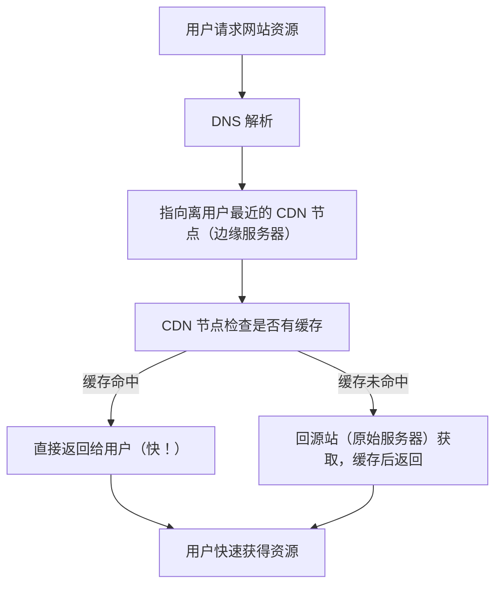

### CDN

CDN，全称内容发布网络（Content Delivery Network），是**一个经由分布在不同地理位置的服务，将内容缓存并发送给用户的网络**。

### 主要内容

1. **加速内容加载速度**：

   当用户访问一个网站时，CDN 会自动将用户请求导向最近的服务器(**就近原则**)，从该服务器获取内容，而不是直接回源站，从而减少了网络延迟，加快了页面加载速度。

2. **分担源压力**：

   所有用户请求都通过CDN 节点**分发**，减少了源站服务器的直接访问压力，提高了网站的稳定性和可靠性。

3. **提高网站可用性**：
   
   即使源站服务器出现故障，CDN 节点仍然可以继续提供内容(访问其他节点)，保证了网站的正常访问。

4. **降低带宽成本**:

   通过缓存内容，CDN 减少了回源流量，降低了带宽成本。

5. **提高用户体验**：

   CDN 能够根据用户的地理位置，智能选择最近的服务器，提供更快的访问速度和更流畅的体验。

### 工作原理

1. **内容分发和缓存**：
   
   CDN 将源站的内容复制到遍布全球的节点服务器上，这些服务器被称为**边缘服务器**。
2. **DNS解析**：
   
   当用户访问一个使用 CDN 的网站时，用户的浏览器会首先向本地 **DNS 服务器发起域名解析**请求。
3. **智能调度**：
   
   CDN 的 DNS 服务器会根据用户的 IP 地址和地理位置，将用户的请求**重定向到最近**、**负载均衡的最佳** CDN 节点。
4. **就近访问**：
   
   用户向选定的CDN节点发起请求，CDN 节点会直接将**缓存的内容**返回给用户，无需回源到源服务器，从而加快了访问速度。
5. **内容更新**：
   
   当源站的内容更新后，CDN 会自动更新后的内容同步到各个节点，保证用户访问到最新的内容。

工作原理的关系图如下所示：

### 应用场景

| 场景 | 功能 |
| --- | --- |
| 网站加速 | 加快首页、图片、JS/CSS 加载 |
| 视频/直播平台| 流媒体分发，降低卡顿 |
| 电商平台 | 商品图、详情页快速加载 |
| 移动 App | App 资源（如启动图、配置）加速下载 |
| 游戏更新 | 快速分发游戏补丁 |
| API 接口缓存 | 缓存公共数据接口，提升响应速度 |