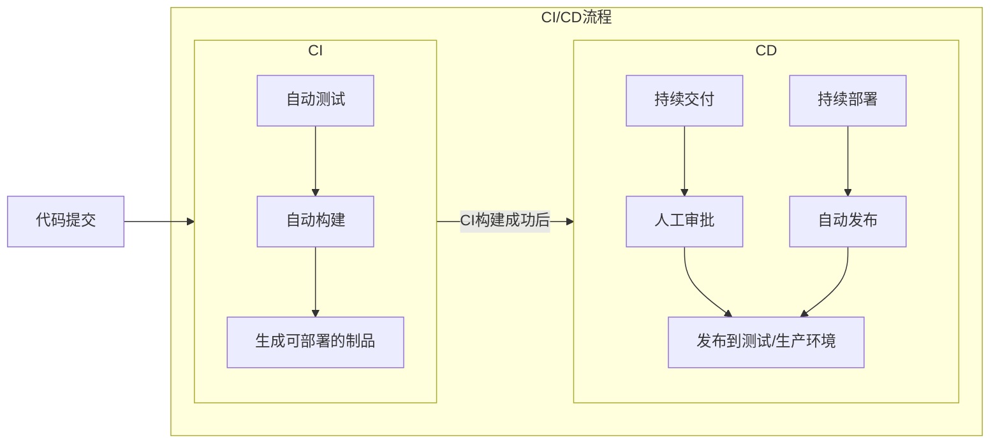

# CI/CD

> CI 是 **持续集成**(Continuous Integration)，CD 是 **持续交付/部署**(Continuous Delivery/Deployment)。
>
> CI/CD 是是现代软件开发中常用的实践，旨在提高软件开发的速度、质量和效率。

### 核心理念

**CI/CD** 的核心理念是**自动化**，通过在软件开发生命周期的**构建**、**测试**和**部署阶段实施自动化**，减少人工错误，加快交付速度。

**CI**(**持续集成**) 指的是频繁地将代码更改集成到共享代码库中，并进行**自动化的构建**和**测试**。

**CD**(**持续交付/部署**) 是指在 CI 流程成功后的基础上，将代码**自动部署**到**测试环境**，甚至直接部署到**生产环境**。

### CI/CD 流程

1. **代码提交**:开发人员将代码提交到代码仓库。
2. **触发CI** 流程:代码提交触发CI 流程，自动执行构建、测试等操作。
3. **构建**:CI 流程将代码编译成可执行文件或软件包。
4. **测试**:CI 流程运行各种自动化测试，包括单元测试、集成测试、UI 测试等。
5. **交付**/部署:如果CI 流程成功，则进入CD 流程，将代码部署到测试环境或生产环境。
6. **监控**:部署完成后，对系统进行监控，确保其正常运行。

CI/CD 流程 关系图如下所示：

### 常见的 CI/CD 工具

* **[Jenkins](https://www.jenkins.io/doc/)**:
  开源CI/CD 工具，功能强大，插件丰富，适用于各种项目和平台。
* **[GitLab CI](https://gitlab.cn/docs/jh/ci/quick_start/)**:
  GitLab 提供的CI/CD 功能，与GitLab 代码仓库集成紧密，易于使用。
* **[GitHub Actions](https://docs.github.com/zh/actions)**:
  GitHub 提供的CI/CD 功能，与GitHub 代码仓库集成，提供自动化工作流程。
* **[CircleCI](https://circleci.com)**:
  云原生CI/CD 工具，支持多种语言和平台，提供灵活的配置选项。
* **Azure Pipelines**:
  Azure DevOps 提供的CI/CD 功能，与Azure 平台集成，适用于各种应用场景。
* **Travis CI**:
  开源CI/CD 工具，与GitHub 代码仓库集成，提供自动化构建和测试。
* **AppVeyor**:
  云原生CI/CD 工具，支持多种语言和平台，提供灵活的配置选项。

