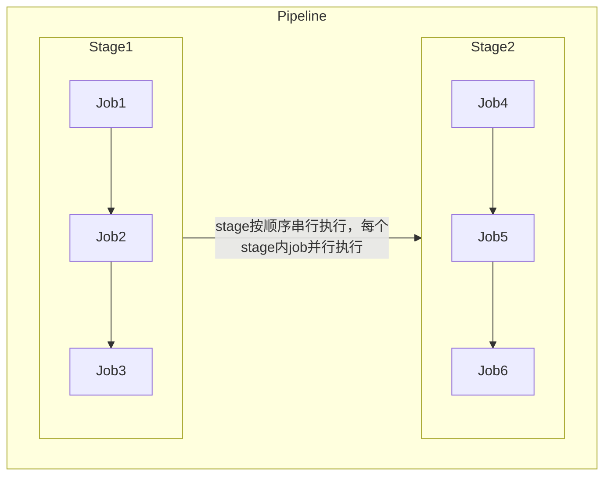

# Gitlab CI/CD

### 工作流程

1. 你当前的代码库托管在Gitlab上， 且已经为代码仓库配置了 `gitlab-runner` 服务, 它是用来实际执行CI任务的服务器；
2. 提交代码，且根目录中包含一个名为 `.gitlab-ci.yml` 的文件，该文件是用来指定构建、测试和部署流程、以及CI触发条件的脚本，其概念类似于`docker-compose.yml` 文件；
3. Gitlab检测到 `.gitlab-ci.yml` 文件，若当前提交符合文件中指定的触发条件，则会使用配置的 `gitlab-runner` 服务运行该脚本进行测试等工作；
4. 若 `.gitlab-ci.yml` 中定义的某个自动化脚本运行失败，将判定为此次CI不通过，则需要提交者修复问题代码后重复提交，直至自动化CI通过。
5. 没有问题的提交才能被项目负责人 `merge` 到主分支，进行后续的部署工作。

### .gitlab-ci.yml 配置参数

| 关键字 | 描述 |
| --- | --- |
| script | 必须参数，运行器需要执行的脚本 |
| image | 使用Docker image镜像 |
| services | 使用Docker services镜像 |
| before_script | 作业执行前需要执行的命令 |
| after_script | 作业执行后需要执行的命令 |
| stages | 定义流水线所有的阶段 |
| stage | 定义作业所处流水线的阶段(默认test阶段) |
| only | 限制作业在什么时候创建 |
| except | 限制作业在什么时候不创建 |
| tags | 作用使用的Runner运行器的标签列表 |
| allow_failure | 允许作业失败，失败的作业不影响提交的状态 |
| when | 什么时候运行作业 |
| environment | 作用部署的环境名称 |
| cache | 指定需要在job之间缓存的文件或目录 |
| artifacts | 归档文件列表，指定成功后应附加到job的文件和目录的列表 |
| dependencies | 当前作业依赖的其他作业，你可以使用依赖作业的归档文件 |
| coverage | 作业的代码覆盖率 |
| retry | 作业失败时，可以自动执行多少次 |
| parallel | 指定并行运行的作业实例 |
| trigger | 定义下游流水线的触发器 |
| include | 作业加载其他YAML文件 |
| extends | 控制实体从哪里继承 |
| pages | 上传GitLab Pages的结果 |
| retry | 作业失败时，可以自动执行多少次 |
| variables | 定义环境变量 |


### Pipeline 说明

一个 `.gitlab-ci.yml` 文件触发后会形成一个 `pipeline` 任务流，由 `gitlab-runner` 来运行处理，`pipeline` 中 `stage`、`job` 概念如下，需要按照项目实际情况定义不同 `stage` 和 `job`:




### 编写 `.gitlab-ci.yml` 文件

默认情况下，流水线有 `build`、`test`、`deploy` 三个阶段，即构建、测试、部署，未被使用的阶段将会被自动忽略。

如下代码实例为一个前端项目的 `.gitlab-ci.yml` 文件配置：

```yaml
stages:
  - install
  - lint
  - test
  - build
  - deploy

# 缓存 node_modules 与构建缓存
cache:
  key: ${CI_COMMIT_REF_SLUG}
  paths:
    - node_modules/
    - .npm/

# 1. 安装依赖
install:
  stage: install
  image: node:18-alpine
  script:
    - npm ci --cache .npm --prefer-offline
  artifacts:
    paths:
      - node_modules/
    expire_in: 1 hour

# 2. 代码检查
lint:
  stage: lint
  image: node:18-alpine
  needs: [install]
  script:
    - npm run lint

# 3. 单元测试
unit:
  stage: test
  image: node:18-alpine
  needs: [install]
  script:
    - npm run test:unit -- --coverage
  coverage: '/Lines\s*:\s*(\d+\.\d+)%/'
  artifacts:
    reports:
      junit: junit.xml

# 4. 生产构建
build:
  stage: build
  image: node:18-alpine
  needs: [install]
  script:
    - npm run build
  artifacts:
    paths:
      - dist/           # Vite/Webpack 输出目录
    expire_in: 1 week

# 5. 部署（示例：用 rsync 推送到 Nginx 静态目录）
deploy:
  stage: deploy
  image: alpine:latest
  needs: [build]
  before_script:
    - apk add --no-cache openssh-client rsync
    - eval $(ssh-agent -s)
    - echo "$SSH_PRIVATE_KEY" | tr -d '\r' | ssh-add -
    - mkdir -p ~/.ssh && ssh-keyscan -H $DEPLOY_HOST >> ~/.ssh/known_hosts
  script:
    - rsync -az --delete dist/ $DEPLOY_USER@$DEPLOY_HOST:$DEPLOY_PATH
  environment:
    name: production
    url: https://your-domain.com
  only:
    - main
  when: manual           # 可选：手动确认后再发
```

其他案例（前端项目打包成zip 推送至另一个 Git 仓库）：

```yaml
stages:
  - build
  - package
  - push-zip

variables:
  ZIP_NAME: "frontend-${CI_COMMIT_SHORT_SHA}.zip"   # 最终文件名
  STATIC_BRANCH: "main"                             # 目标仓库分支

# 1) 正常 build
build:
  stage: build
  image: node:18-alpine
  cache:
    key: ${CI_COMMIT_REF_SLUG}
    paths:
      - node_modules/
  script:
    - npm ci --prefer-offline
    - npm run build
  artifacts:
    paths:
      - dist/
    expire_in: 1 hour

# 2) 把 dist 打成 zip
package:
  stage: package
  image: alpine:latest
  needs: [build]
  script:
    - apk add --no-cache zip
    - cd dist
    - zip -r9 "../$ZIP_NAME" .
  artifacts:
    paths:
      - ${ZIP_NAME}
    expire_in: 1 hour

# 3) 把 zip 推到另一个仓库
push-zip:
  stage: push-zip
  image: alpine:latest
  needs: [package]
  before_script:
    - apk add --no-cache git openssh-client
    - eval $(ssh-agent -s)
    - echo "$STATIC_REPO_KEY" | tr -d '\r' | ssh-add -
    - mkdir -p ~/.ssh
    - ssh-keyscan -H $(echo $STATIC_REPO | sed 's/.*@\(.*\):.*/\1/') >> ~/.ssh/known_hosts
  script:
    - |
      # 克隆目标仓库
      git clone --depth=1 --branch=$STATIC_BRANCH $STATIC_REPO static-repo
      cd static-repo

      # 删除旧 zip（可选，保持仓库干净）
      find . -name '*.zip' -delete

      # 拷贝新 zip
      cp ../$ZIP_NAME .

      # 提交并推送
      git config user.name  "gitlab-ci"
      git config user.email "ci@example.com"
      git add $ZIP_NAME
      git commit -m "Add $ZIP_NAME from $CI_PROJECT_NAME@$CI_COMMIT_SHA" || exit 0
      git push origin $STATIC_BRANCH
  only:
    - main
  when: manual   # 可选：手动确认后再推
```


### 参考链接

> [GitLab CI流水线配置文件.gitlab-ci.yml详解](https://meigit.readthedocs.io/en/latest/gitlab_ci_.gitlab-ci.yml_detail.html)
> 
> [GitLab CI/CD 教程：您的第一个流水线](https://gitlab.cn/docs/jh/ci/quick_start/#gitlab-ciyml-tips)
>
> [Gitlab-CI配置及使用全流程总结 - 掘金](https://juejin.cn/post/6921581836426706957)
