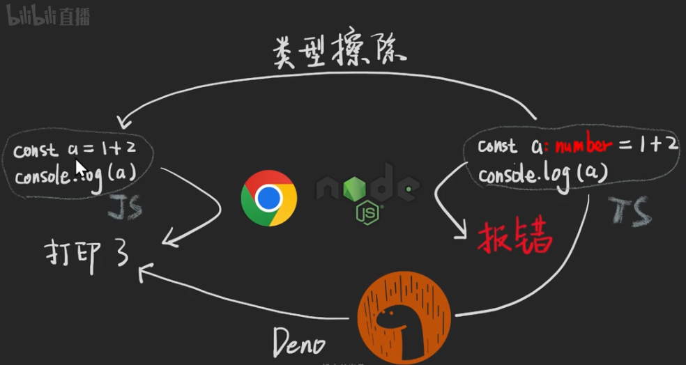
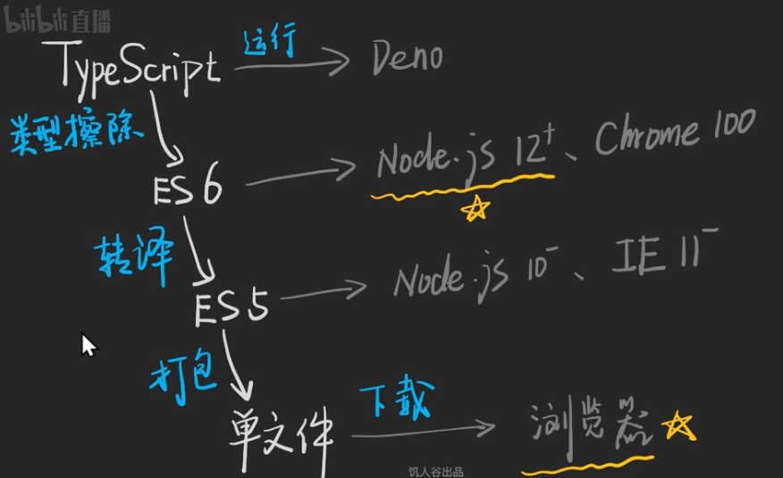

## TS运行与调试

JS代码是可以在浏览器和node中运行，但是TS代码就不可以在这两者中运行，需要进行**类型擦除**处理才可以执行。若是不想处理则可以使用[Deno](https://deno.land/)。

Deno是node之父后写的项目可以直接执行TS，原理是因为Deno有rust和v8，将ts编译成js，然后在通过v8引擎执行。

### 什么是类型擦除

**类型擦除**是[计算机程序设计](https://zh.m.wikipedia.org/wiki/%E8%AE%A1%E7%AE%97%E6%9C%BA%E7%A8%8B%E5%BA%8F%E8%AE%BE%E8%AE%A1)时，在[编译期](https://zh.m.wikipedia.org/wiki/%E7%BC%96%E8%AF%91%E6%9C%9F)明确去掉所编程序（某部分）的[类型系统](https://zh.m.wikipedia.org/wiki/%E7%B1%BB%E5%9E%8B%E7%B3%BB%E7%BB%9F)。

#### 如何擦除类型

* 使用esbuild

安装：`npm i -g esbuild`

案例使用：`esbuild 1.ts > 1.js`

* 使用swc

安装：`npm i -g @swc/cli @swc/core`

案例使用：`swc 1.ts -o 1.js`

* 使用typescript

安装：`npm i -g typescript`

案例使用：`tsc 1.ts`

* 使用babel

安装：`pnpm i @babel/core @babel/cli @babel/preset-typescript`

案例使用：`babel --presets @babel/preset-typescript 1.ts`

前两种执行速度快(因为不校验TS语法)，后两种执行速度慢(因为校验TS语法)。

### 如何将TS转为JS

### 如何运行TypeScript

* [TypeScript PlayGround](https://www.typescriptlang.org/play/)
* 第三方在线编辑器[playcode.io](https://playcode.io/)、[stackblitz.com](https://stackblitz.com/)、[codesandbox.io](https://codesandbox.io/)
* 本地在线编辑器[Vite](https://cn.vitejs.dev/)
* 本地编辑+Node：[ts-node](https://typestrong.org/ts-node/docs/)、[swc-node](https://github.com/swc-project/swc-node)、[@esbuild-kit/esm-loader](https://github.com/esbuild-kit/esm-loader#readme)、esno

### 如何调试TypeScript

编辑器上通过鼠标悬浮进行查看，看报错(通过控制台)

### 补充

其他学习资料：《编程与类型系统》、《TypeScript编程》《类型和程序设计语言》

