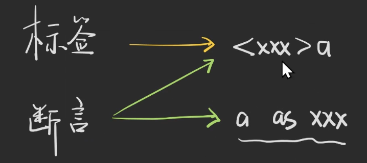
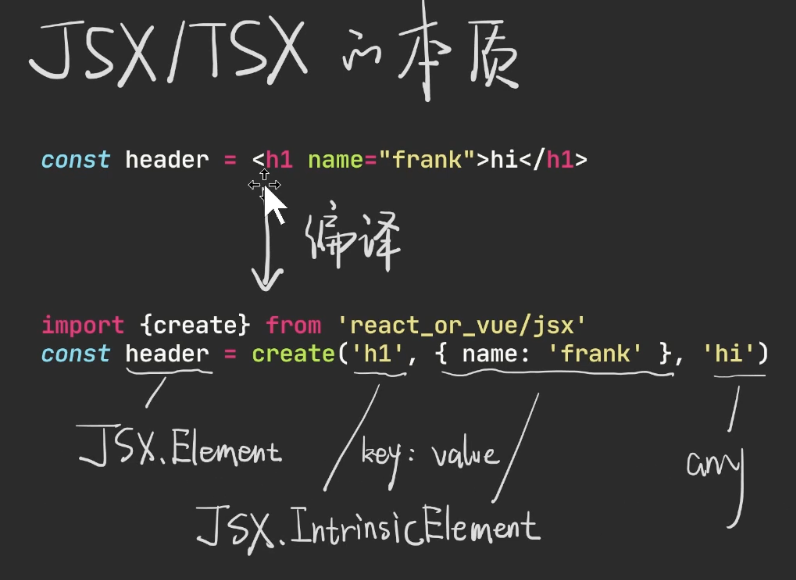

# TypeScript X JSX = TSX

### 如何使用TSX

* Webpack—— create-react-app / VueCli
* Vite—— template + plugin(plugin-vue-jsx)
* Next.js / Remix.js / Fresh.js
* 其他

### 标签与断言之冲突

```ts
const header = <h1>hi</h1>
const a = 1 as unknown
const b = a as number
// 有歧义的断言 tsx下报错 ts下可以，tsx下不要使用
const c = <number>a // error
export {header}
```


在JSX中，只能用 `as` 断言。

### JSX/TSX的本质

```ts
const header = <h1 name="frank">hi</h1>
// 编译 后 伪代码 其实还是在写JS/TS，那就是还有类型
import {create} from 'react_or_vue/jsx'
const header = create('hi', { name: 'fank' }, 'hi')
```



JSX的本质就是编译后变成函数，并且是可以配置的。

浏览器的标签都要在全局声明中声明过。创建标签对应的类型是由 `JSX.Element` 命名的。

### 函数组件

```ts
const Header = (x: { level: number }, context: unknown) => {
  console.log(x, context)
  return <h1 name="frank">hi</h1>
}
const App = <Header level={1} />
```
### 类组件

接受类型是通过 `props` 来接受的。

```ts
class ClassHeader {
  props: {
    level: number
  }
  constructor(props: { level: number }) {
    this.props = props
  }
  render() {
    return <h1>level: { this.props.level }</h1>
  }
}
const App2 = <ClassHeader level={1}/>
```
### 组件共有属性

```ts
// 函数组件或类组件需要的共有属性
interface IntrinsicAttributes {
  key: string
}
// class属性需要的共有属性
interface IntrinsicClassAttributes<T> {
  // Ref 相当于拥有一个 current 对象
  ref: {
    current: T | null
  }
}
```
### JSX如何把内容变成props的属性

需要在全局声明中声明JSX元素的属性。`Children`属性。React内是`Children`，而Vue内相当变成了插槽`slot`。

```ts
interface ElementChildrenAttributes {
  children: {}
}
```
### React/Vue项目中声明jsx类型的地方

react项目使用jsx，声明了jsx类型的地方


vue项目使用jsx，声明jsx类型的地方


### JSX.Element v.s. ReactElement v.s. ReactNode

ReactNode 为 react节点


jsx继承了reactElement


ReactFragment是一个语法糖，类型声明里面为迭代器，[]数组是最简单的迭代器。

ReactPortal是传送门。

### React事件处理函数的类型

可以先点击原有的方法去查找类型，然后再去输入。

```ts
const App = () => {
  const onClick: MouseEventHandler<HTMLInputElement> | undefined = (e) => {
    console.log((e.target as HTMLInputElement).value)
  }
  const onChange: ChangeEventHandler<HTMLInputElement> | undefined = (e) => {
    console.log(e.target.value)
  }
  // onchange 触发时机是在失去焦点
  // oninput 触发时机是在输入时
  // oncompositionstart 开始输入
  // oncompositionend 结束输入
  return (
    <input onClick={onClick} onChange={onChange}/>
  )
}
```
### 是否可以指定children的类型？

不完全可以。

```ts
type BProps = {}
const B: React.FC<BProps> = (props) => <div>B组件</div>
type CProps = {}
const C: React.FC<CProps> = (props) => <div>C组件</div>
type X = ReturnType<typeof C>
type AProps = {
  children?: ReturnType<typeof B>
}
const A: React.FC<AProps> = (props) => {
  if(props.children?.type !== B){
    throw new Error('children必须是B组件')
  }
  return <div>{props.children}</div>
}

const App = () => {
  return (
    <A>
      <C/>
    </A>
  )
}
```
### 参考文章

> [React泛型组件是什么？](https://segmentfault.com/q/1010000040343011)
>
> **泛型组件**即能接受泛型的组件。
> [思考题：Vue + TSX 有泛型组件吗？为什么？](https://mp.weixin.qq.com/s/LAXPCJr7Z-X1S7RVMLBwyg)
> 
> 答案是没有，vue的组件是一个对象，不是函数做不到

