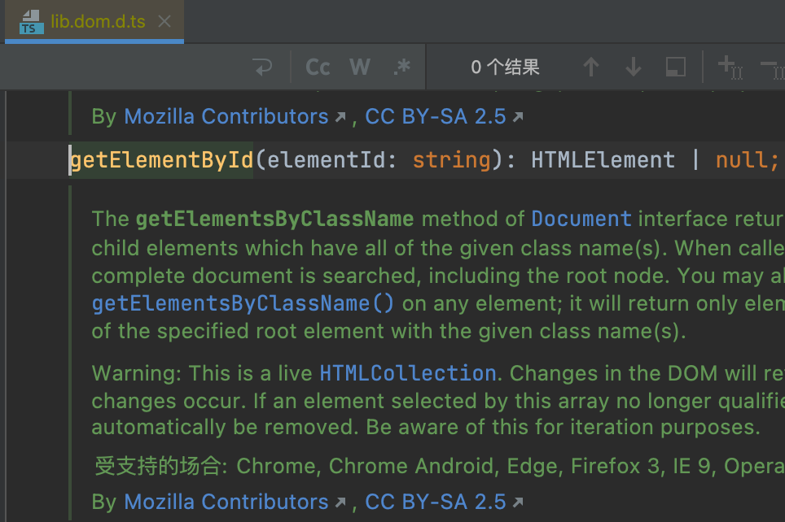
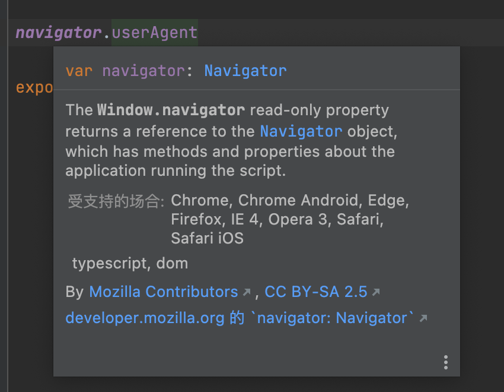
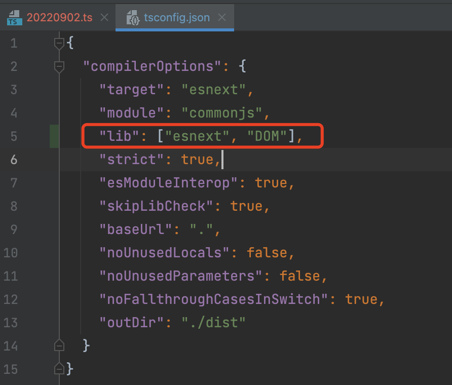
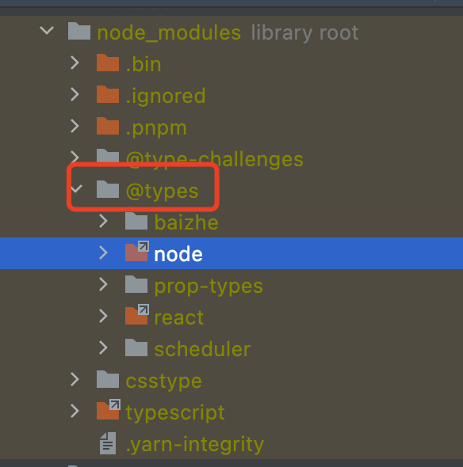
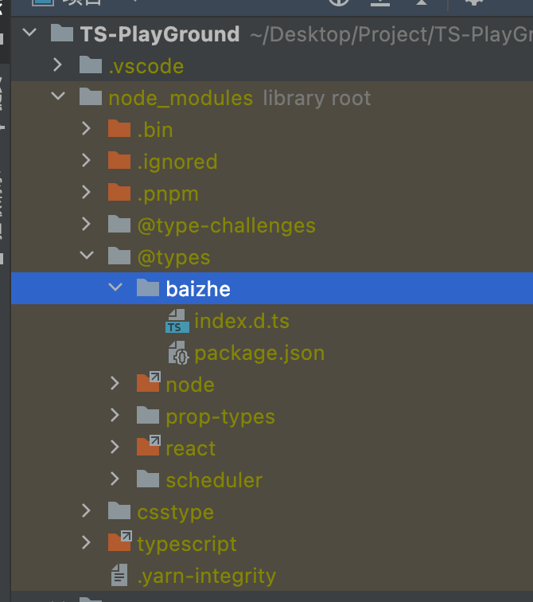
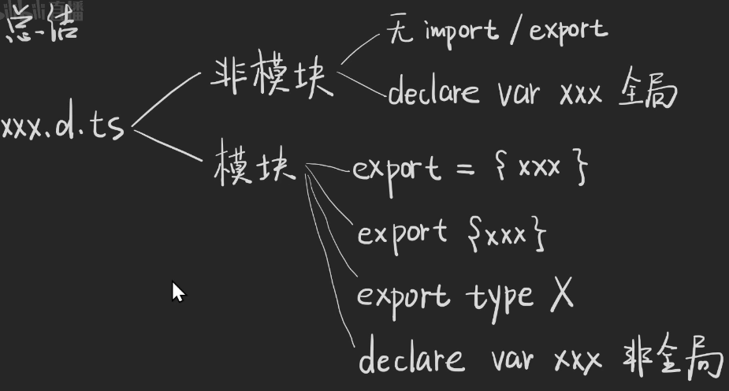

# TypeScript全解之模块

**关于模块分如下几个方面：**

1. **环境模块**
2. **独立模块**
3. **全局声明**

思考题 `type A = string ｜ number`，请问A的**作用域**是？

1. 当前文件内。(`\*.ts/\*.tsx`)
2. 整个项目内。(`\*.d.ts`)
3. 以上都有可能。
如左侧思考题A的**作用域**应该选第三项，以上都有可能。

这是因为可以在项目中的 `tsconfig.json` 内配置 `include` 包含的文件夹，使得类型的作用域能够扩大。

### 环境模块

#### 关于lib.dom.d.ts

```ts
const Button = document.getElementById('b')
// 请问Button的类型是什么？
// 请问类型 HTMLElement 是哪来的？
// Ctrl + 点击 getElementById 可以查看类型声明
```
Button的类型是HTMLElement，类型HTMLElement来自于 `lib.dom.d.ts`。



可以发现，在 `lib.dom.d.ts` 内有很多相同名的 `interface` 声明，这是因为 `interface` 会合并。

查看 `tsconfig.json` 内配置项的 `"lib": ["esnext", "DOM"]`，`esnext` 即最新的es语法，`dom` 即运行在浏览器。

如上图所示，可以发现DOM的定义顺便把BOM也定义在了一起，他们写在一起。可以理解 `lib.dom.d.ts` **就是环境模块**。



但这个文件是谁撰写的内，它是由[mhegazy](https://github.com/mhegazy)这个人写的有一万八千多行，在2014年上传至Github的。而为什么vscode和webstorm知道要引入 `lib.dom.d.ts` 呢？

这是因为在 `tsconfig.json` 文件内配置了lib项。



#### 关于node\_module/@types

```ts
import {readFile} from 'fs'
// ^--- Cannot fin module 'fs' or ...(2307)
```
若在文件中写如上代码，使用node下的fs，会发现报错了，复制报错信息到Google得到解决方案是需要安装关于node的类型包，`npm i -d @types/node`。

这是因为node没有标准规范，但是dom有w3c的规范准则，每年会进行更新，可以内置在 `lib.dom.d.ts` 文件内。



如上右图所示，可以发现在 `node\_modules/@types` 内有 `node`的类型。所以猜想 `node\_modules/@types` 里的类型声明会被自动引入。

若 `tsconfig.json` 中的 `include` 没有指定导入那些类型模块，`**node\_modules/@types**` 内的**类型声明**会**自动引入**。

举例 `@types/node` 到引入步骤：

1. 看每个目录里 `package.json` 到types字段。
2. 读取对应文件。
3. 遇到 `/// <reference.../>` 则读取之。
4. 遇到 `import` 也读取之。

如果发现 `@types/` 目录下有很多内容，但是只想引入一部分类型，则可以在 `tsconfig.json` 的 `types` 数组中加入想要引入的部分。

#### 类型的作用域

* `\*.ts` 中的Type作用于当前文件。
* `\*.d.ts` 中的Type作用于整个项目。
* `node\_modules/@types/\*` 中的Type作用于整个项目。

举例使用 `node\_modules/@types/\*` 的写法：

首先在 `node\_modules/@types` 的目录下创建文件夹，文件夹内有 `package.json` 和 `index.d.ts` 文件。

然后就可以在其他地方使用了。前提是关闭了白名单即(`tsconfig.json` 的 `include`)，在使用的时候要开启要用的环境，加到白名单内。




由于直接写在 `node\_modules/@types/\*` 内的类型，别人无法使用，若是想要别人使用应该发布到npm上让别人去下载。

如果 `a.ts` 和 `b.ts` 想共享类型，该怎么办？有两种方法如下所示。

1. `export type`+`import type`——**推荐使用**

```ts
// b.ts
export type B = string
// a.ts
import type { B } from './b'
type A = B | number
```
2. `export`+`import`+`tsconfig.json` 内的 `"isolatedModules": false`——**不推荐使用**

```ts
// b.ts
type B = string
export { B }
// a.ts
import { B } from './b';
type A = B | number
```
### 独立模块

**独立模块(Isolated Models)**

**独立模块是指每个ts文件导出的，而.d.ts文件不需要导出。**

```ts
import { TypeA, FnA } from 'xxx';
FnA()

export { TypeA, FnA }
```
如上代码片段所示，编译称JS的时候TypeA是否擦除，如果不看xxx的内容无法确定，则称该文件不是独立模块。

由于JavaScript不懂Type是什么，所以编译的时候要依赖另一个文件。

```ts
import { FnA } from 'xxx'
FnA()

export { FnA }
```
如果**只看当前文件**就知道怎么擦除，则称该文件是独立模块。

推荐永远使用独立模块。这就是为什么文件中没有export 内容，就会报错。

**独立模块的两个规则：**

1. 所有ts文件都必须的模块，包括 `index.ts`
2. 所有ts文件不得使用 `declare const enum` 这种写法。其中 `declare` 和 `const` 为知识点。

```ts
declare const enum X {
  One = 1,
  Two = 2
}
const x = X.One
// 编译称JS后
// const x = 1 /* X.One */;

```
关于 `const` 又要提到 `as const`。如下代码片段所示，若不使用 `as const`， TypeScript就会认为a的类型是 `string｜number[]` ，而不是自己期望的 `[number, string]` 的类型。`as const` 的内容具体可以见[TS官网](https://www.typescriptlang.org/docs/handbook/release-notes/typescript-3-4.html#const-assertions)。它会在数组或对象在结尾添加 `as const` 会添加上 `readonly` 只读属性。

```ts
const a = [1,'string'] as const
// 若不使用 as const 则可以以下这样子赋值
a[0] = 'hi'
a[1] = 1
```
如果不是用 `const` 和 `declare`，如下代码所示。

```ts
enum X {
	One = 1,
  Two = 2
}
const x = X.One
// const x = 1 编译成js 选2

// 1. const x =  {One:1 ,Two:2}
// 2. const x = X.One
```
转变为js后如右侧所示。


如果使用 `const enum` 的声明方式，`const` 声明的值会类型擦除。


由此可以得出使用 `enum` 是不会类型擦除的，而使用 `const enum` 是会进行类型擦除的。

如果使用 `declare enum` 的类型声明，则会如下图所示。


可以发现 `enum` 声明会变成对象，`declare enum` 会变成数字/字符串。

### 全局声明

关于JS模块的历史

1. 无模块 `window.jQuery = function ...`
2. CommonJS模块 `var fs = require('fs')`，没有规范的时候，民间自行开发的CommonJS。
3. ES6标准模块 `import {x} from '...'`，即2015年有了规范后。

#### 例一、给全局变量加声明

```ts
var baizhe = {
  name: 'baizhe',
  age: 18,
  sayHi() {
    console.log('Hi,I am' + this.name)
  }
}
window.baizhe = baizhe
// 如上代码若需要添加导出
// baizhe.d.ts
declare var baizhe: {
  name: string
  age: number
  sayHi(): void
}
// main.ts
import './baizhe'
console.log(baizhe)
// ^ Object对象
```
`baizhe.d.ts` 能否换名，换名会将所有的类型会导出成any类型，除了上述写法还有另一张写法使用 `declare namespace` 如下代码段所示。

```ts
// baizhe.js
var baizhe = {
  name: 'baizhe'
  age: 18,
  sayHi() {
    console.log('Hi, I am' + this.name)
	}
}
window.baizhe = baizhe
// baizhe.d.ts
declare namespace baizhe {
  var name: string
  var age: number
  function sayHi(): void
}
// main.ts
console.log(fang)
```
#### 例二、全局变量 + CommonJS导出

```ts
// baizhe.js
var baizhe = {
  name: 'baizhe'
  age: 18,
  sayHi() {
    console.log('Hi, I am' + this.name)
	}
}
window.baizhe = baizhe // 全局变量
exports.baizhe = baizhe // CommonJS导出
// 以上内容要添加导出
// baizhe.d.ts
declare var baizhe: {
  name: string
  age: number
  sayHi(): void
}
export = { baizhe }
// main.ts
const all = require('./baizhe')
console.log(all)
// webpack搭建的环境下可以显示，vite环境不可以
```
CommonJS的导出 `export = {xxx}` 导入 `const all = require('./baizhe')`

#### 例三、全局变量 + ES6导出

```ts
// baizhe.js
var baizhe = {
  name: 'baizhe'
  age: 18,
  sayHi() {
    console.log('Hi, I am' + this.name)
	}
}
window.baizhe = baizhe // 全局变量
export {baizhe} // ES6导出
// 给上述代码添加导出
// baizhe.d.ts
declare var baizhe: {
  name: string
  age: number
  sayHi(): void
}
export { baizhe }
// main.ts
import { baizhe } from './baizhe'
console.log(baizhe)
```
若是想让其声明成全局变量。

```ts
// global.d.ts
// 文件名随意，文件后缀必须是 .d.ts
declare var baizhe: {
  name: string
  age: 18
  sayHi(): void
}
```
一旦 `xx.d.ts` 内声明成了模块，并导出了模块，文件内部在声明全局类型，是不可以的，它则不是全局类型了。

```ts
// global.d.ts
// 文件名随意，文件后缀必须是 .d.ts
import type { Fang } from './fang';
declare global {
  declare var fang: Fang
}
type X = string // 这时声明的X 不是全局类型。
```
非模块是因为早期没有定义。



举例 `type A` 是声明在当前文件的，而 `declare type A` 是声明在全局的。若要不写 export 则需要先关闭独立模块。

**建议**在 `custom.d.ts` 文件内声明 `declare type A = string`，同时开启独立模块。

下面的举例内容关闭了独立模块。声明全局函数的时候，可以发现 `declare` 可以重载，这是因为早起是先有JavaScript，TypeScript后出，是分开写的，ts也要兼容js的重载功能。

```ts
//  全局量
declare var a: number;
declare let b: number;
declare const c: number;
//  全局函数
declare function add(a: number, b: number): number
declare function add(s1: string, s2: string): string
// 全局变量document2
declare namespace document2 {
  type Element = string
  function getElementById(id: string): Element;
}
// 多层同时声明
declare namespace A.B.C.D {
  type E = string
}

```
使用命名空间的时候值可以直接用，类型不可以使用。如下代码图所示。

```ts
declare namespace A.B.C.D {
  type E = string
  let e:E
}
```

```ts
const x:A.B.C.D.E = 'xx'
const y =  A.B.C.D.e

export {}
```
**参考文章：**

<https://ts.xcatliu.com/basics/declaration-files.html>

<https://www.typescriptlang.org/docs/handbook/modules.html#handbook-content>

<https://www.typescriptlang.org/docs/handbook/declaration-files/by-example.html#handbook-content>

