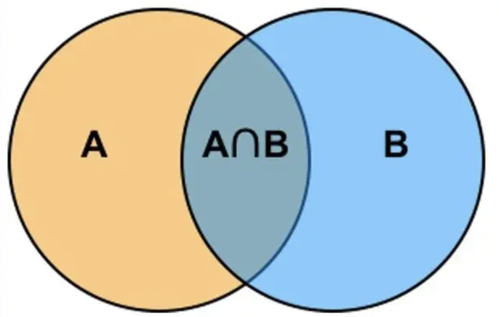
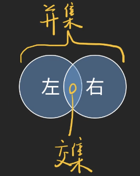

JS可以对**值**进行加减运算，如果把TS的类型系统当作一门语言，TS可以对**类型**进行各种**运算**。TS就相当于JS + 类型系统。

## TS的类型系统有哪些运算？

### 联合类型(并集union types)

**并集案例：**

```
type A1 = number
type B1 = string
type C1 = A1 | B1
const c1:C1 = 42

type A2 = { name: string }
type B2 = { age: number }
type C2 = A2 | B2

const c2:C2 = {
  name: 'John',
  age: 18
}
```


C1的类型范围及为A1和B1两者的并集，即上图的A圈和B圈的内容。

#### 使用typeof区分类型

这种不断通过if语句进行**typeof**类型判断，来断定值属于那个类型，这也叫**类型收窄(Narrowing)。**

```
const f1 = (a: number | string) => {
  if (typeof a === 'number') {
    a.toFixed(2)
  } else if(typeof a === 'string') {
    parseFloat(a).toFixed(2)
  } else {
    throw new Error('Never do this')
  }
}
```
**typeof**的局限性

只能返回类型的字符串，且就只有这几种类型，对于**数组类型**、**普通对象**、**日期对象**、**null**，这些返回的都是**"object"**。

typeof x可以推断类型的字符串，具体类型如下所示：

* "string"
* "number"
* "bigint"
* "boolean"
* "symbol"
* "undefined"
* "object"
* "function"

#### 使用instanceof来区分类型

**instanceof**以**对象**的类为主。也叫**类型收窄(Narrowing)**。

**instanceof**后面只能接一个**class**。

```
const f1 = (a: Array<Date> | Date) => {
  if (a instanceof Date) {
    a.toISOString()
  } else if () {
    a[0].toISOString()
  } else {
    throw new Error('Never do this')
  }
}
```
**instanceof**的局限性

1. 不支持string、number、boolean...这些简单类型判断。
2. 不支持TS独有的类型(会被擦除的类型)。

```
type Person = { name: string }
// type 不能用作 value
const f1 = (a: Person) => {
  if(typeof Person) {
// 'Person' only refers to a type
// , but is being used as a value
  }
}
```
#### 如何解决typeof和instanceof都不能用的情况，使用in

使用**in**来收窄类型，只适合普通对象(部分对象)。

```
type Person = {
  name: string
}
const f1 = (a: Person | Person[]) => {
  if ('name' in a) {
    a // Person
  } else {
    a // Person[]
  }
}
```
#### 使用JS中判断类型的函数来区分

```
const f1 = (a: string | string[]) => {
  if (Array.isArray(a)) {
    a.join('\n').toString()
    // 此处a的类型是 string[]
  } else if (typeof a === 'string') {
    parseFloat(a).toFixed(2)
  } else {
    throw new Error('Never do this')
  }
}
```
此方法的局限是**TS的类型还是会被擦除**，用的是JS的逻辑来判断TS的逻辑，这是两门语言，并不能一一对应。

TS能够推断的情况是会自动给推断的，TS收窄文档[Narrowing](https://www.typescriptlang.org/docs/handbook/2/narrowing.html)。

```
const f1 = (a?: string[]) => {
  if (a) { a // string[]
  } else { a // undefined
  }
}
const f2 = (a: string | number) => {
  a = 1 // a 为number
}
const f3= (x: string | number,y: string | number) => {
  if (x === y) {
    x // string
    y // string
  } else {
    x // string|number
    y // string|number
  }
}

```
以上的收窄都是通过JS实现，有没有区分类型的万全之法呢？

#### is 类型谓词/类型判断

```
type Rect = { hegiht: number; width: number }
type Circle = {
  center: [number, number]; radius: number
}
// 只能为function 函数 箭头函数会报错
function isRect(x: Rect | Circle): x is Rect {
  // x is Rect 为什么不写bool
  return 'height' in x && 'width' in x
}
function isCircle(x: Rect | Circle):x is Circle {
  return 'center' in x
}
const f1 = (a: Rect | Circle) => {
  if (isRect(a)) { // isRect 判断a是不是Rect
    a // Rect
  } else {
    a // Circle
  }
}
```
**is**也相当于一种断言，但是是在运行后。

函数的返回类型不写bool值呢？这样写的话函数的返回值的类型是boolean，它可以是true或者false。

**is**的优点：支持所有TS类型

**is**的缺点：麻烦，需要声明函数，声明返回值的类型。

#### 定义可辨别联合属性x.kind

多定义一个属性来定义名称一般用kind、cate，属性名叫做**可辨别联合(Discriminated Unions)**。

```
type A = {
  kind: 'A'; value: number
}
type B = {
  kind: 'B'; value: string
}

const f1 = (a: A | B) => {
  if (a.kind === 'A') {
    a // A
  } else if (a.kind === 'B') {
    a // B
  } else {
    a // never
  }
}
```

```
interface Circle {
  kind: "circle"; radius: number
}
interface Square {
  kind: "square"; sideLength: number
}
type Shape = Circle | Square
const f1 = (shape: Shape) => {
  if (shape.kind === 'circle') {
    shape // Circle
  } else if (shape.kind === 'square') {
    shape // Square
  } else {
    shape // never
  }
}
```
优点：让**复杂类型**的**收窄**，变成**简单类型**的**对比**。

要求：T = A ｜B｜C｜D｜...

1. A、B、C、D....**有相同属性kind**或其它。
2. kind的类型是**简单类型**。
3. 各类型中的**kind无区分**。一句话总结：**同名、可辨别的简单类型的key**。

符合以上三种要求，则可称T为**可辨别联合**。

#### 类型收窄总结

* JS方法：typeof x...
* TS方法：is
* TS方法：x.kind
* TS方法：断言(**使用as**)

### 交叉类型(交集itersection types)

```
// 简单案例
type A = string & number
//  ^-- never

type 有左手的人 = {
  left: string
}
type 有右手的人 = {
  right: string
}
type C = 有左手的人 | 有右手的人
type D = 有左手的人 & 有右手的人
const d: D = {
  // ^-- 'right' is missing
  left: 'yes'
}
type
```


```
type 有左手的人 = { left: string}
const b = {
  left: '一米八',
  right: '一米五'
}
const a: 有左手的人 = b
const a2: 有左手的人 = {
  left: '一米八',
  right: '一米五'
// ^-- error
}
```
左边的案例，可以得出**初始化的时候**不能有**多余的东西**。这是因为TS有的时候松有的时候严格，所以可以发现`const a: 有左手的人 = b`，a可以被赋值且不会发生报错，而通过定义好类型后再去赋值添加多余的东西则会报错。

交集不仅能用在**type**，接口**interface**也能求交集。

```
interface Colorful {
  color: string
}
interface Circle {
  radius: number
}
type ColorfulCircle = Colorful & Circle
```
还可以模拟继承

```
type Person = {
  name: string
  age: number
}
type User = Person & {
  id: number
  email: string
}
const u: User = {
  name: 'baizhe', age: 18, id: 1,
  email: 'xxxx@qq.com'
}
```
错误的情形：

```
type Person = {
  name: string
  age: number
  id: string
}
type User = Person & {
  id: number
  email: string
}
// 尝试同名覆盖，属性冲突了但未报错。
const u: User = {
  id: 1, // never
  name: 'baizhe', age: 18,
  email: 'xxx@qq.com'
}
const a: User = {
  email: 'x',
  name: 'frank',
  id: (1) as never // 强制为 never 奇妙的方法 断言为 never类型
}
console.log(a.id) // never

// 另一种情况
type A = { kind: 'A', name: string }
type B = { kind: 'B', age: number } & A
// ^-- never
```
#### interface和type的另一个区别

遇到属性冲突时，interface直接报错，type会直接never。**能够对外提供的接口**拓展性**强**一些。

```
interface Person {
  name: string
  age: number
  id: string
}
interface User extends Person {
      // ^-- 'number' is not assignable to 'string'
  id: number
  email: string
}

```

```
type A = {
  kind: 'A',
  name: string
}
type B = {
  kind: 'B',
  age: number
} & A
```

两个函数求交集会得到并集如下面代码所示，这是因为TS会进行递归的交集，但是**函数的交集会得到一个参数的并集**。

```
type A = {
  method: (a: number) => void
}
type B = {
  method: (a: string) => void
}
const b: B = {
  method(a) {
    a // number | string
  }
}
// 另一种案例
type F1 = (n: number) => void
type F2 = (n: string) => void
type X = F1 & F2
const x: X = (n) => {
  // number | string
  console.log(n)
}
```
**结论：**交叉类型常用于有交集的类型A、B，如果A、B无交集，可能得到`never`，也可能只是属性为`never`。

### 思考题

1. any = 所有类型的联合？为什么？(除了 never/unknow/any/void)，具体见[TS文档](https://www.typescriptlang.org/docs/handbook/2/everyday-types.html#any)。

可以理解为 any = 法外狂徒张三，TS绝大部分规则对`any`不生效。type any = noErrorType。

type unknow = 所有类型联合，用反证法可以证明，但联合之后有些不能用了。

```
const f1 = (a: string | number) => {
  a.split()
}
const f2 = (a: any) => {
  a.toFixed()
  a.split()
}
//
const f3 = (a: any) => {
  const b: never = a //errors
}
```
2. 什么 = 所有类型的联合(除了 never/unknow/any/void)，为什么？

是unknown。必须收窄类型去使用。举例如下所示。

```
const f1 = (a: unknow) => {
  if(a instanceof Date) {
    a // Date
  }
}
const f2 = (a: unknow) => {
  if(isPerson(a)) {
    a // Person
  }
}
```
