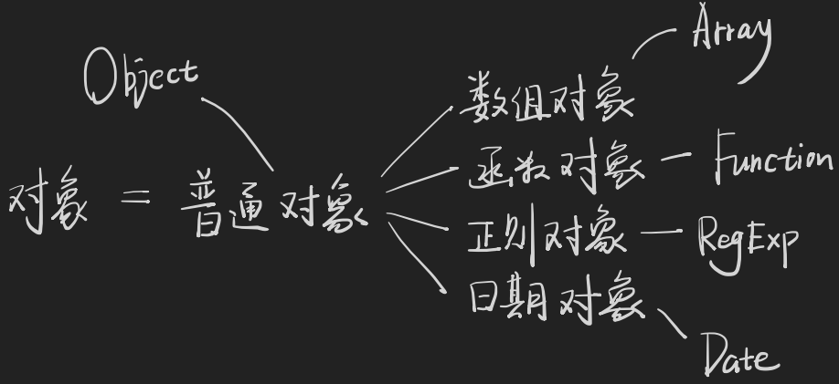

### TS/JS中有哪些数据类型

* JS——datatype：`null`、`undefined`、`string`、`number`、`boolean`、`bigint`、`symbol`、`object(含Array、Function、Date...)`
* TS——dataype：js所有，加上`void`、`never`、`enum`、`unknown`、`any`，再加上自定义类型`type`、`interface`

### 如何理解TS的数据类型

以集合的方式来理解TS类型。

```
type number = 1 | 1.1 | 1.22 | .....
type string = 'a'|'v'| ..
type boolean = true | false
type Object = { ? } | Array | Function | String | Number | Boolean | RegExp | ...
// 一个对应的是值 一个是类型
```
为什么会有两个number、两个string、两个boolean呢？

这是因为JS有一个包装对象的操作

```
(42).toFixed(2)
// 为什么42可以直接调用函数方法
// 这是因为JS自己做了一层包装，其实是在运行如下的代码
let temp = new Number(42) //
value = temp.toFixed(2)
// 之后在删除temp，返回value值
```
所以JS中的`Number`、`String`、`Boolean` 只用于包装对象，在TS里也不用。可以发现Object的范围以很大，所以TS内不使用`Object`。

### 如何在TS描述对象的数据类型



由于对象还分很多类型，所以可以采用下面两种方式描述对象的datatype。

1. 用`class`/`constructor`描述(不推荐使用)
2. 用`type`或`interface`描述(建议使用)

#### 普通对象

TS写法的**索引签名**描述对象，如下所示A表示key为string，value为number的所有对象(k可以换成任意单词)。

```
type A = {
  [k: string]: number
}
// 另一种写法 范型
type A = Record<string, number>
const a: A = {
  age: 18
}
```
key的类型可以不是`string`，也可以是其他类型，由于`object`太不精确了，所以TS一般采用索引签名或者Record泛型来描述普通对象。

#### 数组对象如何描述？

```
type A = string[]
// 等价于
type A = Array<string>
const a: A = ['h', 'i']
type B = number[]
// 等价于
type B = Array<number>
const b:B = [42, 0.8]

type D = [string, number]
// 二元组
const d: D = ['a', 100]
type E = [string, string, string]
// 三元组
const noError: E = ['a','b','c']
const error: E = ['a','b'] // 报错
type F = [string[], number[]]
const f: F = [['a','b','c'],[1,2,3]]

type A = [1,2,3]
const a: A = [1,2,3]
```
由于Array太不精确所以一般采用`Array<?>`或`string[]`或`[string,number]`来描述数组。

#### 函数对象如何描述？

具体配置需要在`ts.config.json`内配置。

```
type FnA = (a: number, b: number) => number
type FnB = (x: string, y: string) => string

type FnReturnVoid = (s: string) => void
type FnRetrunUndefined = (s: string) => undefined

const v: FnReturnVoid = (s: string) => {
  console.log(s)
}
const u:FnReturnUndefined = (s: string) => {
  console.log(s)
  return undefined
}
// this 类型 必须为普通函数，箭头函数不支持this

type Person = {name: string;age: number;sayHi: FnWithThis}
type FnWithThis = (this: Person, name: string) => void

const sayHi: FnWithThis = function() {
  console.log('hi'+ this.name)
}

const x: Person = {name: 'baizhe',age: 18,sayHi: SayHi}
x.sayHi('jack')
sayHi.call(x,'jack')
```
 由于Function太不精确，所以使用`()=> ?`来描述函数，其他对象一般直接用class描述。

#### 其他对象如何描述？

```
const d: Date = new Date()
const r: RegExp = /ab+c/
const r2:RegExp = new RegExp('ab+c')
const m:Map<string, number> = new Map()
m.set('1',2)

const wm:WeakMap<{name:string},number> = new WeakMap()
// WeakMap 的key必定为一个对象，是复杂类型的
const s: Set<number> = new Set()
s.add(123)
const wx:WeakSet<string[]> = new WeakSet()
// WeakSet 的key必定为一个对象，也是复杂类型

```
### any、unknown、never是什么？

#### any和unknown的区别

`any`的类型是什么类型都可以，`unknown`则是未知的，类型也是未知的，使用的时候会报错，可以通过断言的形式来定义类型，适合从外部获取的值(ajax请求获取到的内容)，一般推荐使用`unknow`，`any`无法使用断言了。

```
const a:unknown = 1
console.log(a)
a.toFixed(2) // error
const a:unknow = 2
const b = (a as number)
```
#### never类型怎么用？

`never`可以理解为空集，`any`则为全集，`unknow`则为未知集，`never`一般用于类型检查，比如用来接ajax请求来的内容。

```
type A = string & number // 不存在这种类型

type B = stirng | number | boolean
const b: B = ('hello' as any)
if(typeof b === 'string') {
  a.split('')
} else if(typeof b === 'number') {
  a.toFixed(2)
} else if(typeof b === 'boolean') {
  a.valueOf()
} else {
  console.log('never')
}
```
