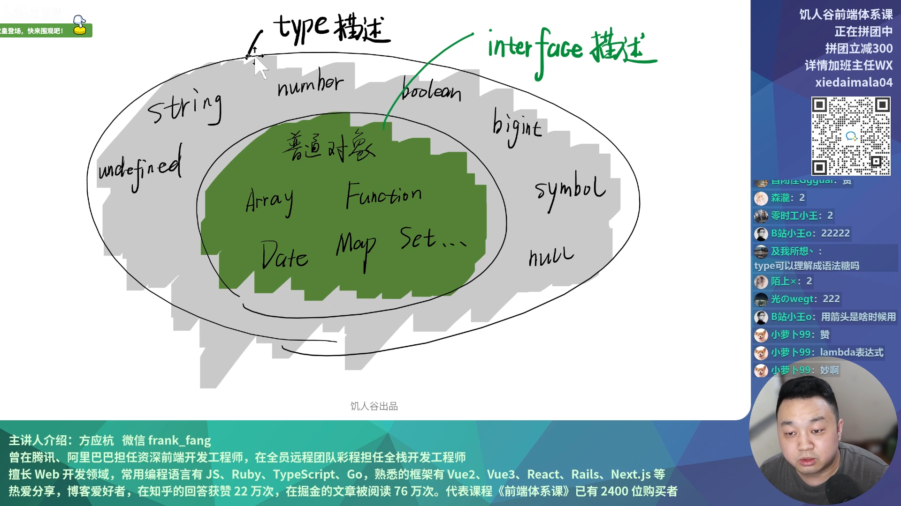

# enum、type、interface

### 什么是enum，什么时候使用？

`enum` 可以做简单的映射，映射 `string`，`number`

```ts
enum A  { // 逗号风格，默认累加
  todo = 0,
  done,
  archived,
  deleted
}
let status = 0；// A.todo 就是0，类型擦除时，A.todo会变为0
status = A.todo;
status = A.done;
// status还是数字，可以映射成相对应的值。
console.log(status)
```
遇到权限的枚举可以用 `enum` 进行位运算，[位运算内容详细见链接](https://www.w3school.com.cn/js/js_bitwise.asp)。

```ts
enum Permission {
  None = 0,
  Read = 1 << 0, // 0001
  Write = 1 << 1, // 0010
  Delete = 1 << 2, // 0100
  Manage = Read | Write | Delete, // 0111
}
// 用二进制位表示权限
// 若a & b === b，则a有b的所有1
function canWrite(p: Permission) {
  return (p & Permission.Write) === Permission.Write
}
function canManage(p: Permission) {
  return (p & Permission.Manage) === Permission.Manage
}
const user1: { permission: Permission } = { permission: 0b0101 }
if (canWrite(user1)) {
  console.log('Write OK')
}
if (canManage(user1)) {
  console.log('Manage OK')
}
```
### 何时不使用enum？

```ts
enum Fruit {
  apple = 'apple',
  banana = 'banana',
  pineapple = 'pineapple',
  watermelon = 'watermelon'
}
let f = Fruit.apple;
let test: Fruit = 'apple' // error
f = Fruit.pineapple
console.log(f)
// 等价于如下，两者含义几乎一致
type Fruit = 'apple' | 'banana' | 'pineapple' | 'watermelon'
let f2: Fruit = 'apple'
f2 = 'watermelon'
console.log(f2)
```
**总结何时可以使用enum：**

* `number` `enum` 可以
* `string` `enum` 不可以
* 其他 `enum` 不可以

### type

`type` 可以理解为集合，type学名叫类型别名 `Type Alias`，用于给其他类型取个名字。

```ts
type Name = string
type FalseLike = '' | 0 | false | null | undefined
// NaN 也是flasy值，但是它是number
type Point = { x: number; y: number }
type Points = Point[]
type Line = [Point, Points]
type Circle = { center: Point; radius: number }
type Fn = (a: number, b: number) => number
type FnWithProps = { // 带有属性的函数声明方式
  (a: number, b: number): number
  prop1: number
}
const f: FnWithProp = (x, y) => {
  return x + y
}
f.prop = 'hello'
```
别名是什么意思，`type` 是声明一个类型，没有生成一个实体。

```ts
type A = string
type B = A
// A B 使用时完全等价
```
### interface

`interface` 是为了迎合**面向对象编程**这个概念，也叫**声明接口**，`interface` 可以**描述对象的属性**(declare the shapes of objects)。

```ts
interface Data { } // 索引签名
type A1 = Array<string> & { name: string } & X
// 等价于
interface X {
  age: number
}
interface Points extends Array<Point>,X {
  name: string
}
// interface 描述函数
interface Fn {
  (a:number, b:number) : number
  xxx: number
}
const f:Fn = (x,y)=>{return x+y}
f.xxx = 100
interface D extends Date {
  xxx: number
}
const d: D = new Date()
d.xxx = 122 // 报错 只有函数可以添加属性
interface D extends RegExp {
  xxx: number
}
const d: D = new Date()
```
### type和interface区别



从上图可以发现这二者的区别：

* `interface` 只**描述对象**，`type` 则**描述所有数据。**
* `type` 只是**别名**，`interface` 则是**类型声明。**
* 对外API尽量用 `interface`，**方便扩展**，对内API尽量用 `type`，防止代码分散。

```ts
// 扩展axios
import { AxiosRequestConfig } from 'axios'
declare module 'axios' {
  export interface AxiosRequestConfig {
    _autoLoading?: boolean
    _mock?: string
  }
}
// 一般需要在xx.d.ts内声明，声明使用的模块然后导出接口
// 扩展String
declare global {
  interface String {
    padZero(length: number): string
  }
}
```
* `type` **不可以重新赋值**，**可以继承**，缺点**不可以扩展**，`interface` 可以**自动合并**。

```ts
// 不可以重新赋值
type A = number
A = string // error

// type可以继承
type A = {
  aaa: string
}
type B = {
  bbb: string
} & A
const b: B = {
  aaa: 'yes',
  bbb: 'yes'
}

// interface 可以自动合并
type X = {
  age: number
}
type X = {
  name: string
}
const a: X = {
  name: 'baizhe',
  age: 18
}
```
