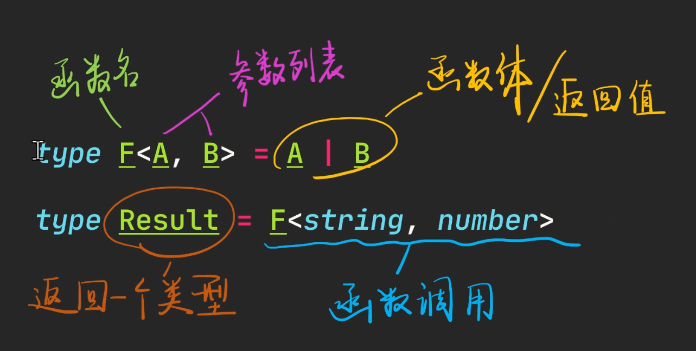
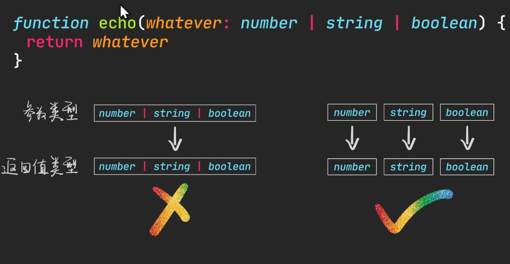
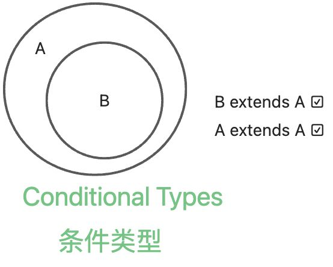
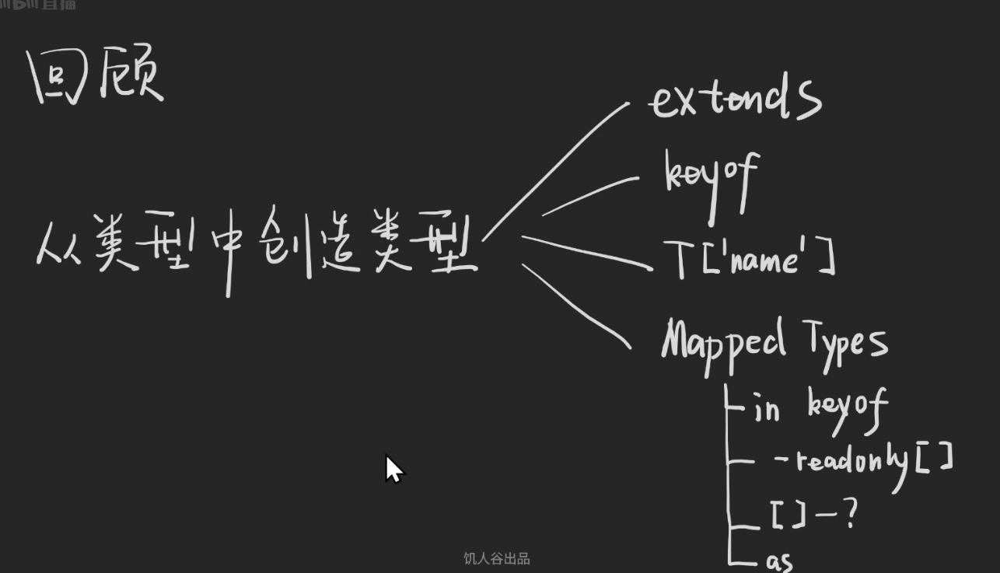

**泛型(Generic Types)**就是多种类型，也可以理解为接受类型的类型，也可以理解为是一种**接受类型的函数**，差别就是在js操作值，ts操作类型，如下代码所示，js的函数与ts的泛型很类似。

```ts
const f = (a, b) => a + b
const result = f(1, 2)
//    ^-- 3
type F<A, B> = A | B
type Result = F<string, number>
//   ^-- string | number
```


### 函数的本质是什么？

**推后执行**的、**部分待定**的**代码**，如下代码所示。

```ts
// 立即执行
console.log(1)

// 延后执行
// 推后一步执行
const f1 = () => console.log(1)
f1()
// 推后两步执行
const f2 = () => console.log(1)
console.log(2)
f2()
// 部分待定的
const fn = (n) => console.log(n) // 参数待定
fn(100)
const ff = (f) => f(1) // 函数待定
```
### 泛型的本质是什么

根据函数的本质可以推断出，泛型的本质是**推后执行**的、**部分待定**的**类型**。

```ts
function each (whatever: string | number | boolean) {
  return whatever
}
```


可以通过进行类型收窄勒确定返回类型，但这写使用了js，写起来太复杂了。

可以发现没有泛型，有些奇怪的**需求**就无法满足；没有泛型的类型系统，就如同没有**函数**的编程语言。

```ts
function each (whatever: string | number | boolean) {
  switch (typeof whatever) {
    case 'string':
      return whatever
      break;
    case 'number':
      return whatever
      break;
    case 'boolean':
      return whatever
      break;
  }
}
```
举例使用泛型有五种难度：

#### 难度一

```ts
type Union<A, B> = A | B
type Union2<A, B, C> = A | B | C

type Intersect<A, B> = A & B
type Intersect2<A, B, C> = A & B & C

interface List<A> {
  [index: number]: A
}
interface Hash<V> {
  [key: string]: V
}
```
可以使用两种方法来理解泛型：

1. 代入法
2. 默认类型

#### 难度二

```ts
type Person = { name: string }

type LikeString<T> = T extends string ? true : false
// T <= string 的 集合 extends 不要理解为继承，理解为继承或包含于
type LikeNumber<T> = T extends number ? 1 : 2
type LikePerson<T> = T extends Person ? true : false

type R1 = LikeString<'hi'> // true
type R2 = LikeString<true> // false
type S1 = LikeNumber<6666> // 1
type S2 = LikeNUmber<fasle> // 2
type T1 = LikePerson<{ name: 'frank', xxx: 1 }> // true
type T2 = LikePerson<{ xxx: 1 }> // false
```
extends 读作**继承**或**包含于。**

规则：

1. 若T为**never**，则表达式的值为**never**
2. 若T为联合类型，则**分开计算**

```ts
type ToArray<T> T extends unknown ? T[] : never

type Result = ToArray<string | number>
// type Result = (string | number) extends unknown ? ...
// type Result = (string extends unknown ? ...)
//             | (number extends unknown ? ...)
// type Result = string[] | number[]
// Result 为 string[] | number[] 类型

type ToArray2<T> = T extends unknown ? T[] : never
type Result2 = ToArray2<never>
// type Result2 = never extends unknown ? ...
// type Result2 = 空集没有元素直接返回 never
// type Result2 = never
// Result为 never 类型
```
可以发现上述的案例数学中的乘法很相似，比如乘法的**分配律**`(A + B) \* C = A \* C + B \* C`，乘法中的**零**`0 \* C = 0`，**注意：只对泛型有效**。

```ts
type Person = { name: string ,age: number }
type GetKeys<T> = keyof T
type Result = GetKeys<Person>
//    ^-- 'name' | 'age'
```

```ts
type Person = { name: string ,age: number }
type GetKeysType<T, K extends keyof T> = T[K]
type Result = GetKeysType<Person, 'name'>
//    ^-- string
 type Result = GetKeysType<Person, 'age'>
//    ^-- number
// 这样的写法有类型与 去对象里的值 Person['name'] 但ts中取的是它的类型
```
#### 难度三

以下的案例，有些为TS提供的方法。

```ts
type Person = { id: number, name: string ,age: number }
// 只读
type X1 = Readonly<Person>
type Readonly<T> = {
  // 映射Key
  readonly [K in keyof T]: T[K]
}
// 即每个属性后面添加是否可选？
type X2 = Partial<Person>
type Partial<T> = {
  [K in keyof T]?: T[K]
}
// 即每个属性添加必填
type X3 = Required<Person>
type Required<T> =  {
  [K in keyof T]-?: T[K]
}
// 类型为 对象的key和value
type Record<Key extends string | number | symbol, Value> = {
  [k in Key]: Value
}
type X4 = Record<string, number>
// 得出集合外的值 可以画图理解
type X5 = Exclude<1 | 2 | 3, 1 | 2> // 3
type Exclude<A, B> = A extends B ? never : A
// 通过代入法可以理解为
// type X5 = 1 extends 1 ｜ 2 ? never : 1
// | 2 extends 1 | 2 ? never : 2
// | 3 extends 1 | 2 ? never : 3
// 抽出 像取交集的值 可以画图理解
type Extract<A, B> = A extends B ? A : never
type X6 = Extract<1 | 2 | 3, 2 | 4> // 2
// 忽略对象的key
type Omit<T, Key> = {
  [K2 in keyof T as K2 extends Key ? never : K2]: T
// [K2 in keyof T as (K2 extends Key ? never : K2)]: T
// 映射类型 + 断言 + 条件判断 TS源码中使用了Pick
}
// TS 源码 Pick之后取反
type Omit<T, Key extends keyof T> = Pick<T,Exclude<keyof T ,Key>>
type X7 = Omit<Person, 'name' | 'age'>

// 只取部分属性
type Pick<T, Key extends keyof T> = {
  [k in Key]: T[k]
}
type X8 = Pick<Person, 'name' | 'age'>

// 去除readonly
type Person = {
  readonly id: number,
  readonly name: string,
  readonly age: number
}
type Mutable<T> = {
  -readonly [k in keyof T]: T[k]
}
type X9 = Mutable<Person>

// 补充 ： in 的区别
// : 会有问题
type A1 = {
  [k: string]: number
}
type A2 = {
  [k in string]: number
}
type YK = keyof Y
type Zk = keyof Z
```


关于ts的类型体操的内容，可以看看另外两篇文章，一篇为[TS类型实现象棋](https://zhuanlan.zhihu.com/p/426966480)，另一篇为[TS类型实现Lisp 解释器](https://zhuanlan.zhihu.com/p/427309936)。