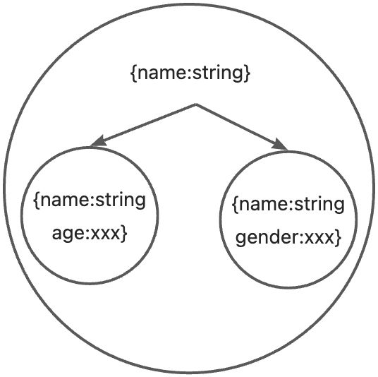
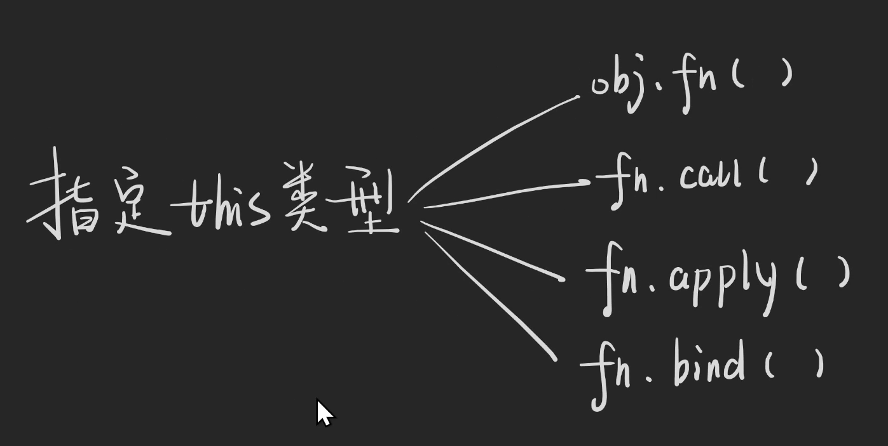
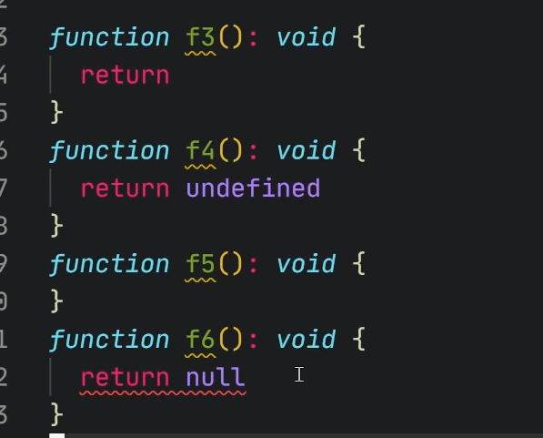

## 回顾对象的内容

### 使用Type或inferface描述对象类型

`type`可以理解为集合，学名叫类型别名`Type Alias`，用于给其他类型取名字；`interface`为声明接口，`interface`可以**描述对象的属性**(declare the shapes of objects)。

```
type Person = {
  name: string
}
type Person = {
  name: string, age: string
} | {
  name: string, age: number
} | {
  name: string, gender: string
} | {
  name: string, gender: number
}
// ....
interface Person {
  name: string
}
```
如左边案例所示，可以看出属性越多，集合越小。

### 索引签名与映射类型

**索引签名(Index Signature)**可以和**普通的属性**一起使用。

```
type Hash = {
  [k: string]: unknown
  length: number
}
type List = {
  [k: number]: unknown
  length: number
}
```
**映射类型(Mapped Type)**，**无法添加属性**，独占这个花括号，多用于**范型**。

```
type Hash = {
  [k in string]: unknown
}
type List = {
  [k in number]: unknown
}
```
### 问号是否可选

```
interface InputProps {
  defaultValue?: string
  value?: string
  onChange?: () => void
}

// 举例做到二选一
//  1.用了 defaultValue 就不能用 value
// 	2.用了 value 就必须用 onChange
// 在不用范型的前提下，达到条件，但还是有问题
type InputProps = {
  defaultValue?: string
  value?: undefined
  onChange?: () => undefined
} | {
  defaultValue?: undefined
  value?: string
  onChange?: () => void
}
```
### readonly表示只读

`readonly`表示**只读**，**不能写**。但**有局限性**，属性里面的值不会进行限制。

```
interface User {
  readonly id: number
  readonly name: string
  readonly scores: number[]
  age?: number
}
const u: User = {
  id: 1,
  name: 'frank'
  scores: [87, 52]
}
u.id = 2
// ^-- Cannot assgin to 'id' because
// it is a read-only property.ts(2540)
u.scores[0] = 100
// 不报错
```
描述对象总结：

1. type 或 interface
2. 索引签名 和 映射类型
3. 问号表示可选
4. readonly表示只读
## 深入函数的内容

### 函数的语法

对象的语法**全部适用于**函数。JS声明函数的方法和TS声明函数的方法有点不同，具体举例如下所示。

**JS声明函数的方法**

```
// js function
function functionName() { // body }
const functionName = functionName() { // body }
const functionName = () => { // body }
const f4 = new Function('a','b','return a + b')
```
**TS五种声明函数的方法(生成器和异步函数除外)**

```
// 第一种：先写类型在赋值
type F1 = (a: number, b: number) => number
const f1: F1 = (a,b) => a + b
// 第二种：先实现箭头函数，再获取类型
const f2 = (a: number, b: number): number => {
  return a + b
}
type F2 = typeof f2
// 第三种写法：先实现普通函数，再获取类型
function f3 (this: unknown, a: number, b: number): number {
  return a + b
}
type F3 = typeof f3
// 第四种：先实现匿名普通函数，再获取类型
const f4 = function (this: unknown, a: number, b: number): number {
  return a + b
}
type F4 = typeof f4
// 第五种：没人写
const f5 = new Function('a','b', 'return a + b')
type F5 = typeof f5
```
**两种特殊函数**

1. 构造函数(待完善)
2. 类型谓词

类型谓词，做类型联合的时候使用，用于类型收窄

```
type Person = {
  name: string
}
type Animal = {
  xxx: string
}
type A = Person | Animal
function f1(a: A)  {
  if (isPerson(a)) {
    a.name
	} else {
    a.xxx
  }
}
function isPerson (x: Person | Animal):x is Person {
  return 'name' in x
}
const isPerson2 = (x: Person | Animal) => x is Person => {
  return 'name' in x
}
```
### 可选参数

可选参数只需要在属性的冒号前**添加问号**。**可选参数****必须放在****必选参数后面**。因为无法做到第一个可选，第三个可选，必选参数不可以再可选参数后面。

```
type AddEventListener = (eventType: string, fn: unknown, useCapture?: boolean) => void

const addEventListener: AddEventListener = (eventType,fn,useCapture) => {
  // body
  // 若是useCapture没有传入
  if(useCapture === undefined) = {
    // ...
  }
}
addEventListener('click',() => {})
```
### 参数默认值

参数默认值其实是js的知识，即只要在参数后面**添加**`**=**`**然后加默认值**。举例函数的第三个参数若要设置默认值，如下所示。

```
type AddEventListener = (eventType: string, fn: unknown, useCapture?: boolean) => void
// 使用时候设置默认值
const addEventListener: AddEventListener = (eventType,fn,useCapture = false) => {
  // body
  // 若是useCapture没有传入
}
// 偷懒的方法, ts会自动去推断类型
const addEventListener = (eventType: string, fn: () => void, useCapture = false) => {
  // body
}
addEventListener('click',() => {})

// 若参数为对象时
const fn1 = (config = {a:[],b:'x',c:'x'}) => {
  									// ^ never[]
  // body
}
// 或声明config类型
type Config = { a: string[], b: string, c: string }
const fn2 = (config:Config = {a:[],b:'x',c:'x'}) => {}
// 或用断言
const fn3 = (config = {a:[],b:'x',c:'x'} as Config) => {}
```
### 参数也是函数

```
type AddEventListener = (
  eventType: string,
  fn: (e: Event)=> void,
  useCapture?: boolean) => void

const addEventListener: AddEventListener = (eventType,fn,useCapture = false) => {
  // 浏览器的代码 伪代码
  const event: Event = {} as any
  const element: Element = {} as any
	fn.call(element, event)
  // body
}
```
### 返回值也是一个函数

```
// 返回值为函数
function createAdd(n:number) {
  return function (m:number) {
    return m + n
  }
}

// 先写类型
// type F = (n:number) => ((m: number) => number)
type E = (n: number) => (m: number) => number

const createAdd: E => n => m => m + n

const add = createAdd(6)
console.log(add(5))

export {}
```
### 重载


重载就是**同名函数**，可以接受**参数类型不同**、**参数个数不同**、**都不同**。即满足右边的三种情况，详细内容见TS官网的[链接](https://www.typescriptlang.org/docs/handbook/2/functions.html#function-overloads)。重载能不用就不用，除非折磨自己。重载适合牛逼的库比如 `JQuery` 不想取多个名字，也可以通过重载对`axios`进行二次分装。

```
// 重载
// 案例一
type Print = (n: string | number) => void

type Print2 = (a: string | number, b?: string | number) => void
type Print3 = (a: boolean, b?: string | number) => void

function print(n: string | number): void
function print(a: boolean, b: string | number): void
function print(a: (string | number) | boolean, b?: string | number): void {
  if (typeof a === 'boolean') {
    if (b) {
      console.log(a, b)
    } else {
      console.log(a)
    }
  } else {
    // a
  }
}

// java 的重载 名字相同 同名不同参，与返回类型无关

// 案例二 可以看ts官网案例
// ts的重载是可以使用联合类型的 与 java的重载不同
// 重载只描述参数的，对于返回值并不管

// function createDate(n: number): void; //场景1
// function createDate(year: number, month: number, date: number): void; //场景2
// // 实现签名 只需要在逻辑上兼容上面的情况
// function createDate(x: number, y?: number, z?: number): void {
//
// }
// 两种最大的集合
function createDate(n: number): Date; //场景1
function createDate(year: number, month: number, date: number): Date; //场景2
// 实现签名 只需要在逻辑上兼容上面的情况
//
function createDate(x: number, y?: number, z?: number): Date {
  if (z !== undefined && y !== undefined) {
    // year month date
    // createDate(2011, undefined, 1)
    return new Date(x, y, z)
  }
  if (x !== undefined && y !== undefined && z !== undefined) {
    // createDate(2011, 1, undefined)
    // n
    return new Date(x)
  }
  // 防御型编程
  throw new Error('参数错误')
}

// 还不如直接写两个函数
function createDateFormNumber(n: number): Date {
  return new Date(n)
}

function createDateFormYMD(x: number, y: number, z: number): Date {
  return new Date(x, y, z)
}

// 上述那种重载适合牛逼的库比如 JQuery 不想取多个名字 二次分装axios
// $div = $('#id')
// $div = $(div)
// $div = $('<div>hi</div>')
// $div = $(document)
// $div = $(document.body)
// $div = $(window)

// 请求方式
// js ajax
const xhr = new XMLHttpRequest()
xhr.open('post', '/xxx')
xhr.onreadystatechange = () => {
  if (xhr.readyState) {
  }
}
xhr.setRequestHeader('Content-Type', 'application/json')
xhr.send(JSON.stringify({xx: 'baizhe'}))

// Fetch
// fetch()
//可以在控制台发出fetch请求
// Axios
```
### 指定this类型



函数能够指定`this`，那么TS中如何指定类型，如下代码所示。TS中指定函数`this`的类型**能不用就不用**。

```
type Person = {
  name: string
}

function f1(this: Person, n: number) {
  console.log(n)
}

// f1(1)

// 1.person.f(1)
// 这种方法过于平凑
const p: Person & { f: typeof f1 } = {name: 'baizhe', f: f1}
p.f(1)

// 2. f.call(person,1)

const p2: Person = {name: 'baizhe'}
f1.call(p2, 1)

// 3. f.apply(person,[1])
const p3: Person = {name: 'baizhe'}
f1.apply(p3, [1])

// 4 f.bind(person)(1)
const p4: Person = {name: 'baizhe'}
const newF = f1.bind(p4)
newF(1)
// bind 用于部分赋值

// bind 补充内容
function x1(a:number,b:number,c:number) {
  console.log(a+b+c)
}
const x2 = x1.bind(null) // null => this
const x3 = x2.bind(null,1) // 1 => a
const x4 = x3.bind(null,2) // 2 => b
const x5 = x4.bind( null, 3) // 3 => c
console.log(x5())

// 疑问！
// x1.call.bind(null,1)
```
### ... 与 参数

###

1. 剩余参数——用于参数长度不固定的情况。

```
// ... 与参数
function n1(...x: number[]) {
  console.log(x)
}
n1(1)
n1(1,2)
n1(1,2,3)

function n2(a:number,...b:number[]) {
  console.log(a,b)
}
n2(1)
n2(1,2)
n2(1,2,3)
// 用于参数长度不固定的情况
```
2. 展开参数与`as const`，`as const`的内容具体可以见[TS官网](https://www.typescriptlang.org/docs/handbook/release-notes/typescript-3-4.html#const-assertions)。数组或对象在结尾添加`as const`会添加上`readonly`只读属性。若是字符串类型的则不在扩展，也不会添加`readonly`属性。

```
// 展开参数案例1
function y(a:number, ...b:number[]){
  y2.apply(null,b)
}
function y2(...a:number[]){
  console.log(a)
}

// 展开参数与 as const案例2
function g(a:number,...b:number[]){
  // let z = [1,2]
  // 这里z TS会自动推断为number[]，无法用于g2函数
  // 解决方法：
  // 1. 断言z为二元组 let z = [1,2] as [number,number]
  // 2. 类型写死 let z:[number,number] = [1,2]
  // 可以发现使用const定义const z = [1,2] 数组内还能在添加数字
  // 3. 使用 as const
  let z = [1,2] as const
  //  ^-- let z: readonly [1, 2]
  // 自动类型推导
  g2(...z)
}

function g2(a:number,b:number) {
  console.log(a,b)
}

// 通过下面的例子可以看出 const 和 let 的区别
const consta = 1
type constA = typeof consta
//   ^-- type 为 1
let leta  = 1
type letA = typeof leta
//   ^-- type 为 number
// 常量做类型推断往小的猜，变量做类型对端往大的猜
```
3. 参数对象析构

```
type Config = {
  method: 'GET' | 'POST',
  data?: unknown,
  query?: {}
}
// 可以不传参数，接受参数对象析构赋值
request()
function request({method,data, ...rest}:Config = { method: 'GET'}){
  console.log(method,data,rest)
}
```
### void 返回类型

若是函数先声明好返回类型为`void`，使用的时候可以`return`任何其他值，但他会被忽略。具体可以查看[TS官网](https://www.typescriptlang.org/docs/handbook/2/functions.html#return-type-void)。

```
// 先声明好函数返回类型为void

type voidFunc = () => void;
const voidFunc1 = () => { return true }
const voidFunc2 = () => { return undefined }
const voidFunc3 = () => { return null }
const voidFunc4 = () => {  }

// 不提前声明
function void1(): void {
  return
}
function void2(): void {
  return undefined
}
function void3(): void {}
function void4(): void {
  return null
  // ^--Type 'null' is not assignable to type 'void'
  // 可以通过修改tsconfig.json的配置项 "strictNullChecks": false,
}
```


