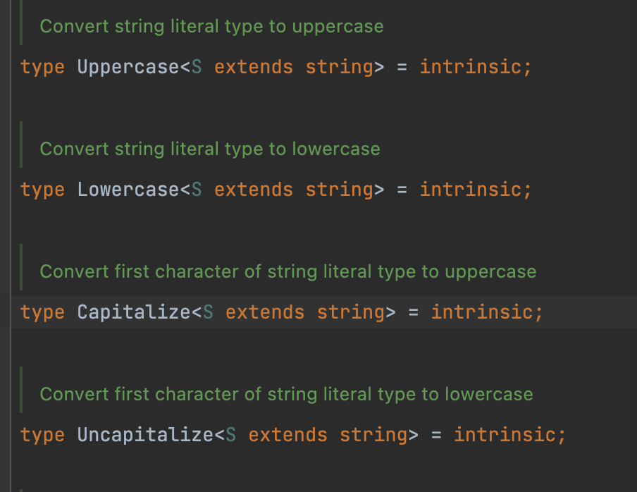

# 类型体操

### 基本原理

#### if else条件语句

如果要用 `if else`语句，比如 `if(A <= B) true else false`，可以如下写法。

```ts
type A = 1
type B = 1 | 2
type Result = A extends B ? true : false
```
如果要写 `if(A <= B) and (C <= D) ...`

```ts
type A = 1
type B = 1 | 2
type C = 3
type D = 3 | 4
type Result = A extends B
  ? C extends D
    ? "true, true"
    : "true, false"
  : C extends D
    ? "false, true"
    : "false, false"
```
#### 空数组

```ts
type A = []
type IsEmptyArray<Arr extends unknown[]> =
	Arr['length'] extends 0 ? true : false
type Result = IsEmptyArray<A>
//    ^-- true
```
#### 非空数组

```ts
type A = [1]
type NotEmpty<Arr extends unknown[]> =
  Arr extends [...infer X, infer Last] ? true : false
type Result = NotEmpty<A>
//   ^-- true
```
`infer`相当于给`unknown[]`取名字

#### 递归

最多递归数组的时候最多47层。

```ts
type A = ['ji', 'ni', 'tai', 'mei']
type Reverse<Arr extends unknown[]> =
	Arr extends [...infer Rest, infer Last]
  ? [Last, ...Reverse<Rest>]
  : Arr
type Result = Reverse<A>
// Result is ['mei', 'tai', 'ni', 'ji']
```
#### 模式匹配 + infer"引用"

```ts
type Tuple = ["ji", "ni", "tai", "mei"]
type Result1 = Tuple extends [infer First, ...infer Rest]
  ? First : never
// Result1 is "ji"
type Result2 = Tuple extends [infer First, ...infer Rest]
  ? Rest : never
// Result2 is ["ni", "tai", "mei"]
```

```ts
type A = ['ji','ni','mei']
type R = A['length']
```
数组长度不限制，元祖长度有限制

### 元祖体操

可以使用JS的拓展操作符。

```ts
type A = [1]
type B = [...A,2]
```

```ts
type B = [1,2]
type C = [3,4]
type D = [...B,...C]
```
取元祖最后一项

```ts
type D = [1,2,3,4]
// 注意 1，2，3，4都是类型，不是值
type Last<T> = T extends [...items: unknow[], last: infer X]
  ? X : never
type E = Last<D>
// ^--- E = 4 注意这里的4是类型，不是值
```
取除了最后一项的元祖

```ts
type D = [1,2,3,4]
type NoLast<T> = T extends [...items: infer X, last: unknow[]]
  ? X : never
type E = NoLast<D>
// [1,2,3,4] => [1,2,3]
// [ ] => [ ]
```
### 字符串体操

`Capitalize` TS原生就有，内置的，用于**首字母大写**。`intrinsic` 表示内置，内在。

```ts
type A = 'fang'
type B = Capitalize<A>
//   ^-- type B = "Fang"
type C = 'ji' | 'ni' | 'tai' | 'mei'
type X = Capitalize<C>
//   ^-- type X = "Ji" | "Ni" | "Tai" | "Mei"
```
还有其他内置的方法如`Uppercase`**字符串大写**，`Lowercase`**字符串小写**，`Uncapitalize`**首字母小写**。



**模版字符串**

```ts
type A = "ji"
type B = "ni"
type C = "tai"
type D = "mei"
type X = `${A} ${B} ${C} ${D}`
// ^-- type X = "ji ni tai mei"
```

```ts
type A = "ji ni tai mei"
type First<T extends string> = T extends `${infer F}${string}` ? F : never
type Result = First<A>
// ^-- "j"
```
 字符串可以转为元祖

```ts
// 字符串可以转为元祖
// 我们可以获取字符串的最后一项
type StringToTuple<T extends string> =
  T extends `${infer F}${infer R}`
  ? [F, ...StringToTuple<R>]
  : []
type LastOfTuple<T extends any[]> =
  T extends [...infer Rest, infer Last] ? L : never
type LastOfString<T extends string> = LastOfTuple<StringToTuple<T>>
```
关于 `infer` 引用可以用来数组拍平

```ts
type Flatten<Type> = Type extends Array<infer Item> ? Item : Type
```
### string => 联合类型

```ts
type StringToUnion<S extends string> =
	S extends `${infer First}${infer Rest}`
  ? First | StringToUnion<Rest> : never
type Result = StringToUnion<'jinitaimei'>
// type Result = "j" | "i" | "n" | "t" | "a" | "m" | "e" | "i"
// 注意，联合类型自动去重了
type UnionToString<>
```
### string => ['a','b','c']

```ts
type StringToTuple<S extends string> =
	S extends `${infer First}${infer Rest}`
  ? [First, StringToTuple<Rest>]: []
type Result = StringToTuple<'jinitaimei'>
// type Result = ["j" , "i" , "n" , "t" , "a" , "m" , "e" , "i"]
// 注意，联合类型自动去重了

```
判断是否为联合类型

```ts
// 泛型 + 联合 => 分配律
// 判断联合类型
// 只有联合类型才会有分配律
// 我们现在要判断一个类型是否是联合类型
// 如果被分配了，那么就是联合类型，
// 如果没有被分配，那么就不是联合类型
type IsUnion<A, B=A> = A extends A ?
  [B] extends [A] // 遇到联合类型一定返回false // 遇到非联合类型一定返回true
  ? false
  : true
: never
type UnionToString<U> = IsUnion<U> extends true
  ?
  : never
```
