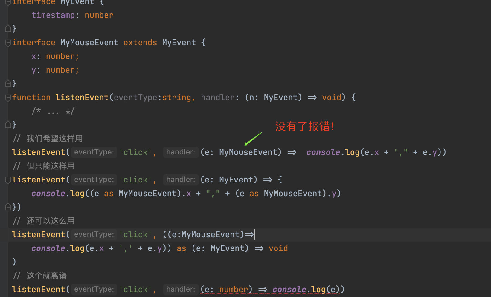

为什么要兼容，因为实际工作中往往无法做到类型一致。

```ts
const config = {
  a: 1, b: 2,c: 3, d: 4
}
const newConfig = loadsh.pick(config, ['a','b','c'])
runTask(newConfig)
// v.s
const config = {
  a: 1, b: 2,c: 3, d: 4
}
runTask(config)
```
所以需要用更全的类型代替，举例来说y有的，x都有，则x兼容y。

### 简单类型

```ts
type A = string ｜ number
const a: A = 'hi'
```
从并集的角度来看，类型A为`string`和`number`的并集，值a刚好是并集在类型中，两者并集，并集部分小的，可以赋值给更大的并集。所以**小的可以赋值给大的**。


### 普通对象的兼容

```ts
type Person = {
    name: string
    age: number
}
let user = {
    name: 'baizhe',
    age: 18,
    id: 1,
    email: 'xx@qq.com'
}

let p: Person
p = user
```
user兼容p，故将user**赋值**给p**不报错**。这样赋值的前提是要有共同的属性，属性多的就是限制条件多，user小，Person大。可以得出**属性多的可以代替属性少的**。

我们也可以反推user对象的类型，可以发现这里的`typeof`为TS的`typeof`。

```ts
let user = {
    name: 'baizhe',
    age: 18,
    id: 1,
    email: 'xx@qq.com'
}
type User = typeof user
// ^-- type User = { name: string; age: number; id: number; email: string; }
```

```ts
type Person = { name: string, age: number}
let user = { name: 'baizhe',age: 18,id: 1 }
const f1 = (p: Person) => {
  console.log(p)
}
f1(user)
```
如左边代码所示，可以发现user参数能够直接被使用且不报错得出结论：

作为**参数的时候**也可以**兼容**，**多传参数**也**不会报错**。

### 父子接口

```ts
interface 父接口 {
    x: string
}
interface 子接口 extends 父接口 {
    y: string
}
let objectChild: 子接口 = {
    x: 'yes',
    y: 'yes'
}
let objectParent: 父接口

objectParent = objectChild
```
由左侧的案例可以看出功能多的能代替功能少的，即**属性多**的能够赋值给**属性少**的。

```ts
interface 有左手的人 {
  left: string
}
interface 有双手的人 {
  left: string
  right: string
}
let person: 有双手的人 = {
  left: 'yes',
  right: 'yes'
}
let personLeft: 有左手的人 = {
  left: 'yes'
}
personLeft = person
```
左侧案例中两个接口直接没有关系，也是可以的，`person`能够赋值给`personLeft`。

### 复杂的函数，函数包括参数和返回值

#### 1. 参数个数不同，能兼容吗？

```ts
let 接受一个参数的函数 = (a: number) => {
    console.log(a)
}
let 接受两个参数的函数 = (b: number, s: string) => {
    console.log(s, b)
}
接受两个参数的函数 = 接受一个参数的函数 // ok
接受一个参数的函数 = 接受两个参数的函数 // error
```
左侧的案例可以得出**参数少的可以赋值给参数多**的。

可以用一种取巧方法来判别，如下图所示：若上下参数类型一样则为**绿色**，参数多的一方则无法复制给上面为**红色**箭头，若**有红色则左侧也为红色**，这样就可以得出两者是否兼容。


```ts
const button = document.getElementById('submit')!
const fn = (e: MouseEvent) => console.log(e)

button.addEventListener('click', fn)
button.addEventListener('click', fn , false)
button.addEventListener('click', fn , false)

let item = [1, 2, 3]

item.forEach((item,index,array)=> console.log(item))
item.forEach((item)=> console.log(item))
```
根据js程序猿的习惯，很常见少传递参数的情况。

#### 2. 参数类型不同，能兼容吗？

```ts
interface MyEvent {
    target: string
}
interface MyMouseEvent extends MyEvent {
    x: number
    y: number
}
let listener = (e: MyEvent) => {
  console.log(e.target)
}
let mouseListener = (e: MyMouseEvent) => {
  console.log(e.x, e.y)
}
mouseListener = listener // ok
listener = mouseListener // error
```
根据左侧的案例可以看出，`MyEvent`是父集，是个关于事件的类型；`MyMouseEvent`是子集，是个关于鼠标事件的类型。根据父子接口得出的结论是，父不能赋值给子，子可以。但对于**函数的参数类型不同**来说，它们**两者方向相反**。

根据参数类型的兼容性取反，可以得出对**参数要求少**的可以赋值给对**参数要求多**的。


`MyEvent`的参数要求少，`MyMouseEvent`的参数要求多。根据取巧箭头的方法可以得出，`listener`是可以赋值给`mouseListener`。

也可以通过断言来直接决定返回值的类型，断言是为了事件绑定。断言也不能瞎断言，TS会进行判断。但是`const x = (e as unknow as number)`，这样的操作可以逃脱检查。

```ts
interface MyEvent {
    timestamp: number
}
interface MyMouseEvent extends MyEvent {
    x: number;
    y: number;
}
function listenEvent(eventType:string, handler: (n: MyEvent) => void) {
    /* ... */
}
// 我们希望这样用
listenEvent('click', (e: MyMouseEvent) =>  console.log(e.x + "," + e.y))
// 但只能这样用
listenEvent('click', (e: MyEvent) => {
    console.log((e as MyMouseEvent).x + "," + (e as MyMouseEvent).y)
})
// 还可以这么用
listenEvent('click', ((e:MyMouseEvent)=>
    console.log(e.x + ',' + e.y)) as (e: MyEvent) => void
)
// 这个就离谱
listenEvent('click', (e: number) => console.log(e))
```
报错如下所示：


为了妥协可以在`tsconfig.json`内关闭`strictFunctionTypes:false`

加了选项后显示如下所示：



#### 3. 返回值类型不同，能兼容吗？

```ts
let 返回值属性少集合大 = () => {
  return {
    name: 'Alice'
  }
}
let 返回值属性多集合小 = () => {
  return {
    name:'Alice',
    location: 'seattle'
  }
}
返回值属性少集合大 = 返回值属性多集合小
// OK
返回值属性多集合小 = 返回值属性少集合大
// 报错：'location' is missing
```


根据左侧的代码可以得出，**限制多**的可以**赋值**给**限制少**的，也可以根据集合的形式理解，**属性多集合小**的可以**赋值**给**属性少集合大**的。也可以发现**属性多的限制也多**。

### Any,unknown,object,void,undefined,null,never之间的兼容性


如上的表来自于TS的文档，具体内容见[链接](https://www.typescriptlang.org/docs/handbook/type-compatibility.html#any-unknown-object-void-undefined-null-and-never-assignability)。根据表可以得出一下结论。

* 这些类型都能够分配给自己本身。
* `any`和`unknown`在分配给其他类型上两者相同，但不同的是`unknown`不能被分配给其他除了`any`。
* `void`不能赋值给任何类型或者任何类型赋值。

### 补充类型系统的概念


`unknown`是顶类型，`never`是**底类型**，`never`可以**兼容**其他类型。

**底类型**可以**赋值给****顶类型**往上的，即**向上转换**，向上转换是**安全**的，反之则是**向下转换**，**不安全**。

`null`是一个错误关闭器。

