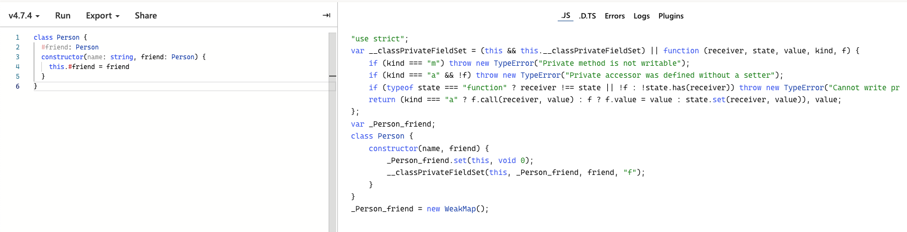
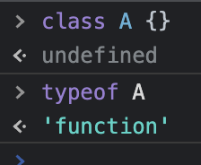
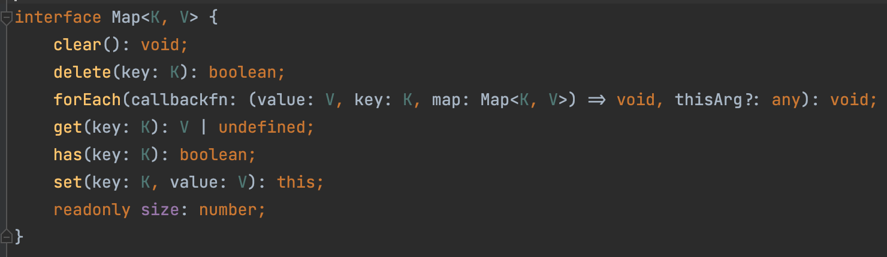

# 面向对象之类的TypeScript语法

复习题

```ts
function Person(name, age) {
  this.name = name
  this.age = age
}
Person.prototype = {
  constructor: Person,
  sayHi(target){
    console.log(`你好，${target.name}，我是${this.name}`)
  }
}
const p0 = new Person('tom', 17)
const p1 = new Person('frank', 18)
const p2 = new Person('jack', 19)
p1.sayHi = function (target) {
  console.log(`${target.name} 你是一个笨蛋`)
}
p2.sayHi(p0)
// 1. 你好，tom，我是jack
// 2. tom 你是一个笨蛋
```
如左侧代码所示，`p2.sayHi(p0)` 会打印出“你好，tom，我是jack”，这是因为创建的 `p2` 的对象的原型上有 `sayHi`方法，调用了 `sayHi`方法，然后方法传入的参数为 `p0`。`target.name` 打印为`tom`，`this.name` 则是指向 `p2` 对象上的属性name，打印为 `jack`。

对于JavaScript的对象的理解，有两种流派，一种是**类class**(采纳了Java的想法，**面向对象编程**[**Object-orientied Programming**])，一种是基于**原型**，考虑的原型链等，若要查看关于原型的内容点击下方卡片。

此处为语雀内容卡片，点击链接查看：<https://www.yuque.com/baizhe-kpbhu/ktvewz/wv2i5r>为啥用使用class呢？

1. 因为学前端的人有很多是后端，**外来人口多**，迫切需要class。
2. class是**保留字**，迟早要实现class。
3. 大部分前端没理解**原型**。

### 关于class

下述代码中给 `p` 对象的属性上赋值的时候就会报错，这是因为 `PointClass` 类没有 `x` 和 `y` 的属性，`p` 对象也不会有这个属性。

```ts
interface PointInterface {
}

class PointClass {
}

const p = new PointClass()
p.x = 1
p.y = 1
// 这个时候就会报错
```
在不严格的检测下，这下面 `interface` 和 `class` 的声明的两种形式相同。

```ts
interface PointInterface {
  x: number
  y: number
}

// 在tsconfig.json中修改，就不会报错
// "strictPropertyInitialization": false

class PointClass {
  x: number
  y: number
}

// 若tsconfig.json中的"strictPropertyInitialization": true 或 "strict": true
// class PointClass中的x和y就会报错
// 报错：TS2564: Property 'x' has no initializer and is not definitely
// assigned in the constructor.

const p = new PointClass()
p.x = 1
p.y = 1
```
但是在使用strict模式下，还是有四种解决方法。

```ts
class PointClass {
  x: number = 0
  y: number = 0
}
// 1.创建的时候初始化值
class PointClass {
  x: number = 0
  y: number = 0
}
// 2.第二种断言
class PointClass {
  x = 0
  y = 0
}
// 3.不偷懒写法
class PointClass {
  x: number
  y: number
  constructor() {
    this.x = 0
    this.y = 0
  }
}
// 4.!不检查
class PointClass {
  x!: number
  y!: number
}

const p = new PointClass()
p.x = 1
p.y = 1
```
可以得出：`interface` 只有成员的类型**没有实现**，`class` **须同时**有成员的类型和实现

### class的构造函数

```ts
// class的构造函数方式一
class Point {
  x: number;
  y: number;
	constructor(x = 0, y = 0) {
    this.x = x;
    this.y = y;
  }
}
const p = new Point()
console.log(p.x, p.y)

// class的构造函数方式二
// ts专有，在参数前添加public
class Point {
  constructor(public x:number = 0, public y:number = 0) {
  }
}
const p = new Point()
console.log(p.x, p.y)
```
class的构造函数也**接受重载**。

```ts
class Point {
  x!: number;
  y!: number;
	// !表示不做校验
  constructor(x: number, y: number);
  constructor(s: string);
	// 	上面两个写不写无所谓
  constructor(xs: number | string, y?: number) {
    if(typeof xs === 'number' && typeof y === 'number') {
      this.x = xs
      this.y = y
    } else if (typeof xs === 'string') {
      const parts = xs.split(',')
      this.x = parseFloat(parts[0])
      this.y = parseFloat(parts[1])
    }
  }
}
const p = new Point('1,2')
console.log(p.x, p.y)
```
在class内可以使用**索引签名**。

```
class Hash {
  [s: string]: unknown
  set(key: string, value: unknown) {
    this[key] = value
  }
  get(key: string) {
    return this[key]
  }
}
```
### class可以实现接口

关键词 `implements` 用于**实现接口**。

```ts
interface Person {
  name: string
  sayHi: (target: Person) => void
}
class User implements Person {
  constructor(public name: string) { }
   sayHi(target: Person){
     console.log(`Hi ${target.name}`)
   }
}
```
如果前面的是类，后面的是类则是继承。

如果前面是类后面是接口，则是implements，实现接口。

```ts
interface Person {
  name: string
  sayHi: (target: Person) => void
}
interface Taggable {
  tags: string[]
  addTag: (tag: string) => void
}

class User implements Person, Taggable {
  constructor(public name: string) {}
  tags: string[] = []
  sayHi(target: Person) {
    console.log(`Hi ${target.name}`)
  }
  addTag(tag: string) {
    this.tags.push(tag)
  }
  removeTag(tag: string) {
    // 修改老数组上的内容
    const index = this.tags.indexOf(tag)
    this.tags.splice(index, 1)
    // 或使用filter 但会创建一个新的数组
    // this.tags = this.tags.filter(item=> item !== tag)
  }
}
```

```ts
interface Person {
  name: string
  age?: number
  sayHi: (target: Person) => void
}
class User implements Person {
  constructor(public name: string) { }
  sayHi(target: Person) {
    console.log(`Hi ${target.name}`)
  }
}
const u = new User('frank')
// 问： u.age 的值是多少？
// 1. 0
// 2. undefined
// 3.报错
```
上述代码片段题目的答案是3 Typescript报错。

`implement` 不会帮你实现任何东西，比如对 `User` 不会进行处理。

### class可以继承class

#### 继承父类的方法

通过 `super`，继承父类的的属性，会拥有父类的所有方法。

```ts
class Person {
  constructor(public name: string) { }
  sayHi() {
    console.log(`你好，我是${this.name}`)
  }
}
class User extends Person {
  constructor(public id: number, name: string) {
    super(name)
  }
  login() { }
}
const u = new User(1, 'frank');
u.sayHi()
u.login()
```
#### 重写方法

在继承的时候**重写**，有两个知识点配合下面的代码段可以发现。

1. `override` 重写，可以看到 `sayHi()` 被User重写了。
2. `super.method()`，`sayHi()`被重写了，但当`target`没有传入的时候使用父类的方法。

```ts
class Person {
  constructor(public name: string) { }
  sayHi() {
    console.log(`你好，我是${this.name}`)
  }
}
class User extends Person {
  constructor(public id: number, name: string) {
    super(name)
  }
  login() { }
  sayHi(target?: User) {
    if(target === undefined){
      super.sayHi()
      // 继承父类的方法
    } else {
      // override 重写了sayHi方法
      console.log(`你好，${target.name}，我是${this.name}`)
    }
  }
}
```
#### 重写属性

注释 `declare friend: User`，会发现很奇怪，与父类的不同。其实 `declare` 是一个关键词，如果继承一个类，希望把父类的属性重写，则使用 `declare` 重新声明。

```ts
class Person {
  friend?: Person
  constructor(public name: string, friend?: Person) {
    this.friend = friend
  }
}
class User extends Person {
  declare friend: User
  constructor(public id: number, name: string, friend?: User) {
    super(name, friend)
  }
}
const u1 = new User(1, 'frank')
const u2 = new User(1, 'frank', u1)
console.log(u2.friend);
```
### 成员可见性

#### public

类成员的**默认**可见性是**公开**的。公共成员可以在任何地方访问。即使不写 `public` 关键字，也会被认为是 `public`，`public` 也可以理解为是**类外可见**。

```ts
class Greeter {
  public greet() {
    console.log("hi!");
  }
}
const g = new Greeter();
g.greet();
```
#### protected

`protected` 成员仅对声明它们的类的子类可见，即**子类可见**。

```ts
class Person {
  protected friend?: Person
  constructor(public name: string, friend?: Person) {
    this.friend = friend
  }
}
const person1 = new Person('person1')
const person2 = new Person('person2', person1)
class User extends Person {
  constructor(public id: number, name: string, friend?: User){
    super(name,friend)
  }
  xxx(){
    console.log(this.name)
  }
}
const user1 = new User(1,'user1')
const user2 = new User(2,'user2', user1)
user2.friend
// ^-Property 'friend' is protected and only
// accessible within class 'Person' and its subclasses'

```
#### private

`private` 就像 `protected`，但不允许从子类访问父类的属性，即**类内可见**。

```ts
class Person {
  private friend?: Person
  constructor(public name: string, friend?: Person) {
    this.friend = friend
  }
  xxx() {
    console.log(this.friend)
  }
}
const p1 = new Person('jack')
const p2 = new Person('frank', p1)
p2.friend
// ^-- Property 'friend' is private and only accessible within class 'Person'.
```
但是`private`在一种情况下会失效，即**类型擦除**的时候，所以也可以说`private`是**假私有属性**，若要它的属性真的变为真私有属性，要是用到`**#**`。

#### #var 真私有属性

使用`**#**`，就不会被**类型擦除**了，如下图所示为TSplayGround 转为JS后的代码，详细可以查看[链接](https://www.typescriptlang.org/play?#code/MYGwhgzhAEAKCmAnCB7AdtA3gWAFDWgGIAzRAS3jQBMAuOJVNPA4dCAF0QFdh2VEAFGjABbeHQ7k0AcwA00UhWp0EydAEoszAtHYALMhAB0JcpSrQAvArPVtAXzz2gA)。



### static

**static**关键字，即可以**通过类名访问**，static又被叫做**类属性**，**静态属性**，但是不能有**static name**(name为已经创建好的属性名或是不可写的关键词)。

```ts
class Person {
  static xxx = 1 // Person.xxx = 1
  name: string
 // static name //error
  constructor(name: string) {
    this.name = name
  }
}
console.log(Person.xxx) // 1
```
**通过类名访问**举例来说就像 `static xxx = 1` 相当于普通对象Person上的xxx属性即 `Person.xxx = 1`。

同时`static`标注的属性也是**类属性**。

**静态属性**的意思是可以在未创建之前，**先初始化值**，如左侧代码段也可以体现出。但还是**可以**在创建的时候**重写覆盖**，加上readonly就不能重写覆盖了。

上述代码段也能得出不能有**static name**，因为Person虽说是Class，但它是一个**函数**，可以发现若name**已经被声明**了，则**不能再声明**了。举例证明Class为函数，如左侧图所示。



可以发现**class内属性为独有**，**函数**为**共有属性**，使用**static**可以使其变成**共有属性**。

有的时候真私有化属性的时候但是想要初始化真私有化属性的值的时，需要用到 `static block`，它专门用于**初始化私有属性**。

```ts
class Foo {
  static #count = 0;
  static {
    const count = loadFromLocalStorage() || 0
    Foo.#count += count
  }
  constructor() {
    console.log(Foo.#count)
  }
}
```
### 类+泛型

类与泛型的组合如下代码所示。

```ts
class Hash<K, V> {
  map: Map<K, V> = new Map()
  set(key: K, value: V) {
    this.map.set(key, value)
  }
  get(key: K) {
    return this.map.get(key)
  }
}

const h = new Hash<string|number|Date|Array<any>,string|number>()
h.set('name', 'hi')
h.get('name')

class Hash<K, V> extends Map<K, V> {
  destroy() {
    this.clear()
  }
}
```
Map 是一个 interface，但是能够继承，可以点击Map查看源码，具体内容如下图所示。



### class表达式

class的表达式有点类似于匿名函数，如下代码段所示，有点相当于一个**匿名class**。

```ts
const Rectangle = class {
  constructor(public height: number, public width: number){}
  area() {
    return this.height * this.width;
  }
}
const r = new Rectangle(100, 200)
```
### 抽象类

属性前不写 `abstract` 则需要实现。抽象类也可以当作**接口**用。

**抽象类不能实例化**，只有**具体的类**才能**实例化**。

```ts
abstract class C {
  abstract name: string
  age: number
  protected constructor(age: number) {
    this.age = age
  }
  abstract a(): number
  abstract b(): number
}
class D extends C {
  name: string
  constructor(name: string) {
    super(18)
    this.name = name
  }
  a() { return 1 }
  b() { return 2 }
}
const c = new D('baizhe')
```
### 把类当作参数

**把类作为参数，而不是把对象作为参数**，如下代码段案例所示。

```ts
class Person {
	constructor(public name: string) {}
}
function f(x: Person) {
  const p = new x()
  //^---  This expression is not constructable.   Type 'Person' has no construct signatures
}
f(Person)
// 写法一
function f(x:typeof Person) {
  // typeof Person 并不是Person 而是获取Person的类型
  const p = new x('baizhe')
  console.log(p.name)
}
// 写法二
function f2(x: new () => Person) {
  // x 的类型是一个构造函数，返回值是一个Person的对象
  const p = new x('baizhe')
  console.log(p.name)
}
```
注意：f2的`new (name: string) => Person`不是箭头函数，是构造函数。

Person的**本质**是一个**构造函数**，`new Person()`会返回Person的实例。

把**类作为参数**带入的案例如下所示。

```ts
// 案例一
class Person {
  constructor(public name: string) {}
  sayHi() {
    console.log(`Hi, I am ${this.name}`)
  }
}
function greet(constructor: typeof Person) {
  const p = new constructor('baizhe')
  p.sayHi()
}
greet(Person) // 不报错
greet(new Person('baizhe')) // 报错
// 案例二
class Person {
  constructor(public name: string) {}
  sayHi() {
    console.log(`Hi, I am ${this.name}`)
  }
}
function greet(constructor: new (name: string) => Person) {
  const p = new constructor('baizhe')
  p.sayHi()
}
greet(Person) // 不报错
greet(new Person('baizhe')) // 报错
```

