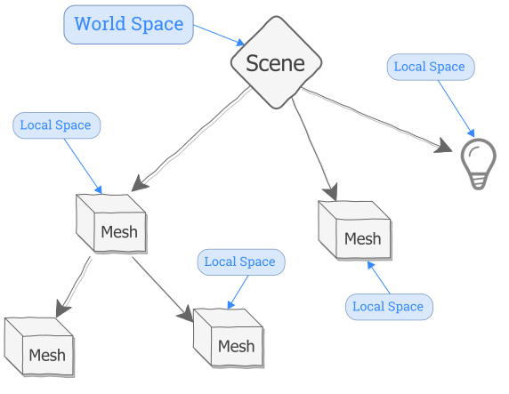

# 变换、坐标系

### 三大基本变换 (TRS)

在 3D 空间中移动任何对象都依赖于三种基本的数学变换，简称 TRS：
1.  **平移 (Translation)**：改变对象的位置，通过 `.position` 属性控制。
2.  **旋转 (Rotation)**：改变对象的方向，通过 `.rotation` 属性控制。
3.  **缩放 (Scale)**：改变对象的大小，通过 `.scale` 属性控制。

所有可添加到场景中的对象（如网格、灯光、相机）都继承自 `Object3D` 基类，因此都具备这些属性。

### 坐标系：世界空间与局部空间

理解坐标系是掌握变换的关键。
*  **世界空间 (World Space)**：由 `scene` 对象定义的全局坐标系。场景中所有对象的最终渲染位置都是基于世界空间计算的。
*  **局部空间 (Local Space)**：每个 `Object3D` 对象（如网格）都有自己的局部坐标系。对象的 `.position`、`.rotation` 和 `.scale` 属性都是相对于其**父对象的局部空间**（对于场景的直接子对象，则是世界空间）来定义的。

### 场景图 (Scene Graph)

Three.js 使用一种树状结构来组织场景中的所有对象，这种结构被称为**场景图**。
*   **父子关系**：通过 `parent.add(child)` 方法，可以将一个对象（子对象）添加到另一个对象（父对象）中。
*   **层级变换**：子对象的变换（位置、旋转、缩放）是相对于其父对象的坐标系进行的。当父对象移动时，所有子对象会跟随移动。
*   **访问子对象**：可以通过 `.children` 数组访问一个对象的所有子对象。

### 变换详解

#### 1. 平移 (Translation)
*   **数据存储**：`Vector3` 类。它有 `.x`, `.y`, `.z` 三个属性，分别代表在三个轴上的偏移量。
*   **单位**：Three.js 中的单位约定为 1 单位 = 1 米。
*   **方向**（默认相机视角下）：
    *   `+X`: 屏幕右侧
    *   `+Y`: 屏幕上方
    *   `+Z`: 朝向屏幕外（朝向观察者）

#### 2. 缩放 (Scale)
*   **数据存储**：同样使用 `Vector3` 类。
*   **比例值**：缩放值是相对于对象的初始大小。
    *   `1` = 100% 大小
    *   `2` = 200% 大小
    *   `0.5` = 50% 大小
*   **统一缩放**：在 X, Y, Z 轴上使用相同的比例值，保持对象的原始比例。
*   **非均匀缩放**：在不同轴上使用不同的比例值，会拉伸或压扁对象。
*   **负值缩放**：在任意轴上使用负值可以镜像（翻转）对象。

#### 3. 旋转 (Rotation)
*   **数据存储**：使用 `Euler` 类。它也有 `.x`, `.y`, `.z` 属性，但代表绕各轴的旋转角度。
*   **单位**：**弧度 (radians)**，而非度数。Three.js 提供了 `MathUtils.degToRad()` 工具函数进行转换。
*   **重要性**：**旋转顺序至关重要**。先绕 X 轴再绕 Y 轴旋转，与先绕 Y 轴再绕 X 轴旋转，结果通常不同。
*   **旋转顺序**：默认顺序是 "XYZ"，可以通过 `.rotation.order` 属性修改。
*   **另一个表示法**：`Quaternion`（四元数）。它没有“万向锁”等问题，在动画和复杂计算中更稳定。`rotation` (欧拉角) 和 `quaternion` 会自动同步。

### 变换矩阵 (Transformation Matrix)

这是计算机内部高效处理变换的核心。
*   **目的**：将 `.position`、`.rotation` 和 `.scale` 这三个属性组合成一个单一的 `Matrix4`（4x4 矩阵）对象，以便 GPU 高效计算。
*   **局部矩阵 (`.matrix`)**：存储对象相对于其父对象的变换。
*   **世界矩阵 (`.matrixWorld`)**：存储对象在世界空间中的最终变换结果。渲染器会根据世界矩阵来绘制对象。
*   **自动更新**：通常不需要手动操作矩阵，渲染器会在渲染前自动更新所有对象的矩阵。

> **总结**：开发者通常使用直观的 `.position`, `.rotation`, `.scale` 属性进行操作，而 Three.js 引擎则在后台使用高效的 `Matrix4` 来完成最终的计算，实现了易用性与性能的平衡。