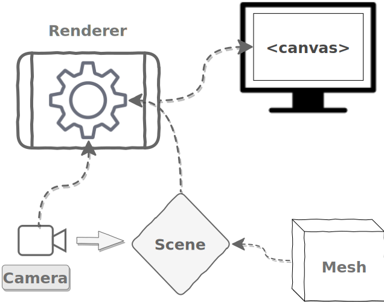
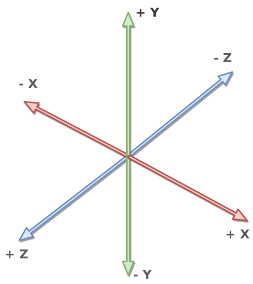
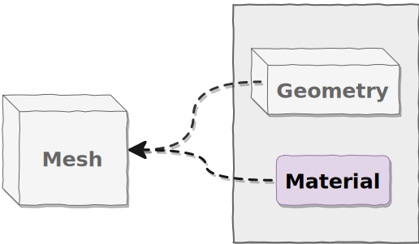

# 第一个Three.js场景:你好，立方体！

### 常用 3D 应用程序组件



每个 Three.js 应用程序的基本组件是场景、相机、渲染器，它们构成了应用程序的基本脚手架。接下来是HTML `<canvas>` 元素，我们可以在其中看到结果。

#### 场景

**场景是我们看到一切的载体**。场景定义了一个空间的坐标系，世界空间是一个**3D笛卡尔坐标系**。场景的中心是点（0，0，0），也被称为坐标系的**原点**，
场景的坐标系统是右手坐标系，x轴指向右侧，y轴指向顶部，z轴指向屏幕外。



```js
import { Scene } from 'three';
const scene = new Scene();
```

当我们将对象添加到场景中时，它们会被放入**场景图中**，这个是一个树形结构，场景位于底部。

#### 相机

要查看场景，需要打开一个进入这个领域的窗口，并将其转换为对我们人眼感觉合理的东西，这就是**相机**的用武之地。

* **透视投影**：会模拟人眼观察的真实效果，远处的物体看起来比近处的物体小。
* **正交投影**：不会产生这种透视效应，物体的大小不随距离变化，常用于工程制图等需要精确测量的场景。

#### 渲染器

**将负责将3D 场景（包含模型、光照、相机等）通过 WebGL API 将其转化为浏览器中的2D 图像**。渲染器接收场景和相机的信息，处理光照、阴影、材质等渲染细节，最终将渲染结果呈现在一个HTML `<canvas>` 元素上，从而在网页上显示出3D 效果。

### 可见对象：网格Mesh

**网格是 3D 计算机图形学中最常见的可见对象**，用于显示各种 3D 对象——猫、狗、人类、树木、建筑物、花卉和山脉都可以使用网格来表示。还有其他种类的可见对象，例如线条、形状、精灵和粒子等，我们将在后面的部分中看到所有这些，但在这些介绍性章节中我们将坚持使用网格。



:::tip 几何体和材质
```js
import { Mesh } from 'three';

const mesh = new Mesh(geometry, material);
```
`Mesh` 构造函数有两个参数：**几何体** 和 **材质**，在创建网格之前，我们需要创建这两个。
:::

#### 几何体

**几何体定义了网格的形状**。将使用一种称为 `BufferGeometry` 的几何体。

```js
import { BoxBufferGeometry } from 'three';

const length = 2;
const width = 2;
const depth = 2;

const geometry = new BoxBufferGeometry(length, width, depth);
```

构造函数最多需要六个参数，但在这里，我们只提供前三个参数，它们指定盒子的长度、宽度和深度。

#### 材料

虽然几何体定义了形状，**但材质定义了网格表面的外观**。

```js
import { MeshBasicMaterial } from 'three';

const material = new MeshBasicMaterial();
```


### 简单实践

步骤：
1. 初始化设置
2. 创建场景
3. 创建相机
4. 创建可见对象
5. 创建渲染器
6. 渲染场景

```js
import {
  BoxBufferGeometry,
  Color,
  Mesh,
  MeshBasicMaterial,
  PerspectiveCamera,
  Scene,
  WebGLRenderer,
} from 'three';

// 创建一个scene-container元素用于创建 canvas 元素
const container = document.querySelector('#scene-container');

// 创建场景背景色
const scene = new Scene();

// 设置背景色
scene.background = new Color('skyblue');

// 创建相机
const fov = 35; // 视野：相机的视野有多宽，以度为单位。
const aspect = container.clientWidth / container.clientHeight; // 纵横比：场景的宽度与高度的比率。
const near = 0.1; // 近剪裁平面：任何比这更靠近相机的东西都是不可见的
const far = 100; // 远剪裁平面：任何比这更远离相机的东西都是不可见的。

const camera = new PerspectiveCamera(fov, aspect, near, far);
// 创建一个相机的视锥体

// 每个对象最初都位于场景的中心，(0,0,0)
// 相机默认位置也在(0,0,0)，所以我们需要将相机移动到场景中，才能看到物体
camera.position.set(0, 0, 10);

// 创建几何体
const geometry = new BoxBufferGeometry(2, 2, 2);

// 创建材质
const material = new MeshBasicMaterial();

// 创建网格
const cube = new Mesh(geometry, material);

// 将网格添加到场景中
scene.add(cube);

// 创建渲染器
const renderer = new WebGLRenderer();

// 使用容器的宽度和高度告诉渲染器我们的场景大小
renderer.setSize(container.clientWidth, container.clientHeight);

// 设置渲染器设备屏幕的像素比视多少，这是防止 HiDPI 显示器模糊所必需的 
renderer.setPixelRatio(window.devicePixelRatio);

// 添加渲染器生成的 <canvas> 元素到页面中
container.append(renderer.domElement);

// 渲染场景
renderer.render(scene, camera);
```

