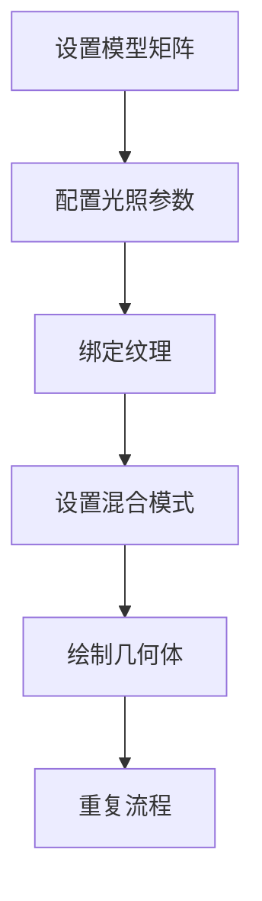
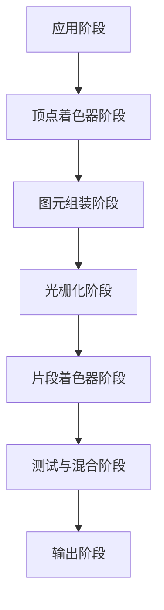

# 渲染管线

> **渲染管线（Rendering Pipeline）** 是指：
> 
> 将 3D 模型转换为 2D 图像并显示在屏幕上的整个过程。这个过程被划分为多个阶段，每个阶段负责不同的任务。
> 也可以想象为一个流水线，输入的是模型数据，输出的是图像。
>
**固定渲染管线**和**可编程渲染管线**是现代图形编程中两种根本不同的架构模式，它们在灵活性、控制粒度和工作流程上存在本质差异。

### 固定渲染管线
* **硬件固化**：渲染流程由GPU硬件预先固化。
* **有限配置**：通过API参数调整有限功能。
* **黑盒操作**：开发者无法修改内部处理逻辑。
* **典型代表**：OpenGL 1.x、DirectX 7。

### 可编程渲染管线
* **软件定义**：关键阶段由开发者编写着色器程序控制。
* **完全可定制**：可自由实现任意渲染算法。
* **透明控制**：直接操作顶点/片元处理逻辑。
* **典型代表**：OpenGL 2.0+ (GLSL)、DirectX 9+ (HLSL)、Vulkan/Metal

### 功能控制对比

#### 顶点处理

| 能力	| 固定管线	| 可编程管线 |
| --- | --- | --- |
| 坐标变换	| 固定矩阵堆栈 (glMatrix)	| 自定义矩阵运算 |
| 光照计算	| 固定Gouraud/Phong模型	| 任意光照模型 (PBR等) |
| 骨骼动画	| 不支持	| 自由实现蒙皮权重 |
| 顶点数据	| 固定属性 (位置/法线/UV)	| 任意自定义属性 |

#### 片元处理

| 能力	| 固定管线	| 可编程管线 |
| --- | --- | --- |
| 纹理混合	| 固定组合 (GL_COMBINE)	| 任意数学运算 |
| 材质系统	| 简单材质参数	| 复杂PBR材质 (金属/粗糙度/环境反射等) |
| 后期效果	| 有限雾效/Alpha测试	| 全屏后处理 (SSR, HDR等) |
| 条件分支	| 不支持	| 完整流程控制 (if/else, switch等) |

#### 工作流程

**固定管线工作流**：

**可编程管线工作流**：

1. 应用阶段：CPU输出数据给GPU，相当于发送指令数据。
   * 场景管理，**准备渲染数据**。
   * 初始化WebGL上下文。
   * 创建创建着色器程序（编写顶点着色器、片段着色器代码）。
   * 准备缓冲区。
   * 设置渲染状态。
2. 顶点着色器阶段：处理每个顶点的属性。
   * 顶点变换
   * 顶点属性
3. 图元组装阶段：将顶点组织称为图元(点、线、三角形等)
4. 光栅化阶段：将图元转换为片元。
5. 片元着色器阶段：处理每个片段的颜色和纹理。
6. 测试与混合：
   * 深度测试：判断该像素是否被遮挡
   * 模板测试：控制某些区域是否允许绘制
   * 混合：处理透明物体的颜色叠加
   * 写入缓冲区：存储最终图像的内存区域，显示器定期读取并刷新屏幕。

#### 性能特性对比

| 特性	| 固定管线	| 可编程管线 |
| --- | --- | --- |
| 启动开销	| 极低	| 较高（需编译着色器） |
| 运行时效率	| 稳定但固定	| 依赖着色器优化程度 |
| 硬件利用率	| 中低（功能未完全利用）	| 极高（可充分发挥GPU能力） |
| 并行处理	| 有限	| 大规模并行 (SIMT架构) |
| 内存带宽	| 需求较低	| 可能较高（大量纹理/缓冲区） |

#### 典型场景

固定管线适用场景：
* 简单2D/UI渲染
* 老旧硬件支持
* 快速原型开发
* 教育演示基础

可编程管线适用场景：
* 现代3A游戏渲染
* 基于物理的渲染 (PBR)
* 复杂后期处理
* GPU计算 (GPUGPU)
* VR/AR实时渲染