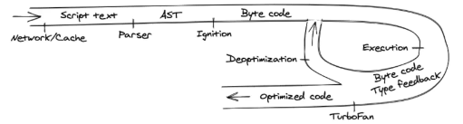
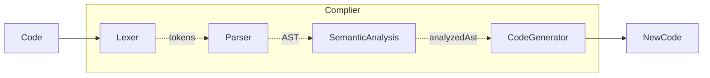
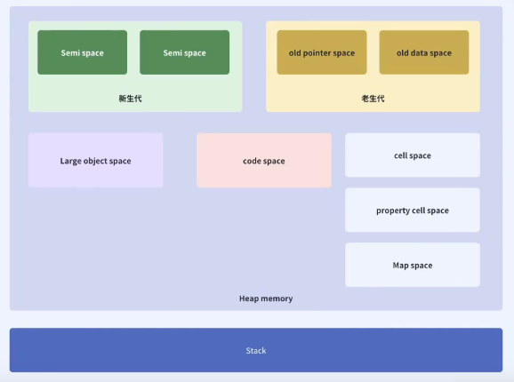

# JavaScript 引擎

### JavaScript 是解释性语言还是编译性语言？

**解释性语言**：边编译，边执行。（JavaScript）

**编译性语言**：先进行编译处理，再执行。（Java、C、C++）

### JavaScript 由谁来解释？

浏览器嵌入了**V8引擎**，解释以后由**CPU**执行。

**JavaScript 引擎**：
* **V8**（Google），用C++编写，开放源代码，由Google丹麦开发，是Google Chrome的一部分，也是用于Node.js。
* JavaScriptCore（Apple），开放源代码，用于webkit型浏览器，如Safari，2008年实现了编译器和字节码解释器，升级为了SquirreFish。苹果内部代码“Nitro”的JavaScript引擎也是基于JavaScriptCore引擎的。
* Rhino（Mozilla 基金会），由Mozilla基金会法国管理，用于Mozilla Firefox浏览器。
* SpiderMonkey（Mozilla），第一款 JavaScript引擎，早期用于 Netscape Navigator，现时用于Mozilla Firefox。
 
[V8](https://v8.dev/)为案例：

**V8 工作流程步骤**：
1. 开始执行 JavaScript 代码。
2. V8 解析源代码并将其转换为抽象语法树（AST）。
3. 基于该AST，**Ignition** 解释器可以开始它的事情，并产出字节码。
4. 同时开始运行代码并收集类型反馈。
5. 引擎可以检测到某些行为是否经常发生，以及使用的数据类型，为了使它运行得更快，字节码可以和反馈数据一起被发送到**优化编译器**。优化编译器在此基础上做出某些假设，然后产生高度优化的机器代码 **【内联混存技术（inline cashing）】**。
6. 如果在某些时候，其中一个假设被证明是不正确的，编译器优化就会取消优化，并回到解释器。

### Compiler

**编译流程**：

### 垃圾回收

垃圾回收算法：
1. **引用计数算法**（淘汰）
2. **标记清除算法**
3. **标记清除压缩算法**
4. **Cheney算法**（目前用在 V8 新生代垃圾回收）

**内存划分：老生代 vs 新生代**：

| 类型 | 描述 | 特点 |
| --- | --- | --- |
| 新生代 | 存放生命周期短的对象（如临时变量） | 回收频繁，速度快 |
| 老生代 | 存放生命周期长的对象（如全局变量、闭包） | 回收慢，但更高效 |

**新生代 GC：Scavenge 算法（复制算法）**

**原理**：

* 新生代内存分为两个区：**From** 空间 和 **To** 空间
* 每次 GC 时，将 **From** 空间中仍存活的对象复制到 **To** 空间
* 清空 **From** 空间，交换 **From** 和 **To**

**特点**：

* 适合生命周期短的对象
* 回收速度快
* 内存利用率低（只使用一半空间）

**老生代 GC：Mark-Sweep + Mark-Compact**

1. **Mark-Sweep（标记清除）**：
   * **标记阶段**：遍历所有可达对象（如全局变量、闭包、DOM 引用等），标记为“存活”。
   * **清除阶段**：清除未被标记的对象（释放内存）。
   * **缺点**：造成内存碎片化（后续分配大对象可能失败）。

2 **Mark-Compact（标记压缩）**：
   * 在 Mark-Sweep 基础上增加“整理”步骤
   * 将存活对象移动到内存的一端，消除碎片。
   * **优点**：更好地利用内存空间，减少内存浪费。

