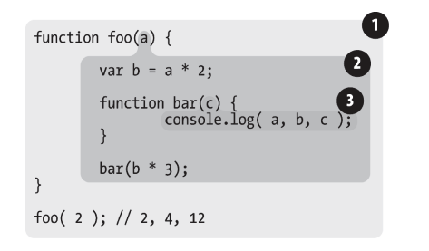

# 词法作用域

::: tip 作用域
有两种主要的，分别是<font style="color:#E8323C;">**词法作用域**</font>（大多数编程语言所采用的）和<font style="color:#E8323C;">**动态作用域**</font>（Bash脚本、Perl中的一些模式）。
:::

### 词法阶段

**词法作用域**是<u>**定义词法阶段的作用域**</u>，即<u>**写代码时将变量和块作用域写在哪里来决定**</u>的。



::: tip 如上图所示

1.  包含整个**全局作用域**，其中只有**一个标识符**：**foo**。
2. 包含着**foo所创建**的**作用域**，其中有**三个标识符**：**a**、**bar**和**b**。
3. 包含着**bar所创建**的**作用域**，其中只有**一个标识符**：**c**。由此可以得出<font style="color:#E8323C;">**作用域气泡由其对应的作用域块写在哪里决定**，</font>它们是<font style="color:#E8323C;">**逐级包含的**</font>。

:::

#### 查找
作用域气泡的结构和互相之间的位置关系给引擎提供了足够的位置信息，引擎用这些信息来查找标识符的位置。

还是如上一个代码图所示，引擎在执行 `console.log()` 声明，并查找a、b和c三个变量的引用。它首先从最内部的作用域，也就是 `bar(..)` 函数的作用域气泡开始查找。引擎无法在这里找到a，因此会从上一次所嵌套的 `foo(..)` 的作用域中继续查找。在这里找到了a，因此因此使用了这个引用。同理b和c。

**<font style="color:#E8323C;">作用域查找会在找到第一个匹配的标识符时停止(作用域查找始终从最内层逐层到外)</font>**。因此在多层的嵌套作用域中可以定义同名的标识符，这叫作“**<font style="color:#F5222D;">遮蔽效应</font>**”（内部的标识符“遮蔽”了外部的标识符）。

**<font style="color:#F5222D;">全局变量会自动成为全局对象（比如浏览器中的window对象）的属性</font>**，因此**不可以直接**通过全局对象的**词法名称**，而是**间接**地通过对**全局对象属性的引用**来对其进行访问。如 `var a = 3;` 可以通过 `window.a` 访问。

无论函数在**哪里**被调用，也无论它**如何**被调用，它的词法作用域**只由**函数被声明时所处的**位置决定**。

### 欺骗词法

可以修改写代码时函数所声明的位置，所谓**欺骗词法**，但<u>欺骗词法作用域会导致性能下降</u>。

#### eval

`eval(..)` 函数可以接受**一个字符串**为参数，并将其中的内容**转为动态生成的代码**。

```javascript
function foo(str, a) {
  eval(str); //欺骗！
  console.log( a,b );
}
var b = 2;
foo( "var b = 3;", 1 ); // 1,3
```


`eval(..)` 其实在foo的作用域内**创建**了一个**变量b**，**遮蔽**了**外部（全局）作用域**中的**同名变量**。所以在查b时，在foo内部找到了**第一个匹配**的**标识符**的时候就停止了。`eval(..)` <u>可以</u>**<u>间接</u>**<u>调用使其运行在全局作用域中，对全局作用域进行修改</u>。


但是在<u>**严格模式**</u>的程序中，`eval(..)` 在运行时有其<u>自己的</u>词法作用域，意味着其中的声明<u>无法修改</u>所在的作用域，如下案例所示：


```javascript
function foo(str) {
  "use strict";
  eval( str );
  console.log(a); 
  // ReferenceError: a is not defined
}
foo("var a = 2");
```

::: danger 注意
和 `eval(..)` 类似的还有 `setTimeout(..)` 和 `setInterval(..)` 的第一个参数可以是字符串（内容会被解释诶一段动态生成的函数代码）。`new Function(..)` 的最后一个参数也可以接受代码字符串。<font style="color:#E8323C;">切记避免使用</font>。

:::

#### with

`with` 通常被当作重复引用同一个对象中的多个属性的快捷方式，可以不需要重复引用对象本身。


```javascript
var obj = {
  a: 1,
  b: 2,
  c: 3
};
obj.a = 2;
obj.b = 3;
obj.c = 4;
// 简单的快捷方式
with(obj) {
  a = 3;
  b = 4;
  c = 5;
}
```

```javascript
function foo(obj) {
  with(obj) {
    a = 2;
  }
}
var o1 = {
  a: 3
};
var o2 = {
  b: 3
};

foo(o1);
console.log(o1.a); // 2

foo(o2);
console.log(o2.a); // undefined
console.log(a); // 2 a被泄漏到全局作用域勒
```

::: tip 案例说明
例子二可以看出 `foo(..)` 函数接受一个obj参数，该参数是对象的一个引用，并对这个对象执行了 `with(obj){..}`。在 `with` 块内部其实执行了**LHS**操作。而执行 `foo(o2)` 的时候发现o2没有 `a` 这个属性，他不会创建这个属性，`o2.a` 保持 `undefined`，但却在全局中创建一个变量`a`（非严格模式）
:::


这是因为 `with` 可以<font style="color:#E8323C;">**将一个没有或有多个属性的对象**</font>**处理为一个**<font style="color:#E8323C;">完全隔离的词法作用域</font>**，即对象的属性会被处理为定义在这个**<font style="color:#E8323C;">**作用域中的词法标识符**</font>。


### 小结

JavaScript中有**两个**机制可以“**欺骗**”**词法作用域**：`eval(..)`和`with`。


::: tip
`eval(..)` 函数如果接受了<font style="color:#E8323C;">含有一个或多个声明的代码</font>，就会<font style="color:#E8323C;">修改其所处的词法作用域</font>，而 `with` 声明实际上是根据你传递给它的对象<font style="color:#E8323C;">凭空创建</font>了一个<font style="color:#E8323C;">全新</font>的<font style="color:#E8323C;">词法作用域</font>。切。**<font style="color:#E8323C;">记永远不要使用它们。</font>**
:::

