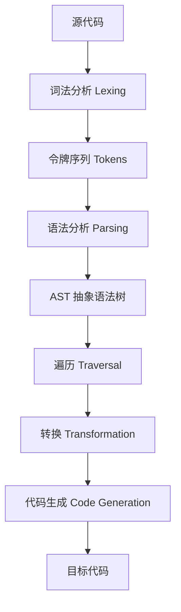

# 抽象语法树

抽象语法树（Abstract Syntax Tree 或者缩写为 AST），或者语法树（Syntax Tree），是 **源代码的抽象语法结构的树状表现形式**，这里特指编程语言的源代码。树上的每个节点都表示源代码中的一种结构。

**AST处理全流程**：



### 编译原理

编译原理的流程：

1. **词法分析**：单词与记号、正则表达式、有限自动机、从正则表达式到有限自动机的转换、词法分析器的实现。
2. **语法分析**：上下文无关文法、递归下降分析、LR 分析、错误处理、语法分析器自动生成。
3. **语义分析**：类型系统、属性文法、语法制导翻译、符号表管理、抽象语法树、线性中间表示、图中间表示。
4. **中间代码生成**：变量地址分配、算术表达式翻译、布尔表达式翻译、数组、结构体和字符串的翻译、控制流的翻译、函数调用的翻译。
5. **目标代码优化与生成**：目标体系结构、树匹配代码生成、基于动态规划的代码生成、寄存器分配、指令调度、控制流分析数据流分析、死代码删除、常量传播、拷贝传播、静态单赋值形式。

JavaScript 是解释型语言，但其在执行过程中仍然需要即时编译（JIT），其编译过程也遵循这些流程：

1. **分词/词法分析（tokenize）**：把字符串分解成有意义的代码块，这些代码块被称为词法单元。
2. **解析/语法分析（parse）**：词法单元流（数组）转换成一个由元素逐级嵌套所组成的代表了程序语法结构的树，即 AST。
3. **代码生成**：将 AST 转换为可执行代码。

以 `var foo = 1;` 为例，分词后可以得到如下的效果：
```js
[
  { type: 'identifier', value: 'var' },
  { type: 'whitespace', value: ' ' },
  { type: 'identifier', value: 'foo' },
  { type: 'whitespace', value: ' ' },
  { type: 'operator', value: '=' },
  { type: 'whitespace', value: ' ' },
  { type: 'num', value: '1' },
  { type: 'sep', value: ';' },
];
```
实际使用 `babylon6` 解析这段代码时，分词结果为：
```text
- token: [
  + Token (var) { type, value, strat, end, loc }
  + Token (name) { type, value, strat, end, loc }
  + Token (=) { type, value, strat, end, loc }
  + Token (num) { type, value, strat, end, loc }
  + Token (eof) { type, value, strat, end, loc }
]
```
生成的抽象语法树为：
```json
{
  "type":"Program",
  "body":[
    {
      "type":"VariableDeclaration",
      "kind":"var",
      "declarations":{
        "type":"VariableDeclarator",
        "id":{
            "type":"Identifier",
            "value":"a"
        },
        "init":{
            "type":"Literal",
            "value":42
        }
      }
    }
  ]
}
```

### AST in Babel

Babel 是为使用下一代 JavaScript 语法特性来开发而存在的编译工具，最初这个项目名为 `6to5`，意为将 ES6 语法转换为 ES5。发展到现在，Babel 已经形成了一个强大的生态。

Babel 的工作过程经过三个阶段，`parse`、`transform`、`generate`，具体来说，如下图所示，在 `parse` 阶段，使用 `babylon` 库将源代码转换为 AST，在 `transform` 阶段，利用各种插件进行代码转换，如图中的 JSX transform 将 React JSX 转换为 plain object，在 `generator` 阶段，再利用代码生成工具，将 AST 转换成代码。

```js
import * as babylon from 'babylon';
import traverse from 'babel-traverse';
import generate from 'babel-generator';

const code = `function square(n) {
    return n * n;
}`;

const ast = babylon.parse(code);
traverse(ast, {
  enter(path) {
    if (path.node.type === 'Identifier' && path.node.name === 'n') {
      path.node.name = 'x';
    }
  },
});
generate(ast, {}, code);
```