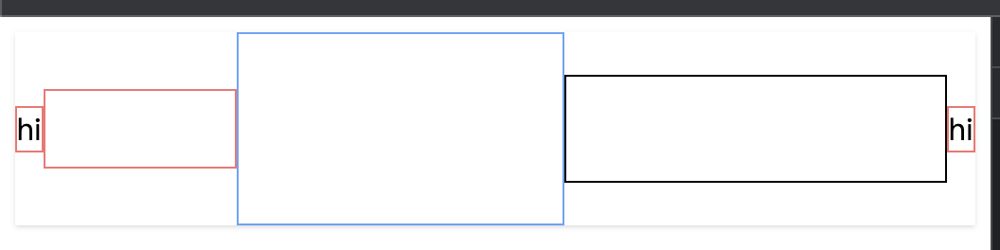
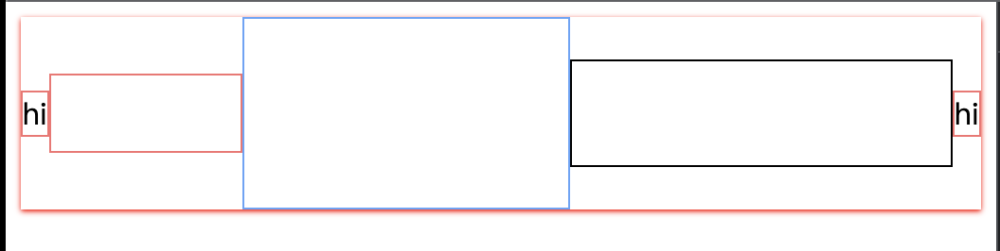

# CSS in JS 的三种方法
### CSS Modules
根据 CSS Modules ，它被解释为：**所有的类名和动画名称默认都有**<span style="color:#E8323C;">各自的作用域</span>**的 CSS 文件**。

所以 CSS Modules 既不是官方标准，也不是浏览器的特性，而是在**构建步骤**（例如使用 Webpack 或 Browserify）中对 **CSS类名** 和 **选择器限定作用域**的一种**方式**（类似于**命名空间**）。

通过 CSS Modules，我们可以保证单个组件的所有样式：

1. 集中在同一个地方
2. 只应用于该组件

[CSS Modules 用法教程 - 阮一峰的网络日志](https://www.ruanyifeng.com/blog/2016/06/css_modules.html)

在代码中使用CSS Modules，终端执行`pnpm install classnames sass`，react项目中可以使用[classname](https://www.npmjs.com/package/classnames)这个中间件，创建`src/pages/Welcome1.module.scss`

```css
.wrapper {

  &:hover {
    background-color: red;
  }
  :global(.frank) {
    border: 1px solid red;
  }
}

.blue {
  color: blue;
}
```

然后在`Welcome1.tsx`导入`classnames`并重命名为c，`classnames`<font style="color:rgb(41, 44, 50);">函数可以接受任意数量的参数，这些参数可以是字符串或对象。</font>

```tsx
import c from 'classnames'
import s from './Welcome1.module.scss'
export const Welcome1: React.FC = () => {
  return (
    <div className={c(s.wrapper, s.blue)}>
      <div className='frank'>
        山竹记账
      </div>
    </div>
  )
}
```

### Style Components
使用模版字符串和 CSS 语法，生成一个样式化组件（StyledComponent），被包裹的自定义组件。简单的来说就是可以将样式写在JSX或TSX上，实现和vue一样的html、css、js三者内聚。

安装`pnpm install styled-components @types/styled-components`，具体内容可查看[链接](https://www.npmjs.com/package/styled-components)。

```tsx
import styled from 'styled-components'
const Box = styled.div`
  border: 1px solid red;
  height: 100px;
  &:hover{
    background: red;
  }
`
const BlueBox = styled(Box)`
  border-color: blue;
`
export const Welcome2: React.FC = () => {
  return (
    <div>
      <Box>
        hi
      </Box>
      <BlueBox>
        hi
      </BlueBox>
    </div>
  )
}
```

### Unocss
安装`pnpm install unocss`

vite插件项中导入`Unocss`，可以直接在Unocss函数中直接写配置的内容，或者另写一个配置项`uno.config.ts`文件。

```typescript
import { defineConfig } from 'vite'
import react from '@vitejs/plugin-react'
import Unocss from 'unocss/vite'

// https://vitejs.dev/config/
export default defineConfig({
  plugins: [
    Unocss(),
    react()
  ]
})

```

并在`main.tsx`中导入unocss的默认样式`import 'virtual:uno.css'`，在配置`uno.config.ts`。

```typescript
import {
  defineConfig, presetAttributify, presetIcons,
  presetTypography, presetUno, transformerAttributifyJsx
} from 'unocss'

export default defineConfig({
  theme: {
  },
  shortcuts: {
  },
  safelist: [],
  presets: [
    presetUno(), // 预设uno配置项
    presetAttributify(), // 预设属性
    presetIcons({ // 预设Icon图标
      extraProperties: { // 额外配置项
        'display': 'inline-block', 
        'vertical-align': 'middle' 
      },
    }),
    presetTypography(), // 预设排版
  ],
  transformers: [ // jsx属性转码
    transformerAttributifyJsx()
  ],
})

```

由于使用的是TSX，需要另外配置react的`HTMLAttributes`接口中的`flex`属性声明。

```typescript
import type { AttributifyAttributes } from "unocss/preset-attributify";

declare module "react" {
  interface HTMLAttributes<T> extends AttributifyAttributes {
    flex?: boolean;
  }
}
```

在`Welcome3.tsx`中使用，若要查看其他css样式内容可以查看[链接](https://uno.antfu.me/)。

```css
export const Welcome3: React.FC = () => {
  return (
    <div flex justify-center items-center
      after="content-[hi] b-1 b-red"
      before="content-[hi] b-1 b-red"
      shadow
    >
      <header hover:bg-red w-100px b-1 b-red h-40px></header>
      <main grow-1 b-1 b-blue h-100px></main>
      <footer w-200px b-1 b-black h-55px></footer>
    </div>
  )
}
```

效果如下所示。



若是要修改unocss的样式,可以写样式修改unocss的根元素中声明的样式，然后在`main.tsx`中导入该修改好的样式文件`import'./global.scss'`

```css
:root {
  --un-shadow-color: red;
}
```

修改如下所示，阴影的颜色变成了红色。



[GitHub - unocss/unocss: The instant on-demand atomic CSS engine.](https://github.com/unocss/unocss)

