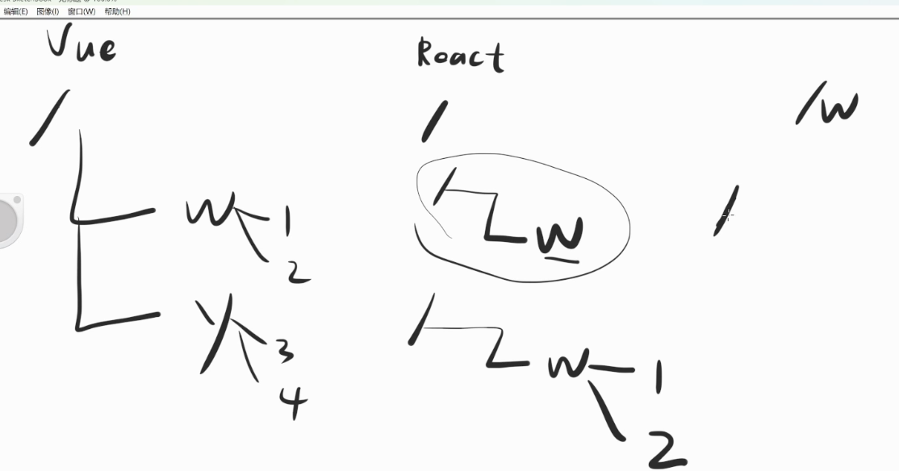
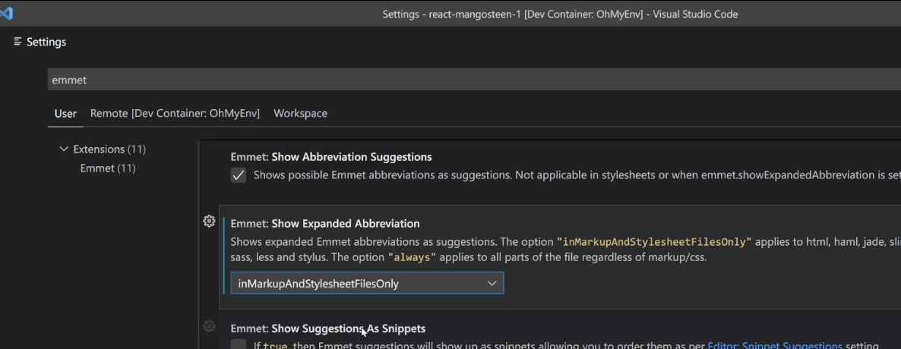

# 引入Zustand.js
### 实现「跳过」功能
如果看过广告，就不用在看，将这个状态存储在localStorage内，添加`onSkip`方法，并在页面中使用。

```tsx
const onSkip = () => {
  localStorage.setItem('hasReadWelcomes', 'yes')
}
```

关于路由，vue有路由守卫，而`react-router`中没有路由守卫，官网中的`action`只是提供一种方式用于提供数据提交。react的路由守卫需要自己写方法，而且react之间父子路径互不影响。



修改`router.tsx`的路由，添加`/home`路由，并修改`MainLayout.tsx`组件，如果`localStorage`内存储着`hasRead`则`<Navigate to='/home' />`否则显示下一页的内容。

```tsx
import { createBrowserRouter } from 'react-router-dom'
import { MainLayout } from '../layouts/MainLayouts'
import { NotFoundPage } from '../pages/NotFoundPage'
import { WelcomeRoutes } from './WelcomeRoutes'

export const router = createBrowserRouter([
  {
    path: '/home',
    element: <div>Home</div>
  },
  {
    path: '/',
    element: <MainLayout />,
    errorElement: <NotFoundPage />,
    children: [
      WelcomeRoutes
    ]
  }
])
```

```tsx
import * as React from 'react'
import { Navigate, Outlet } from 'react-router-dom'
export const MainLayout: React.FC = () => {
  const hasRead = localStorage.getItem('hasReadWelcomes')
  return hasRead === 'yes' ? <Navigate to='/home'/> : <div><Outlet/></div>
}
```

### 自动跳转到/welcome/1
实现方法：把根路径单独移动出来，并放在第一行。

```tsx
import { createBrowserRouter } from 'react-router-dom'
import { Root } from '../layouts/Root'
import { WelcomeLayout } from '../layouts/WelcomeLayout'
import { Welcome1 } from '../pages/Welcome1'
import { Welcome2 } from '../pages/Welcome2'
import { Welcome3 } from '../pages/Welcome3'
import { Welcome4 } from '../pages/Welcome4'

export const router = createBrowserRouter([
  {
    path: '/',
    element: <Root />,
  },
  {
    path: '/home',
    element: <div>Home</div>
  },
  {
    path: '/welcome',
    element: <WelcomeLayout />,
    children: [
      { path: '1', element: <Welcome1 /> },
      { path: '2', element: <Welcome2 /> },
      { path: '3', element: <Welcome3 /> },
      { path: '4', element: <Welcome4 /> },
    ]
  }
])
```

修改`MainLayout`文件名，改为`Root.tsx`。

```tsx
import * as React from 'react'
import { Navigate } from 'react-router-dom'
export const Root: React.FC = () => {
  const hasRead = localStorage.getItem('hasReadWelcomes')
  return hasRead === 'yes' ? <Navigate to='/home'/> : <Navigate to="/welcome/1" />
}
```

修改viewport，抄袭淘宝的

```html
<meta name="viewport" content="width=device-width,initial-scale=1,maximum-scale=1,minimum-scale=1,user-scalable=no,viewport-fit=cover">
```

### 引入zustand.js
全局状态管理工具

[GitHub - pmndrs/zustand: 🐻 Bear necessities for state management in React](https://github.com/pmndrs/zustand)

### 封装useLocalStore钩子
改造zustand，封装useLocalStore钩子，详细代码见[链接](https://github.com/Lu9709/mangosteen-font-react/commit/d47d9778258a9c5be6b623465aedd24cb226b83c)。

```tsx
import create from 'zustand'

interface Local {
  hasReadWelcomes: boolean
  setHasReadWelcomes: (read: boolean) => void
}

const init = localStorage.getItem('hasReadWelcomes')

export const useLocalStore = create<Local>((set, get) => ({
  hasReadWelcomes: init === 'yes',
  setHasReadWelcomes: (read: boolean) => {
    const result = read ? 'yes' : 'no'
    localStorage.setItem('hasReadWelcomes', result)
    set({ hasReadWelcomes: result === 'yes' })
  }
}))
```

使用`useLocalStore.tsx`，修改`onSkip`方法

```tsx
const { setHasReadWelcomes } = useLocalStore()
const onSkip = () => {
  setHasReadWelcomes(true)
}
```

修改`Root.tsx`

```tsx
import * as React from 'react'
import { Navigate } from 'react-router-dom'
import { useLocalStore } from '../stores/useLocalStore'
export const Root: React.FC = () => {
  const { hasReadWelcomes } = useLocalStore()
  return hasReadWelcomes ? <Navigate to='/home'/> : <Navigate to="/welcome/1" />
}
```

### 补充
修改vscode的setting防止tab快捷键按错。



