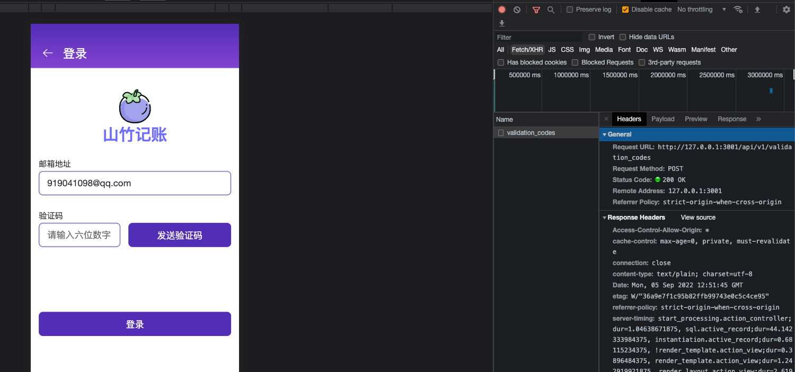

# 第一次前后端联调接口
### 修改后端接口
由于发送邮件的接口没有经过单元测试，需要重新修改ValidationCode的model层。

```ruby
class ValidationCode < ApplicationRecord
  validates :email, presence: true

  before_create :generate_code
  after_create :send_email

  enum kind: { sign_in: 0, reset_password: 1 }

  def generate_code
    self.code = SecureRandom.random_number.to_s[2..7]
  end
  def send_email
    UserMailer.welcome_email(self.email).deliver
  end
end
```

由于**production**的环境下没有配置stmp服务器，于是修改`config/environments/production.rb`，加上如下代码。还要配置生产环境的密钥，可以复制开发环境中的密钥。

`EDITOR="code --wait" bin/rails credentials:edit`--编辑开发环境中的密钥

`EDITOR="code --wait" bin/rails credentials:edit --environment production`--编辑生产环境中的密钥

```ruby
require "active_support/core_ext/integer/time"

Rails.application.configure do
config.action_mailer.raise_delivery_errors = true
config.action_mailer.perform_caching = false
config.action_mailer.delivery_method = :smtp
  config.action_mailer.smtp_settings = {
    address:              'smtp.qq.com',
    port:                 587,
    domain:               'smtp.qq.com',
    user_name:            'fangyinghang@foxmail.com',
    password:             Rails.application.credentials.email_password,
    authentication:       'plain',
    enable_starttls_auto: true,
    open_timeout:         10,
    read_timeout:         10
  }
end
```

由于目前没有配置线上服务器，采用了本地开发，于是终端执行`bin/rails server`启动后端服务器。

### 前端Vite配置转发
前端还要配置Vite进行转发配置，可以请求线上域名也可以请求本地起的地址。

启动前端的服务`pnpm run dev`。Vite配置代理Proxy，可以避免跨域和重复编写url的问题，具体内容见[链接](https://zxuqian.cn/vite-proxy-config/)。

```typescript
import { defineConfig } from 'vite'
import vue from '@vitejs/plugin-vue'
import vueJsx from '@vitejs/plugin-vue-jsx'
import Components from 'unplugin-vue-components/vite';
import { VantResolver } from 'unplugin-vue-components/resolvers';
// @ts-nocheck
import { svgstore } from './src/vite_plugins/svgstore'

// https://vitejs.dev/config/
export default defineConfig({
  plugins: [
    vue(),
    vueJsx({
      transformOn: true,
      mergeProps: true
    }),
    svgstore(),
    Components({
      resolvers: [VantResolver()],
    }),
  ],
  server: {
    proxy: {
      '/api/v1': {
        // target可以转发至线上地址
        target: 'http://127.0.0.1:3000',
      }
    }
  }
})
```

### 安装axios，联调第一个接口
安装`axios`，终端执行`pnpm install axios`。

打开路由为`/sign_in`的页面，修改button可以点击，具体代码可查看[链接](https://github.com/Lu9709/mangosteen-font/commit/8a1b52cfcf3a05120dede954024c03eb4edf98f1)。

由于这边的发送验证码按钮是第一个按钮会触发Form表单的事件，于是修改button组件，给`props.type`添加默认值`default:'button'`。

举例发送验证码的点击函数，如下图所以可以看到接口调用成功，可以在邮箱里看到

```typescript
const onClickSendValidationCode = async() => {
      const response = await axios.post('/api/v1/validation_codes', { email: formData.email })
      console.log(response)
}
```



### 前端：实现倒计时
倒计时封装在Form组件里，倒计时的时间可以外面传入，设置了一个`props.countFrom`值。倒计时还需要用到定时器，根据计时器的值来设置一个`isCounting`的布尔值。对按钮的点击事件进行了二次封装，先发送请求，然后在开始计时器的逻辑，若时间为0的时候则清除定时器，并将`timer`和`count`的值复原。

对于Button组件需要添加`props.disabled`的值，并添加样式，详细内容见[链接](https://github.com/Lu9709/mangosteen-font/commit/8e624d37ee9db8e8df8f313ba6de7a05d044db50)。

```typescript
import { DatetimePicker, Popup } from 'vant';
import { computed, defineComponent, PropType, ref } from 'vue'
import { Button } from './Button';
import { EmojiSelect } from './EmojiSelect';
import s from './Form.module.scss'
import { Time } from './time';
export const Form = defineComponent({
  props: {
    onSubmit: {
      type: Function as PropType<(e: Event) => void>
    }
  },
  setup: (props, context) => {
    return () => (
      <form class={s.form} onSubmit={props.onSubmit}>
        {context.slots.default?.()}
      </form>
    )
  }
})
export const FormItem = defineComponent({
  props: {
   // ******省略代码
    onClick: Function as PropType<()=> void>,
    countFrom: {
      type: Number,
      default: 60
    }
  },
  emits: ['update:modelValue'],
  setup: (props, context) => {
    const refDateVisible = ref(false)
    const timer = ref<number>()
    const count = ref<number>(props.countFrom)
    const isCounting = computed(() => !!timer.value)
    const onClickSendValidationCode = ()=>{
      props.onClick?.()
      timer.value = setInterval(() => {
        count.value -= 1
        if(count.value === 0){
          clearInterval(timer.value)
          timer.value = undefined
          count.value = props.countFrom
        }
      },1000)
    }
    const content = computed(() => {
      switch (props.type) { 
        case 'text':
          return <input
            value={props.modelValue}
            placeholder={props.placeholder}
            onInput={(e: any) => context.emit('update:modelValue', e.target.value)}
            class={[s.formItem, s.input, props.error ? s.error : '']} />
        case 'validationCode':
          return <>
            <input class={[s.formItem, s.input, s.validationCodeInput, props.error ? s.error : '']}
              onInput={(e: any) => context.emit('update:modelValue', e.target.value)}
              placeholder={props.placeholder} />
            <Button disabled={isCountig.value} onClick={onClickSendValidationCode} class={[s.formItem, s.button, s.validationCodeButton]}>
              { isCounting.value ? `${count.value}秒后可重新发送` : '发送验证码'}
            </Button>
          </>
      // ************省略代码
      }
    })
    return () => {
      return <div class={s.formRow}>
        <label class={s.formLabel}>
          {props.label && <span class={s.formItem_name}>{props.label}</span>}
          <div class={s.formItem_value}>
            {content.value}
          </div>
          <div class={s.formItem_errorHint}>
            <span>{props.error ?? '　'}</span>
          </div>
        </label>
      </div>
    }
  }
})
```

### 父组件调用子组件
父组件暴露`context.expose({key: value})`，然后子组件调用的时候创建ref，调用父组件的方法就使用`ref.value.api()`这样的形式来执行(api为暴露expose内对象的键值)。具体内容可见[Vue官网](https://cn.vuejs.org/api/options-state.html#expose)。

所以不必将点击函数进行二次封装，本章内容的代码可见[链接](https://github.com/Lu9709/mangosteen-font/commit/67651d001ee026a40bfe90f0c056c61949c6bf61)。

```typescript
import { DatetimePicker, Popup } from 'vant';
import { computed, defineComponent, PropType, ref } from 'vue'
import { Button } from './Button';
import { EmojiSelect } from './EmojiSelect';
import s from './Form.module.scss'
import { Time } from './time';
export const Form = defineComponent({
  props: {
    onSubmit: {
      type: Function as PropType<(e: Event) => void>
    }
  },
  setup: (props, context) => {
    return () => (
      <form class={s.form} onSubmit={props.onSubmit}>
        {context.slots.default?.()}
      </form>
    )
  }
})
export const FormItem = defineComponent({
  props: {
    label: {
      type: String
    },
    modelValue: {
      type: [String, Number]
    },
    type: {
      type: String as PropType<'text' | 'emojiSelect' | 'date' | 'validationCode' | 'select'>
    },
    error: {
      type: String
    },
    placeholder: {
      type: String
    },
    options: {
      type: Array as PropType<Array<{ value: string, text: string }>>
    },
    onClick: Function as PropType<()=> void>,
    countFrom: {
      type: Number,
      default: 60
    }
  },
  emits: ['update:modelValue'],
  setup: (props, context) => {
    const refDateVisible = ref(false)
    const timer = ref<number>()
    const count = ref<number>(props.countFrom)
    const isCounting = computed(() => !!timer.value)
    const startCount = () =>    
     timer.value = setInterval(() => {
      count.value -= 1
      if(count.value === 0){
        clearInterval(timer.value)
        timer.value = undefined
        count.value = props.countFrom
      }
    },1000)
    context.expose({ startCount })
    const content = computed(() => {
      switch (props.type) {
        case 'text':
          return <input
            value={props.modelValue}
            placeholder={props.placeholder}
            onInput={(e: any) => context.emit('update:modelValue', e.target.value)}
            class={[s.formItem, s.input, props.error ? s.error : '']} />
        case 'validationCode':
          return <>
            <input class={[s.formItem, s.input, s.validationCodeInput, props.error ? s.error : '']}
              onInput={(e: any) => context.emit('update:modelValue', e.target.value)}
              placeholder={props.placeholder} />
            <Button disabled={isCounting.value} onClick={props.onClick} class={[s.formItem, s.button, s.validationCodeButton]}>
              { isCounting.value ? `${count.value}秒后可重新发送` : '发送验证码'}
            </Button>
          </>
        case 'select':
          return <select class={[s.formItem, s.select]} value={props.modelValue}
            onChange={(e: any) => { context.emit('update:modelValue', e.target.value) }}>
            {props.options?.map(option =>
              <option value={option.value}>{option.text}</option>
            )}
          </select>
        case 'emojiSelect':
          return <EmojiSelect
            modelValue={props.modelValue?.toString()}
            onUpdateModelValue={value => context.emit('update:modelValue', value)}
            class={[s.formItem, s.emojiList, props.error ? s.error : '']} />
        case 'date':
          return <>
            <input readonly={true} value={props.modelValue}
              placeholder={props.placeholder}
              onClick={() => { refDateVisible.value = true }}
              class={[s.formItem, s.input]} />
            <Popup position='bottom' v-model:show={refDateVisible.value}>
              <DatetimePicker value={props.modelValue} type='date' title='选择年月日'
                onConfirm={(date: Date) => {
                  context.emit('update:modelValue', new Time(date).format())
                  refDateVisible.value = false
                }}
                onCancel={() => refDateVisible.value = false}
              />
            </Popup>
          </>
        case undefined:
          return context.slots.default?.()
      }
    })
    return () => {
      return <div class={s.formRow}>
        <label class={s.formLabel}>
          {props.label && <span class={s.formItem_name}>{props.label}</span>}
          <div class={s.formItem_value}>
            {content.value}
          </div>
          <div class={s.formItem_errorHint}>
            <span>{props.error ?? '　'}</span>
          </div>
        </label>
      </div>
    }
  }
})
```

```typescript
import axios from 'axios'
import { defineComponent, reactive, ref } from 'vue'
import { MainLayout } from '../layouts/MainLayout'
import { Button } from '../shared/Button'
import { Form, FormItem } from '../shared/Form'
import { Icon } from '../shared/Icon'
import { validate } from '../shared/validate'
import s from './SignInPage.module.scss'
export const SignInPage = defineComponent({
  setup: (props, context) => {
    const refValidationCode = ref<any>()
    const formData = reactive({
      email: '',
      code: ''
    })
    const errors = reactive({
      email: [],
      code: []
    })
    const onSubmit = (e: Event) => {
      e.preventDefault()
      Object.assign(errors, {
        email: [], code: []
      })
      Object.assign(errors, validate(formData, [
        { key: 'email', type: 'required', message: '必填' },
        { key: 'email', type: 'pattern', regex: /^\w+@[a-z0-9]+\.[a-z]{2,4}$/, message: '必须是邮箱地址' },
        { key: 'code', type: 'required', message: '必填' },
        { key: 'code', type: 'pattern' , regex: /^\d{6}$/, message: '必须是六位数字'}
      ]))
    }
    const onClickSendValidationCode = async() => {
      const response = await axios.post('/api/v1/validation_codes', { email: formData.email })
        .catch(()=> {
          // 失败
        })
      refValidationCode.value.startCount()
      console.log(response)
    }
    return () => (
      <MainLayout>{
        {
          title: () => '登录',
          icon: () => <Icon name="left" />,
          default: () => (
            <div class={s.wrapper}>
              <div class={s.logo}>
                <Icon class={s.icon} name='mangosteen'/>
                <h1 class={s.appName}>山竹记账</h1>
              </div>
              <Form onSubmit={onSubmit}>
                <FormItem label="邮箱地址" type="text"
                  placeholder='请输入邮箱，然后点击发送验证码'
                  v-model={formData.email} error={errors.email?.[0]} />
                <FormItem ref={refValidationCode} label="验证码" type="validationCode"
                  placeholder='请输入六位数字'
                  countFrom={60}
                  onClick={onClickSendValidationCode}
                  v-model={formData.code} error={errors.code?.[0]} />
                <FormItem style={{ paddingTop: '96px' }}>
                  <Button>登录</Button>
                </FormItem>
              </Form>
            </div>
          )
        }
      }</MainLayout>
    )
  }
})
```


