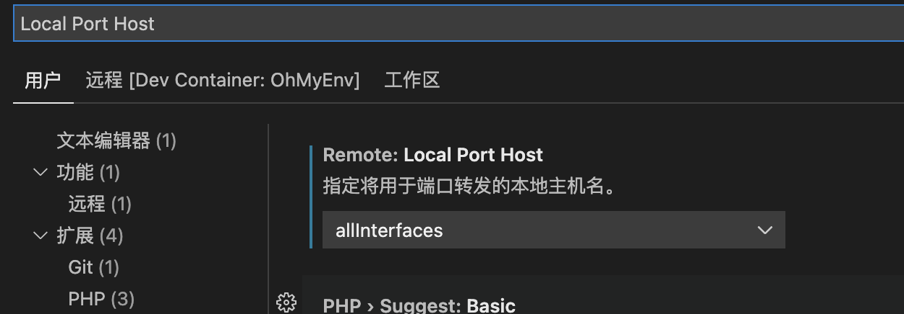

# 页面划分与布局

### 规划分析
项目初始化时候需要对项目进行分析，查看有哪些页面，有哪些组件，如何排期的问题。

山竹记账的分析如下所示：

+ 页面

```plain
/welcome/1~4
/start
/items/new
/tags/new
/tags/:id
/items
/sessions/new
/statistics
```

+ 组件

```plain
layout/welcome
layout/main
tabs
button
overlay
lineChart
pieChart
...
```

+ 排期

排期原则：越细越好(每个页面的工作量是不同的，每个组件的工作量是不同的，不能一概而论)，留好buffer(预估的时间乘以n「 1.2 < n < 3.14 」)

### 完成第一个页面
使用cssModule，需要安装sass，只需创建文件，vite会自动识别文件。第一个页面的代码[具体详见Github](https://github.com/Lu9709/mangosteen-font/commits/master)。

若是要查看代码数据可以下载[cloc](https://www.npmjs.com/package/cloc)(`cloc --vcs=git`「排除git」)或[tokei](https://github.com/XAMPPRocky/tokei)这两个包。

页面的字体可以查找[fonts.css](https://zenozeng.github.io/fonts.css/)

### 手机页面调试
首先需要在VsCode内配置`Local Port Host`设置为`alllnterfaces`。然后可以通过终端查看自己的ip地址(windows命令ipconfig/mac命令ifconfig)



#### 安卓手机
**步骤**：用USB连接手机和电脑，手机开启USB调试，手机打开要调试的页面，打开`edge://inspect`(Edge浏览器)或`chrome://inspect`(chrome浏览器)，等待几分钟，找到对应页面，兼容性只支持Webkit内核浏览器。具体可以搜索Chrome/Edge远程调试手机页面。

#### ios手机
具体可以搜索[Safari远程调试手机页面](https://developer.aliyun.com/article/770478)，兼容性的话iphone上面的浏览都是Webkit内核，所以都支持。

#### 非Webkit浏览器
可以使用模拟控制台，比如[Tencent/vConsole](https://github.com/Tencent/vConsole)或[liriliri/eruda](https://github.com/liriliri/eruda)，适合所有浏览器，但是可能会有小bug。

#### 微信页面调试
**步骤**：用手机打开，在Chrome/Edge远程设备列表里找到对应页面，修改地址栏的网址，开始调试。

### 解决某些浏览器页面无法全屏的问题
采用淘宝手机页面的方法，给底部的操作栏添加上`fixed`定位，[具体见代码](https://github.com/Lu9709/mangosteen-font/commit/c3e212eb4bd4bfc2f7a88545f4f0ff6fab25d2c2)。

### 解决缩放Bug
修改`index.html`的文件的`mete viewport`

```html
<!DOCTYPE html>
<html lang="zh">
  <head>
    <meta charset="UTF-8" />
    <link rel="icon" href="/favicon.ico" />
    <meta name="viewport"
          content="width=device-width,initial-scale=1,minimum-scale=1,maximum-scale=1,user-scalable=no,viewport-fit=cover">
    <title>Vite App</title>
  </head>
  <body>
    <div id="app"></div>
    <script type="module" src="/src/main.ts"></script>
  </body>
</html>
```

### 手机调试基本原则
使用<span style="color:#E8323C;">常用的浏览器优先</span>，常见(微信内嵌页面、系统浏览器、UC、腾讯浏览器等)，不常见(Chrome、Firefox、Edge)；切记<span style="color:#E8323C;">真机调试优先</span>，调试器无法显示所有bug；要<span style="color:#E8323C;">使用调试工具(</span>Elements、Network、Console、Sources等面板)。


