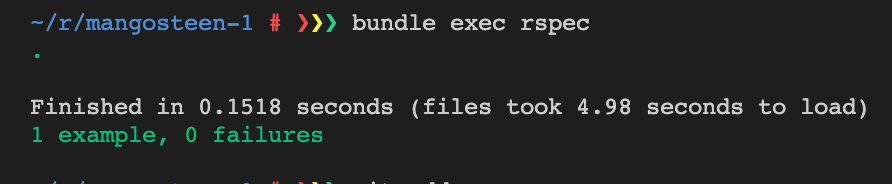

# 后端单元测试
可以在[Ruby Toolbox](https://www.ruby-toolbox.com/)文档内查看测试工具的类别，推荐使用rspec测试框架工具，比rail自带的minitest稍微好一点。目前只测controller，不测rails功能和第三方库。

### 安装rspec
[安装rspec](https://github.com/rspec/rspec-rails)，在gemfile文件添加`gem 'rspec-rails', '~> 5.0.0'`，然后在终端执行`bundle --verbose`，在执行`bundle install`安装后，创建初始化文档`rails generate rspec:install`。

由于需要使用test环境下的数据库并创建数据库及表，需要配置databse.yml，添加test环境，修改后在执行`RAILS_ENV=test bin/rails db:create`，`RAILS_ENV=test bin/rails db:migrate`。

```ruby
test:
  <<: *default
  database: mangosteen_test
  username: mangosteen
  password: 123456
  host: db-for-mangosteen
```

### 测试model用例
测试用例model-user，执行`rails generate rspec:model user`，创建了一个user_rspec.rb文件并修改。

```ruby
require 'rails_helper'

RSpec.describe User, type: :model do
  it 'have email' do
    user = User.new email: 'baizhe@qq.com'
    expect(user.email).to eq('baizhe@qq.com')
  end
end
```

在执行测试`bundle exec rspec`，可以见到测试用例成功。



### 测试requset请求
####  Request——items
使用RSpec 的 request test测试controller，执行代码`bin/rails generate rspec:request api/v1/items`，会在rspec/request路径下创建item_spec.rb文件并修改，执行`bundle exec rspec`进行测试。

```ruby
require 'rails_helper'

RSpec.describe "Items", type: :request do
  describe "index by page" do
    it "works! (now write some real specs)" do
      # 自行构造数据
      11.times { Item.create amount: 100 }
      expect(Item.count).to eq 11
      # 测试数据数量是否匹配
      get '/api/v1/items'
      expect(response).to have_http_status 200
      json = JSON.parse(response.body)
      expect(json['resources'].size).to eq 10
      # 测试分页
      get '/api/v1/items?page=2'
      expect(response).to have_http_status 200
      json = JSON.parse(response.body)
      expect(json['resources'].size).to eq 1
    end
  end
  describe "create" do
    it "can create an item" do
      # 测试创建item
      expect {
        post '/api/v1/items', params: { amount: 99 }
      }.to change { Item.count }.by 1
      # by是否增1
      expect(response).to have_http_status 200
      json = JSON.parse(response.body)
      # 测试item的id是否为数字
      expect(json['resources']['id']).to be_an(Numeric)
      # 测试item的amount是否为99
      expect(json['resources']['amount']).to eq 99
    end
  end
end
```

#### Request——validation_codes
执行`bin/rails generate rspec:request api/v1/validation_codes`，创建测试用例，并修改文件。

```ruby
require 'rails_helper'

RSpec.describe "ValidationCodes", type: :request do
  describe "验证码" do
    it "可以被发送" do
      post '/api/v1/validation_codes', params: { email: '919041098@qq.com' }
      expect(response).to have_http_status(200)
    end
  end
end
```

修改validation_codes_controller.rb文件，使用了[SecureRandom](https://rubyapi.org/3.0/o/securerandom)的随机数，邮箱需要使用到ruby的[Mailer](https://guides.rubyonrails.org/action_mailer_basics.html)。在执行测试用例`bundle exec rspec`

```ruby
class Api::V1::ValidationCodesController < ApplicationController
  def create
    # rand 不太安全
    # SecureRandom.hex(6) 存在字母
    # has_secure_token 24 需要在ValidationCodesController类内添加，但要求长度为24
    code = SecureRandom.random_number.to_s[2..7]
    validation_code = ValidationCode.new email: params[:email],
      kind: 'sign_in', code: code
    if validation_code.save
      head 200
    else 
      render json: { errors: validation_code.errors }
    end
  end
end
```

