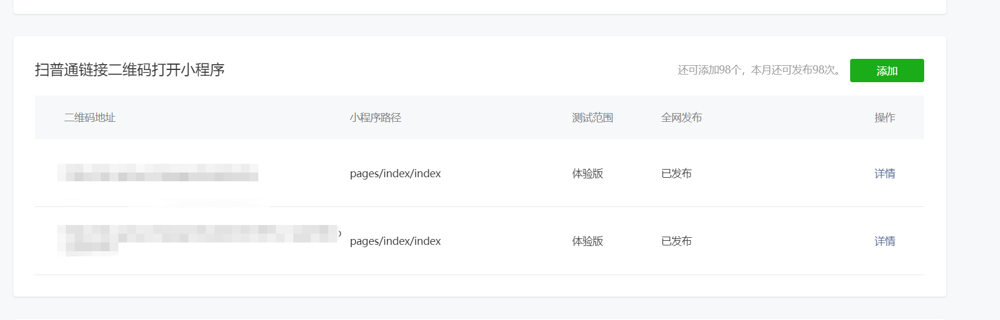
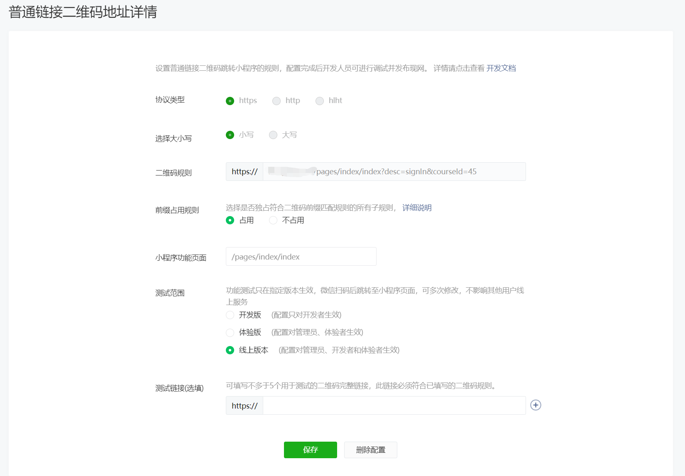

# 小程序扫码二维码进行跳转

在启用页面onLoad事件中获取二维码的参数为q，通过`decodeURIComponent`来解析参数，获取到的参数可能需要自己进行处理。[_详细内容见微信官方文档_](https://developers.weixin.qq.com/miniprogram/introduction/qrcode.html#%E4%BA%8C%E7%BB%B4%E7%A0%81%E8%B7%B3%E8%BD%AC%E8%A7%84%E5%88%99)

```javascript
page({
  onLoad(query){
    // 判断query是否存在
     if(JSON.stringify(query) !== '{}'){
      let url = decodeURIComponent(query.q) // 进行解码
      // url https://域名/pages/login/index?desc=signIn&courseId=45
      let paramStr = url.split("?")[1]
      // paramStr desc=signIn&courseId=45
      let arr = []
      paramStr?.split('&').forEach(item=>arr.push([item.split('=')]))
      let option = {}
      arr.forEach(item=>{
        item.forEach(_item =>{
          option[_item[0]] = _item[1]
        })
      })
      console.log(option)
       // option {desc: "signIn", courseId: "45"}
    }
  }
})
```

并还需要在微信小程序设置的**扫普通链接二维码打开小程序**内设置二维码跳转规则。





